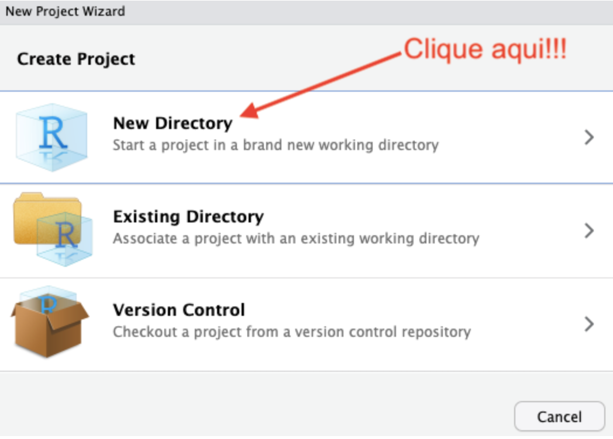
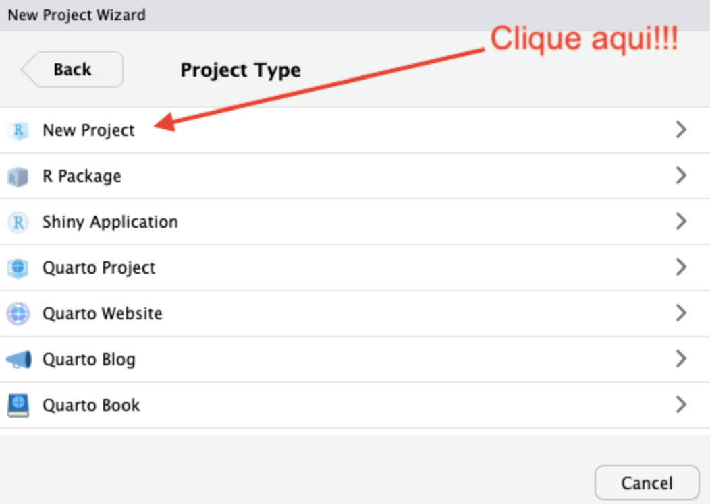
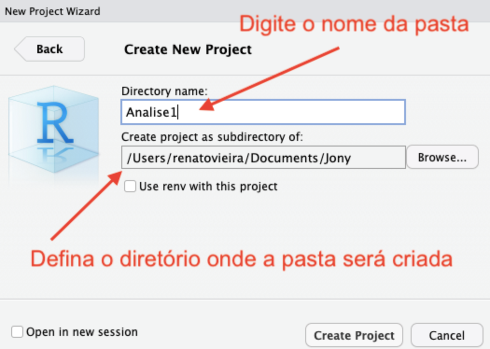
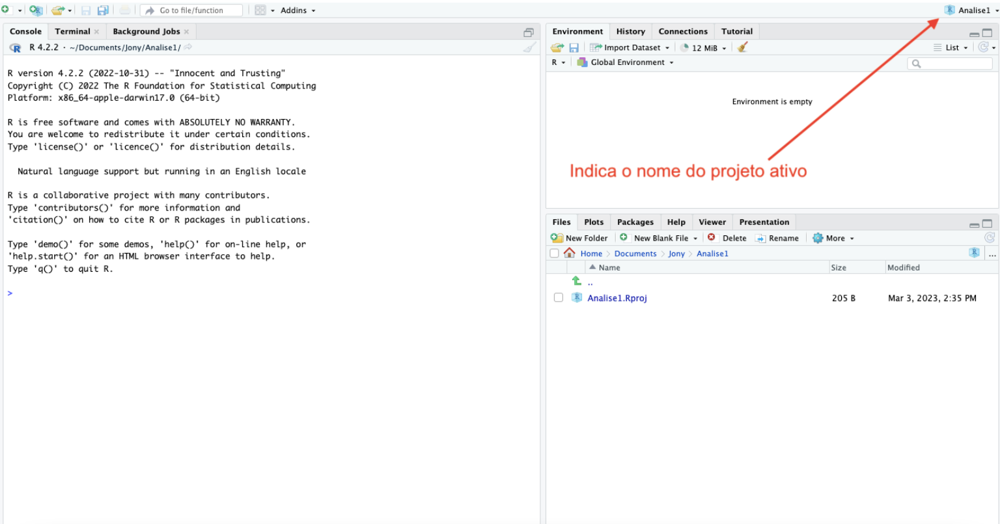
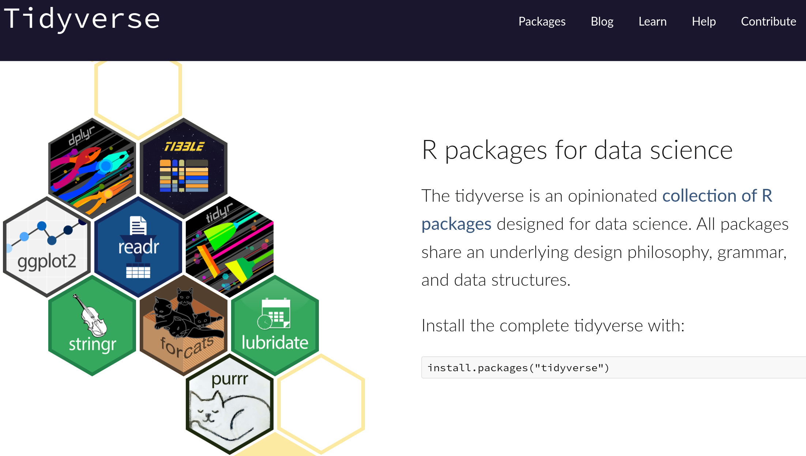

## Preparação

### Crie um Projeto

Um projeto é uma pasta no computador que traz alguns arquivos de configuração para facilitar a organização das pastas, arquivos e caminhos.  Vamos criar um projeto para realizar todas as aulas práticas nele. Ao fim do curso, você terá todo o material de replicação em um único local para referência futura. 

Para criar um projeto, acesse o menu `File → New Project`. Em seguida, podemos escolher criar um novo diretório ou usar um diretório existente para hospedar nosso projeto[^1]. Vamos criar um novo diretório. Clique em New Directory.


Na janela seguinte, escolhemos o tipo de projeto. Por ora, vamos apenas criar um novo projeto.


Em seguida, escolhemos um nome e o caminho no computador em que a pasta do projeto será criada. Note que a pasta será nomeada com o mesmo nome do projeto.


Uma vez criado o projeto, o Rstudio mostrará que o projeto está ativo. Além disso, é possível ver o conteúdo da pasta do projeto na aba `files` e o R irá entender que este diretório é o diretório de trabalho. 


Se quiser verificar o diretório que o R está considerando como "de trabalho" (*working directory*), digite no console `getwd()`. O R irá retornar o caminho do diretório do projeto em seu console. 

### Pacotes

A seguir temos a lista de pacotes que iremos utilizar na aula de hoje. Um pacote do R nada mais é do que um conjunto de funções que têm uma temática em comum e foram "empacotadas" de modo conjunto para sua distribuição. Para instalar pacotes, você pode ir em `Tools  → Install Packages` ou utilizar a função `install.packages("nome_do_pacote")`.

```{r}
library(tidyverse)
library(skimr)
library(readxl)
```

O `tidyverse` é um conjunto de pacotes do R produzidos especificamente para ciência de dados. Cada pacote que faz parte deste "universo" compartilha a mesma filosofia, gramática e estrutura de dados, o que permite uma maior integração entre eles e entre outros pacotes que compartilham das mesmas características. A melhor referência para entender e aprender a utililzar esses pacotes é o livro [R para Ciência de Dados (2ª edição)](https://pt.r4ds.hadley.nz/).


`skimr` é um pacote para produzir estatísticas descritivas de modo ágil, flexível e com apresentação dos resultados de forma clara e otimizada. Já o pacote `readxl` nos permite importar dados de planilhas de Excel para o R (ou exportar do R para o Excel).

Por fim, um pacote muito útil é o `here`. O grande objetivo desse pacote é otimizar a referência a suas pastas/diretórios e arquivos. Usualmente as pessoas definem o diretório padrão do R usando a função `setwd()`. Contudo, isso gera um conjunto de dificuldades para reprodutibilidade dos resultados e para o trabalho em equipe. Para entender e visualizar melhor o quão útil é esse pacote simples, veja os capítulos 3 e 4 do livro [What They Forgot to Teach You About R: The stuff you need to know about R, besides data analysis.](https://rstats.wtf/). Note que, após chamar o pacote, o R irá mostrar qual é o diretório de trabalho. Se você estiver trabalhando dentro de um projeto, este diretório será automaticamente definido pelo arquivo com extensão `.Rproj`. Todos os caminhos serão, então, construídos a partir deste ponto inicial.

```{r}
#| echo: true
#| warning: true
#| error: true

library(here)
```


## Exercício E3.1 Stock e Watson (4a Edição)

Na aula de hoje, iremos fazer o exerício empírico 3.1 do livro de Stock e Watson. No site do livro, você encontrará o arquivo de dados [CPS96_15](https://www.princeton.edu/~mwatson/Stock-Watson_4E/CPS96_15.zip), que contém uma versão estendida do conjunto de dados utilizado na Tabela 3.1 do livro-texto para os anos de 1996 e 2015. Ele contém dados de trabalhadores em tempo integral, com idades entre 25 e 34 anos, que possuem diploma de ensino médio ou graduação como seu maior grau de escolaridade. Uma descrição detalhada está disponível em `CPS96_15_Description`, que vem junto no arquivo zip com os dados[^longnote].

[^longnote]: A cada mês, o U.S. Census Bureau e o U.S. Bureau of Labor Statistics realizam a Current Population Survey (CPS), que fornece dados sobre as características da força de trabalho da população, incluindo os níveis de emprego, desemprego e rendimentos. Aproximadamente 54.000 domicílios nos Estados Unidos são pesquisados a cada mês. A amostra é escolhida por meio da seleção aleatória de endereços a partir de um banco de dados baseado no censo decenal mais recente, complementado com informações sobre novas unidades habitacionais construídas após o último censo.

    O esquema exato de amostragem aleatória é relativamente complexo (primeiro, pequenas áreas geográficas são selecionadas aleatoriamente; em seguida, unidades habitacionais dentro dessas áreas também são selecionadas aleatoriamente); detalhes podem ser encontrados no Handbook of Labor Statistics e no site do Bureau of Labor Statistics (www.bls.gov
).

    A pesquisa realizada a cada mês de março é mais detalhada do que as dos demais meses e inclui perguntas sobre os rendimentos obtidos no ano anterior. As estatísticas apresentadas nas Tabelas 2.4 e 3.1 foram calculadas com base nas pesquisas de março. Os dados de rendimentos da CPS referem-se a trabalhadores em tempo integral, definidos como pessoas empregadas por mais de 35 horas por semana durante pelo menos 48 semanas no ano anterior.


Antes de iniciar o exerício, precisamos importar os dados do arquivo excel para o ambiente do R e vamos fazer uma breve análise da base de dados. Para isso, utilizamos a função `read_excel` do pacote `readxl`.

```{r}
df_cps <- read_excel(here("labs","CPS96_15","CPS96_15.xlsx"))
```

Para dar uma "olhada" rápida nos dados, podemos abrir o data.frame no ambiente gráfico ou utilizar a função `glimpse`.

```{r}
glimpse(df_cps)
```

Notem que as variáveis `female` e `bachelor` são variáveis categóricas. O arquivo `CPS96_15_Description` descreve exatamente como as variáveis estão definidas na base de dados. Em geral, é boa prática converter variáveis categóricas no R para o tipo fator[^2].

```{r}
df_cps <- df_cps %>%
  mutate(
    year = factor(year),
    bachelor = factor(bachelor, levels = c(0, 1), labels = c("Ensino Médio", "Graduação")),
    female = factor(female, levels = c(0, 1), labels = c("Masculino", "Feminino"))
  )
```

Para vermos algumas estatísticas descritivas das variáveis e informações gerais sobre a base de dados, tais como número de observações faltantes (*missings*), podemos utilizar as funções do pacote `skimr`.

```{r}
skim(df_cps)
```

### Análise do rendimento médio por hora (RMH) 

i.  **Calcule a média amostral** para o rendimento médio por hora em 1996 e 2015.

Para calcular a média para cada ano, vamos utilizar a função `summarise` do pacote `dplyr`. Contudo, precisamos também informar que a média deve ser cálculada para cada ano, de modo que precisamos agrupar as informações por esta variável. Para melhor compreender esses e outros tipos de transformações de dados, leia o capítulo 3 do livro [R para Ciência de Dados](https://pt.r4ds.hadley.nz/data-transform.html). Por fim, especificamos qual o cálculo queremos que o R faça, no caso, o cálculo da média (`mean`).

```{r}
df_cps %>%
  group_by(year) %>%
  summarise(media_ahe = mean(ahe, na.rm = TRUE))
```

ii.  **Calcule o desvio padrão amostral** para o RMH em 1996 e 2015.

Para fazer o cálculo do desvio padrão, seguimos os passos anteriores alterando apenas a função que específica o cálculo que queremos fazer ao final. Neste caso, a função `sd` faz o cálculo do desvio padrão.

```{r}
df_cps %>%
  group_by(year) %>%
  summarise(sd_ahe = sd(ahe, na.rm = TRUE))
```

iii.  **Construa um intervalo de confiança de 95%** para as médias populacionais do RMH em 1996 e 2015.

Para realizar testes de hipóteses e construir intervalos de confiança no R, utilizamos um conjunto de funções do pacote `stats`que já vem instalado no R base. 

```{r}
df_cps %>% 
  filter(year == "1996") %>% 
  t.test(ahe ~ 1, data = .)

df_cps %>% 
  filter(year == "2015") %>% 
  t.test(ahe ~ 1, data = .)
```

iv.  **Construa um intervalo de confiança de 95%** para a mudança nas médias populacionais do RMH entre 1996 e 2015.

```{r}
df_cps %>% 
  t.test(ahe ~ year, data = ., var.equal = FALSE)
```


### Análise de RMH em dólares constantes de 2015

Em 2015, o valor do Índice de Preços ao Consumidor (IPC) foi 237. Em 1996, o valor do IPC foi 156,9. Repita as etapas anteriores, mas utilize o RMH medido em **dólares constantes de 2015**; isto é, ajuste os dados de 1996 pela inflação de preços ocorrida entre 1996 e 2015.

Primeiro, precisamos criar a variável de rendimento médio a preços de 2015.

```{r}

df_cps <- df_cps %>%
  mutate(
    cpi = ifelse(year == "2015", 237.0, 156.9),
    ahe_2015 = (ahe / cpi) * 237.0 # Ajusta para dólares de 2015
  )

# Verifique algumas observações da nova variável
df_cps %>%
  select(year, ahe, cpi, ahe_2015) %>%
  sample_n(5) # Mostra 5 linhas aleatórias
```

Agora, vamos repetir as etapas anteriores.

i.  **Calcule a média amostral** para o rendimento médio por hora em 1996 e 2015 medidos a preços constantes de 2015.

```{r}
df_cps %>%
  group_by(year) %>%
  summarise(media_ahe_2015 = mean(ahe_2015, na.rm = TRUE))
```

ii.  **Calcule o desvio padrão amostral** para o RMH em 1996 e 2015 medidos a preços constantes de 2015.
```{r}
df_cps %>%
  group_by(year) %>%
  summarise(sd_ahe_2015 = sd(ahe_2015, na.rm = TRUE))
```

iii.  **Construa um intervalo de confiança de 95%** para as médias populacionais do RMH em 1996 e 2015 medidos a preços constantes de 2015.

Na seção anterior, utilizamos a função `t.test` para fazer o teste e analisamos os resultados diretamente da saída de resultados produzida pelo pacote. O pacote `broom`, também da "família" `tidyverse`, possui um conjunto de funcionalidades para facilitar a organização da saída de resultados de modo que eles possam ser utilizados posteriormente. Abaixo, vemos a diferença na forma de reportar os resultados.

```{r}
library(broom)

df_cps %>% 
  filter(year == "1996") %>% 
  t.test(ahe_2015 ~ 1, data = .)

df_cps %>% 
  filter(year == "1996") %>% 
  t.test(ahe_2015 ~ 1, data = .) %>% 
  tidy()

df_cps %>% 
  filter(year == "2015") %>% 
  t.test(ahe_2015 ~ 1, data = .) %>% 
  tidy()

df_cps %>% 
  filter(year == "2015") %>% 
  t.test(ahe_2015 ~ 1, data = .)
```

iv.  **Construa um intervalo de confiança de 95%** para a mudança nas médias populacionais do RMH entre 1996 e 2015 medidos a preços constantes de 2015.

```{r}
df_cps %>% 
  t.test(ahe_2015 ~ year, data = ., var.equal = F) %>% 
  tidy()
```


### Análise do poder de compra

Se você estivesse interessado na mudança no poder de compra dos trabalhadores de 1996 a 2015, você usaria os resultados de (a) ou (b)? Explique.


### Análise em 2015 por nível educacional

Utilizando os dados de **2015**:

1.  **Construa um intervalo de confiança de 95%** para a média do RMH para graduados do ensino médio.

```{r}
    df_cps %>%
      filter(year == "2015", bachelor == "Ensino Médio") %>%
      pull(ahe_2015) %>%
      t.test()
```

2.  **Construa um intervalo de confiança de 95%** para a média do RMH para trabalhadores com diploma universitário.

```{r}
    df_cps %>%
      filter(year == "2015", bachelor == "Graduação") %>%
      pull(ahe_2015) %>%
      t.test()
```

3.  **Construa um intervalo de confiança de 95%** para a diferença entre as duas médias.

```{r}
    df_cps %>%
      filter(year == "2015") %>%
      t.test(ahe_2015 ~ bachelor, data = ., var.equal = FALSE)
```


### Análise para o ano de 1996 por nível educacional (em valores constantes de 2015)

Repita a análise anterior utilizando os dados de **1996** expressos em **valores constantes de 2015**.

i.  **Construa um intervalo de confiança de 95%** para a média do RMH real para graduados do ensino médio (1996).

```{r}
    df_cps %>%
      filter(year == "1996", bachelor == "Ensino Médio") %>%
      pull(ahe_2015) %>%
      t.test()
```

ii.  **Construa um intervalo de confiança de 95%** para a média do RMH real para trabalhadores com diploma universitário.

```{r}
    df_cps %>%
      filter(year == "1996", bachelor == "Graduação") %>%
      pull(ahe_2015) %>%
      t.test()
```

iii.  **Construa um intervalo de confiança de 95%** para a diferença entre as duas médias.

```{r}
    df_cps %>%
      filter(year == "1996") %>%
      t.test(ahe_2015 ~ bachelor, data = ., var.equal = FALSE)
```

### Perguntas de Inferência

Utilizando estimativas apropriadas, intervalos de confiança e estatísticas de teste, responda às seguintes perguntas:

i.  Os salários reais (ajustados pela inflação) dos graduados do ensino médio aumentaram de 1996 a 2015?
```{r}
df_cps %>%
    filter(bachelor == "Ensino Médio") %>%
      t.test(ahe_2015 ~ year, data = ., var.equal = FALSE)
```


ii.  Os salários reais dos graduados universitários aumentaram?

```{r}
    df_cps %>%
      filter(bachelor == "Graduação") %>%
      t.test(ahe_2015 ~ year, data = ., var.equal = FALSE)
```

iii.  A diferença entre os rendimentos dos graduados universitários e do ensino médio aumentou? Explique.

```{r}
    # Diferença em 2015:
    diff_2015 <- df_cps %>%
      filter(year == "2015") %>%
      t.test(ahe_2015 ~ bachelor, data = ., var.equal = FALSE)

    # Diferença em 1996:
    diff_1996 <- df_cps %>%
      filter(year == "1996") %>%
      t.test(ahe_2015 ~ bachelor, data = ., var.equal = FALSE)

```


### Análise da Diferença de Gênero para Graduados do Ensino Médio

A Tabela 3.1 do livro-texto apresenta informações sobre a diferença de gênero para graduados universitários. Prepare uma tabela similar para **graduados do ensino médio**, utilizando os dados de 1996 e 2015.

```{r results='asis'}
library(glue)
library(gt)
# --- 1. Calcular estatísticas de AHE Real por ano e gênero ---
df_stats_gender <- df_cps %>%
  group_by(year, female) %>%
  summarise(
    Media = mean(ahe_2015, na.rm = TRUE),
    SD = sd(ahe_2015, na.rm = TRUE),
    N = n(),
    .groups = 'drop'
  ) %>%
  arrange(year, female)

# --- 2. Calcular a diferença de gênero e seu IC para cada ano usando broom::tidy ---
df_diff_ci_tidy <- df_cps %>%
  group_by(year) %>%
  # Usamos do() para aplicar tidy() a cada grupo.
  # tidy() do t.test(y ~ x) retorna a diferença da média (level1 - level2) como 'estimate',
  # seu erro padrão como 'std.error', e os limites do IC como 'conf.low' e 'conf.high'.
  do(tidy(t.test(ahe_2015 ~ female, data = ., var.equal = FALSE))) %>%
  ungroup() %>% 
  # Renomear as colunas para maior clareza e consistência com a estrutura anterior
  select(
    year,
    diff_mean = estimate, # 'estimate' do tidy(t.test) é a diferença de médias
#    se_diff = std.error,  # 'std.error' do tidy(t.test) é o erro padrão da diferença
    conf_low = conf.low,
    conf_high = conf.high
  )

# --- 3. Combinar as tabelas para a apresentação final ---
# Primeiro, pivotamos a tabela de estatísticas básicas para ter colunas para Masculino e Feminino
df_combined_data <- df_stats_gender %>%
  pivot_wider(
    names_from = female,
    values_from = c(Media, SD, N),
    names_glue = "{.value}_{female}" # Cria nomes como Media_Masculino, N_Feminino
  ) %>%
  # Juntamos com os resultados da diferença e IC obtidos via broom::tidy
  left_join(df_diff_ci_tidy, by = "year") %>%
  # Criamos uma coluna de texto para o intervalo de confiança formatado
  mutate(
    # Formatação para 2 casas decimais no IC string
    ci_string = glue("[{sprintf('%.2f', conf_low)}, {sprintf('%.2f', conf_high)}]")
  ) %>%
  # Selecionamos e reordenamos as colunas para a tabela final
  select(
    year,
    Media_Masculino, SD_Masculino, N_Masculino,
    Media_Feminino, SD_Feminino, N_Feminino,
    diff_mean, ci_string
  )

# --- 4. Formatar a tabela usando gt ---
df_combined_data %>%
  gt() %>%
  # Título principal da tabela
  tab_header(
    title = md("**Estatísticas de RHM Real para graduados do Ensino Médio por Gênero**"),
    subtitle = "Médias, Desvios Padrão (DP), N e Diferenças de Gênero com IC 95% (2015 USD)"
  ) %>%
  # Rótulos para as colunas
  cols_label(
    year = md("**Ano**"),
    Media_Masculino = md("Média"),
    SD_Masculino = md("DP"),
    N_Masculino = md("N"),
    Media_Feminino = md("Média"),
    SD_Feminino = md("DP"),
    N_Feminino = md("N"),
    diff_mean = md("Diferença<br>(M - F)"),
    # se_diff = md("Erro Padrão da<br>Diferença"), # ALTERADO AQUI: "Erro Padrão" em vez de "DP"
    ci_string = md("IC 95%")
  ) %>%
  # Agrupamento de colunas usando tab_spanner
  tab_spanner(
    label = md("**Masculino**"),
    columns = c(Media_Masculino, SD_Masculino, N_Masculino)
  ) %>%
  tab_spanner(
    label = md("**Feminino**"),
    columns = c(Media_Feminino, SD_Feminino, N_Feminino)
  ) %>%
  tab_spanner(
    label = md("**Diferença de Gênero**"),
    columns = c(diff_mean, ci_string)
  ) %>%
  # Formatar números para 2 casas decimais
  fmt_number(
    columns = c(Media_Masculino, SD_Masculino,
                Media_Feminino, SD_Feminino,
                diff_mean),
    decimals = 2
  ) %>%
  # Formatar números inteiros para N
  fmt_number(
    columns = c(N_Masculino, N_Feminino),
    decimals = 0
  ) %>%
  # Alinhamento das colunas
  cols_align(
    align = "center",
    columns = -year # Todas exceto a coluna 'year'
  ) %>%
  # Adicionar uma nota de rodapé ou fonte
  tab_source_note(
    source_note = "Dados da Current Population Survey (CPS). Cálculo baseado nos dados de Stock e Watson (4ª ed.)."
  ) %>%
  # Ajustes de estilo (opcional, para uma tabela mais compacta ou visualmente atraente)
  tab_options(
    table.font.size = px(12),
    table.border.top.color = "lightgray",
    heading.background.color = "#EFEFEF",
    column_labels.background.color = "#F7F7F7",
    table_body.border.bottom.color = "lightgray"
  )
```


## Recursos adicionais para aprofundar e praticar (opcional)

-   [Ciências de Dados em R - Módolo 1](https://bookdown.org/jarrais/ciencia-dados-r-modi/_book/) *As figuras da seção 1 foram obtidas neste link, que contém também outros tópicos úteis.*
-   [What They Forgot to Teach You About R: The stuff you need to know about R, besides data analysis.](https://rstats.wtf/)
-   [R para Ciência de Dados (2ª edição)](https://pt.r4ds.hadley.nz/)


<!-- Footnotes -->

[^1]: Podemos também criar um projeto a partir de uma página que hospeda projetos com controles de versão. O mais famoso desses websites é o Github. Não teremos tempo de cobrir esse tópico neste curso, mas ele deve ser tratado no curso de Ciências de Dados. 

[^2]:Os principais tipos de variáveis (ou classes de dados) no R incluem
numérico (decimal/inteiro), caractere (texto), lógico (TRUE/FALSE), fator (categórico) e data (datas).