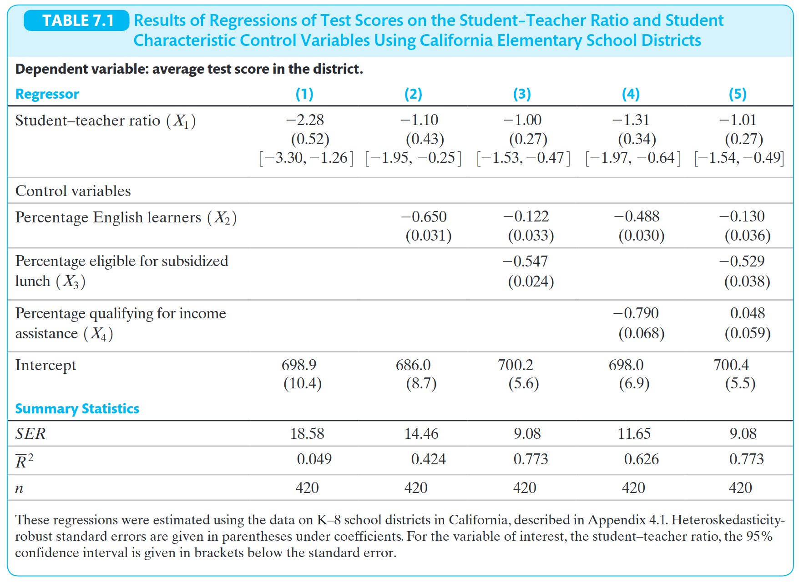

## Introdução

A ideia para aula prática de hoje será reproduzir a Tabela 7.1 do livro de Stock e Watson reproduzida abaixo.

Observação: Na 1^a^ edição do livro é a tabela 5.2.

## Descrição atividade

1. Fazer download da [base de dados](/labs/SW_Datasets/caschool.xlsx) e do [dicionário de variáveis](/labs/SW_Datasets/californiatestscores.pdf). 

2. Estimar os modelos de regressão apresentados nas colunas 1 a 5 da tabela.

3. Utilizando o pacote `gt` e seu estagiário de IA, prepare a tabela para reportar os resultados. Não se preocupe em fazer exatamente igual a formatação, desde que apresente as informações principais. Não há necessidade de mostrar na tabela o intervalo de confiança, como é feito apenas para variável *student-teacher ratio* no livro.

4. Utilizando a tabela e interpretando os resultados apresentados, responda às seguintes perguntas:

    a. Qual especificação do modelo você julga ser a mais apropariada? 
    
    b. Utilizando a especificação escolhida, qual o impacto de reduzir o tamanho médio das turmas em 1 aluno. Interprete o valor do coeficiente e também discute o resultado em termos de inferência estatística.
    
    c. Existe relação causal entre tamanho das turmas e notas? Caso sua resposta seja sim, explique qual foi a hipótese de identificação que você utilizou. Se não, diga qual hipótese o modelo não atende e por que ela não seria atendida. 
    
    d. Imagine que você seja prefeito de uma cidade no Brasil. Seu secretário de educação te apresenta os resultados desse estudo utilizando os dados da Califórnia e sugere que vocês tentem reduzir o tamanho médio das turmas no município com o intuito de melhorar o desempenho escolar. O que você acharia dessa proposta? Justifique.