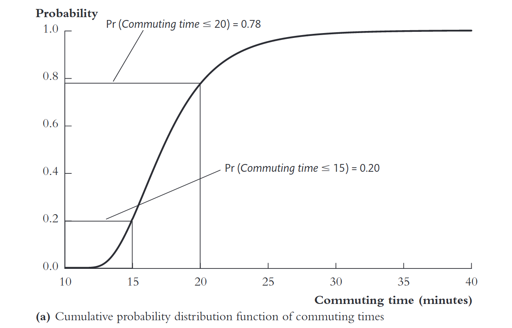
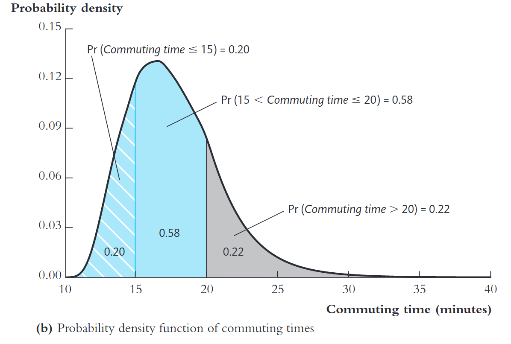
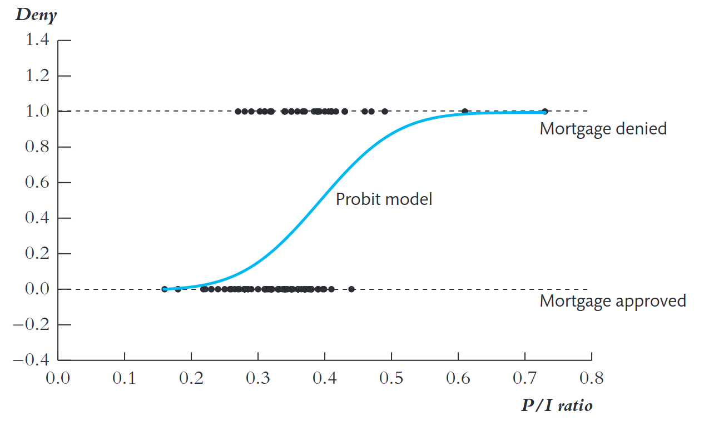
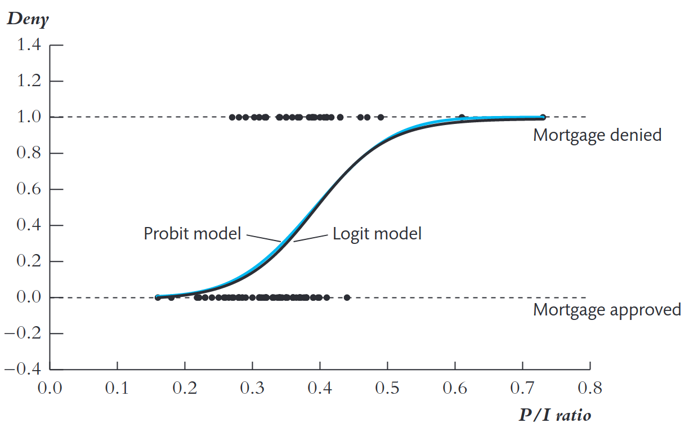
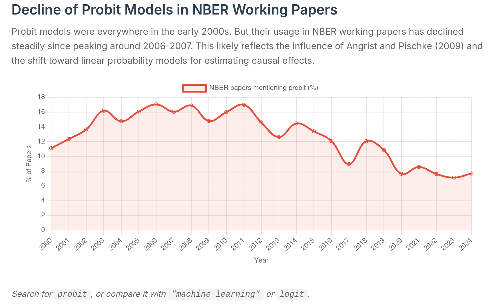

```{r setup, include=FALSE, eval=TRUE}
library(ggplot2)
library(broom)
library(dplyr)
library(tidyr)
library(ggdag)
library(ggraph)
options(digits=5)
```

## Objetivos de aprendizado

Nesta aula, formalizamos como utilizar regressões quando a variável dependente é binária.

<br>

Ao final, o aluno deverá ser capaz de:

-   entender intuitivamente os modelos probit e logit

-   entender as hipóteses de identificação do probit e logit

-   entender como interpretar resultados em um probit e logit

## Referências

::: nonincremental
-   Capítulo 9 @stock_watson_2020 (1a Edição, português)

-   Capítulo 11 @stock_watson_2004 (4a Edição, apenas inglês)

:::

## Introdução aos modelos não lineares

- A ideia é modelar: $$P(Y_i = 1 \mid X_i) = F(\beta_0 + \beta_1 X_i)$$
onde $F(\cdot)$ é uma **função de distribuição acumulada**.

- Assim garantimos que $0 \leq P \leq 1$.

- Duas escolhas principais:
  - $F = \Phi$ (CDF normal padrão): **Probit**
  - $F = \Lambda$ (CDF logística): **Logit**

## Função de Distribuição Acumulada (CDF)

::: {style="font-size: 80%;"}
- Uma CDF descreve a **probabilidade acumulada** de que uma variável aleatória $Z$ seja menor ou igual a um determinado valor $z$:$$F(z) = P(Z \leq z)$$

1. $F(z)$ é **monotonicamente crescente**.
2. $\displaystyle \lim_{z \to -\infty} F(z) = 0$ e $\displaystyle \lim_{z \to +\infty} F(z) = 1$.
3. Para variáveis contínuas, a **densidade** $f(z)$ é a derivada de $F(z)$:$f(z) = \frac{dF(z)}{dz}$
:::

## CDF e PDF: visualização

::: {.columns}
::: {.column width="50%"}

:::

::: {.column width="50%"}

:::
:::

## Modelo Probit

::: {.columns}
::: {.column width="50%"}

::: nonincremental
::: {style="font-size: 70%;"}
$P(Y_i=1|X_i) = \Phi(\beta_0 + \beta_1 P/I_i)$

$\Phi(\cdot)$: CDF normal padrão.

- Para $P/I = 0,2$ → $P(deny =1) \approx 2,1\%$
- Para $P/I = 0,3$ → $P(deny =1) \approx 16,1\%$
- Para $P/I = 0,4$ → $P(deny =1) \approx 51,9\%$
- Para $P/I = 0,6$ → $P(deny =1) \approx 98,3\%$
:::
:::

:::

::: {.column width="50%"}

:::
:::

::: {style="font-size: 70%;"}
Interpretação: A probabilidade aumenta **lentamente para valores baixos** de P/I, **cresce rapidamente** para valores intermediários, e **satura em 1** para valores elevados.
:::

## Modelo Logit

::: {.columns}
::: {.column width="50%"}
::: {style="font-size: 90%;"}
$$
P(Y_i=1|X_i) = \Lambda(\beta_0 + \beta_1 P/I_i)
$$

$\Lambda(\cdot)$: função de distribuição acumulada logística.
:::
:::

::: {.column width="50%"}

:::
:::

::: {style="font-size: 70%;"}
Interpretação: Igual no modelo Probit, a probabilidade aumenta **lentamente para valores baixos** de P/I, **cresce rapidamente** para valores intermediários, e **satura em 1** para valores elevados.
:::

## Interpretação de coeficientes

::: {style="font-size: 80%;"}
- O coeficiente $\beta_1$ representa a diferença no valor de $z$ associada ao aumento de $X_1$ em uma unidade, mantendo as demais variáveis constantes $X_2, \ldots, X_k$.

- Como o modelo é **não linear**, o impacto sobre a probabilidade prevista não é constante.

- Como calcular o efeito marginal aproximado da mudança de um regressor?

    1. Calcular a probabilidade predita para os valores iniciais;
    2. Calcular a probabilidade predita para o novo valor do regressor;
    3. Calcular a diferença entre as duas probabilidades preditas.

- A interpretação depende do ponto da curva: o mesmo incremento em $X_1$ pode gerar **efeitos diferentes** conforme o valor inicial.

:::

## Estimação por Máxima Verossimilhança: intuição

::: {.columns}
::: {.column width="50%"}

:::

::: {.column width="50%"}

:::
:::

## Estimação por Máxima Verossimilhança: formalização

::: {style="font-size: 80%;"}
- Para variáveis binárias, a verossimilhança é:$$L(\beta) = \prod_{i=1}^{n} [P_i]^{Y_i} [1-P_i]^{1-Y_i}$$ com: $P_i = F(\beta_0 + \beta_1 X_i)$

- Maximizamos o logaritmo:$$\ln L(\beta) = \sum_i \left[ Y_i \ln P_i + (1-Y_i)\ln(1-P_i) \right]$$

- Estimação feita numericamente (ex.: algoritmo Newton-Raphson).
:::

## Propriedades do estimador MLE

- **Consistente:** converge para o valor verdadeiro conforme $n \to \infty$.

- **Assintoticamente normal:**$$
  \sqrt{n}(\hat{\beta} - \beta_0) \to N(0, \sigma)
  $$
- **Eficiente:** menor variância assintótica entre estimadores consistentes.

## Erros-padrão e inferência

- Erros-padrão baseados na **matriz de informação de Fisher**:$\hat{V}(\hat{\beta}) = (H^{-1})$
onde $H$ é a matriz Hessiana da log-verossimilhança.

- Intervalos de confiança:$\hat{\beta}_j \pm 1.96 \cdot SE(\hat{\beta}_j)$
  - Testes:
  - $z$-teste individual.
  - Teste de razão de verossimilhança.

## Medidas de ajuste

- O $R^2$ tradicional não é aplicável.

- Usamos o **pseudo-R²** de McFadden:$$R^2_{MF} = 1 - \frac{\ln L_{\text{modelo}}}{\ln L_{\text{nulo}}}$$

- Fração corretamente prevista

## Existe discriminação racial no mercado de crédito imobiliário?

Ver resultados nas [Tabelas](https://raphael-gouvea.github.io/microeconometria_IBM0288/papers/application_boston_mortgage.pdf) do livro.

## Angrist & Pischke: visão prática sobre Y binário

::: {style="font-size: 70%;"}
- **LPM**
  - Útil e suficiente para **inferência causal**;
  - Fácil de **estimar, interpretar e combinar** com VI, efeitos fixos, etc;.
  - Use **erros-padrão robustos**;
  - Previsões fora de $0,1$ não invalidam a **consistência** do efeito médio quando há exogeneidade.

- **Logit/Probit**
  - Impõem probabilidades entre $0,1$, mas **efeitos marginais** geralmente próximos aos do LPM.
  - Escolha da CDF muitas vezes é **secundária**: foco tem que ser no **desenho de pesquisa e na identificação**.

:::

## Guia Prático

::: {.callout-tip}
## Guia Prático
O cerne deve ser a identificação causal. Forma funcional não salva identificação ruim!

**Prática recomendada**: reporte LPM com errros-padrão robustos e, se quiser, logit/probit para mostrar robustez dos resultados.

:::

## Declínio de modelos probit desde Angrist & Pischke

{width="90%"}

::: {style="font-size: 40%;"}
Fonte: [Economics Literature Search](https://paulgp.com/econlit-pipeline/index.html)
:::

## Referências {visibility="uncounted"}

::: {#refs}
:::
