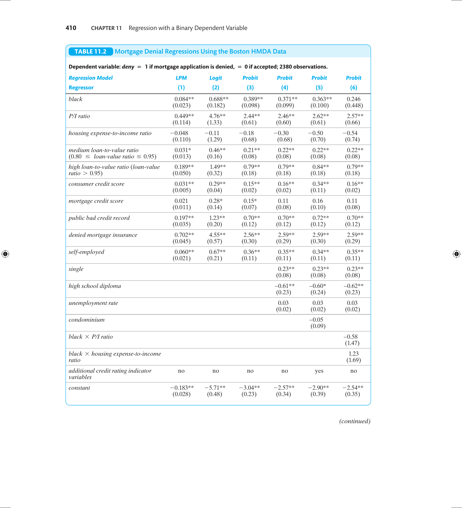

```{r setup, include=FALSE, eval=TRUE}
library(ggplot2)
library(broom)
library(dplyr)
library(tidyr)
library(ggdag)
library(ggraph)
options(digits=5)
```

## Objetivos de aprendizado

Nesta aula, aprofundamos os modelos não lineares para variável dependente binária.

<br>

Ao final, o aluno deverá ser capaz de:

-   entender intuitivamente os modelos probit e logit

-   calcular probabilidades previstas e efeitos marginais no probit e logit

-   compreender a estimação por máxima verossimilhança e suas propriedades

-   entender as hipóteses de identificação e as medidas de ajuste

## Referências

::: nonincremental
-   Capítulo 9 @stock_watson_2020 (1ª Edição, português)

-   Capítulo 11 @stock_watson_2004 (4ª Edição, apenas inglês)

:::

## Introdução aos modelos não lineares

::: {style="font-size: 90%;"}
- A ideia é modelar: $$P(Y_i = 1 \mid X_i) = F(\beta_0 + \beta_1 X_i)$$
onde $F(\cdot)$ é uma **função de distribuição acumulada**.

- [Assim garantimos que $0 \leq P \leq 1$ **por construção**.]{.fragment}

::: {.fragment}
- Duas escolhas principais de $F$:
  - $F = \Phi$ (CDF normal padrão) → **Probit**
  - $F = \Lambda$ (CDF logística) → **Logit**
:::

::: {.fragment}
- O modelo geral com múltiplos regressores é:
$$P(Y_i = 1 \mid X_1, X_2, \ldots, X_k) = F(\beta_0 + \beta_1 X_{1i} + \cdots + \beta_k X_{ki})$$
:::
:::

## Função de Distribuição Acumulada (CDF)

::: {style="font-size: 82%;"}
- Uma CDF descreve a **probabilidade acumulada** de que uma variável aleatória $Z$ seja menor ou igual a um determinado valor $z$:$$F(z) = P(Z \leq z)$$

::: incremental
1. $F(z)$ é **monotonicamente crescente**.
2. $\displaystyle \lim_{z \to -\infty} F(z) = 0$ e $\displaystyle \lim_{z \to +\infty} F(z) = 1$.
3. Para variáveis contínuas, a **densidade** $f(z)$ é a derivada de $F(z)$: $f(z) = \dfrac{dF(z)}{dz}$
:::

::: {.fragment}
→ Essas três propriedades garantem que $F(\beta_0 + \beta_1 X)$ seja sempre uma probabilidade válida em $[0,1]$.
:::
:::

## CDF e PDF: visualização

::: {.columns}
::: {.column width="50%"}

:::

::: {.column width="50%"}

:::
:::

## Modelo Probit

::: {.columns}
::: {.column width="50%"}

::: nonincremental
::: {style="font-size: 70%;"}
$P(Y_i=1|X_i) = \Phi(\beta_0 + \beta_1 P/I_i)$

$\Phi(\cdot)$: CDF normal padrão.

Com $\hat{\beta}_0 = -2{,}19$ e $\hat{\beta}_1 = 2{,}97$ (S&W Eq. 11.7):

- Para $P/I = 0{,}2$: $z = -2{,}19 + 2{,}97(0{,}2) = -1{,}60$ → $P \approx 5{,}5\%$
- Para $P/I = 0{,}3$: $z = -2{,}19 + 2{,}97(0{,}3) = -1{,}30$ → $P \approx 9{,}7\%$
- Para $P/I = 0{,}4$: $z = -2{,}19 + 2{,}97(0{,}4) = -1{,}00$ → $P \approx 15{,}9\%$
- Para $P/I = 0{,}6$: $z = -2{,}19 + 2{,}97(0{,}6) = -0{,}40$ → $P \approx 34{,}5\%$
:::
:::

:::

::: {.column width="50%"}

:::
:::

::: {style="font-size: 68%;"}
A probabilidade cresce **lentamente** para $P/I$ baixo, **rapidamente** para valores intermediários, e **satura em 1** para valores elevados — curva em "S".
:::

## Probit: Exemplo Numérico Detalhado

::: {style="font-size: 84%;"}

::: {.callout-tip}
## Conceito-chave 11.2 (S&W) — Modelo Probit e Probabilidades Previstas
O modelo probit com múltiplos regressores é:
$$Pr(Y=1 \mid X_1, X_2) = \Phi(\beta_0 + \beta_1 X_1 + \beta_2 X_2)$$
O efeito de uma mudança em $X_j$ é **calculado por diferença** de probabilidades previstas — não diretamente pelo coeficiente.
:::

::: {.fragment}
**Exemplo (S&W Eq. 11.8):** probit com P/I e raça:

$$\widehat{Pr}(deny=1) = \Phi(\underset{(0{,}16)}{-2{,}26} + \underset{(0{,}44)}{2{,}74}\;P/I + \underset{(0{,}083)}{0{,}71}\;black)$$

Para **branco** com P/I = 0,30: $z = -2{,}26 + 2{,}74(0{,}30) + 0{,}71(0) = -1{,}44$ → $\Phi(-1{,}44) = 7{,}5\%$

Para **preto** com P/I = 0,30: $z = -1{,}44 + 0{,}71 = -0{,}73$ → $\Phi(-0{,}73) = 23{,}3\%$

→ **Diferença: 15,8 p.p.** (efeito racial controlando por P/I)
:::
:::

## Modelo Logit

::: {.columns}
::: {.column width="50%"}
::: {style="font-size: 84%;"}
$$
P(Y_i=1|X_i) = \Lambda(\beta_0 + \beta_1 P/I_i)
$$

A CDF logística tem forma **fechada**:
$$\Lambda(z) = \frac{1}{1 + e^{-z}}$$

::: {.fragment}
→ Vantagem: não precisa de tabela de distribuição normal. O cálculo é direto.

→ Desvantagem: coeficientes ligeiramente diferentes do Probit (escala diferente), mas **probabilidades previstas muito similares**.
:::
:::
:::

::: {.column width="50%"}

:::
:::

::: {style="font-size: 68%;"}
Padrão idêntico ao Probit: a curva logística também respeita o intervalo $[0,1]$ e tem formato em "S".
:::

## Logit: Exemplo Numérico

::: {style="font-size: 84%;"}

::: {.callout-tip}
## Conceito-chave 11.3 (S&W) — Modelo Logit
$$Pr(Y=1 \mid X_1, \ldots, X_k) = \frac{1}{1+e^{-(\beta_0 + \beta_1 X_1 + \cdots + \beta_k X_k)}}$$
:::

::: {.fragment}
**Exemplo (S&W Eq. 11.10):** logit com P/I e raça:

$$\widehat{Pr}(deny=1) = \frac{1}{1+e^{-(-4{,}13 + 5{,}37\;P/I + 1{,}27\;black)}}$$

Para **branco** com P/I = 0,30: $z = -4{,}13 + 5{,}37(0{,}30) = -2{,}52$ → $\Lambda(-2{,}52) = \dfrac{1}{1+e^{2{,}52}} = 7{,}4\%$

Para **preto** com P/I = 0,30: $z = -2{,}52 + 1{,}27 = -1{,}25$ → $\Lambda(-1{,}25) = \dfrac{1}{1+e^{1{,}25}} = 22{,}3\%$

→ **Diferença: 14,9 p.p.** — resultado muito próximo ao Probit (15,8 p.p.)
:::
:::

## Interpretação de coeficientes

::: {style="font-size: 82%;"}
- O coeficiente $\beta_j$ representa a **variação no índice $z$** associada ao aumento de $X_j$ em uma unidade, mantendo os demais regressores constantes.

- [Como o modelo é **não linear**, o impacto sobre a probabilidade prevista **não é constante**.]{.fragment}

::: {.fragment}
**Como calcular o efeito marginal:**

::: incremental
1. Calcular a probabilidade predita para os valores **iniciais** dos regressores.
2. Calcular a probabilidade predita para o **novo valor** do regressor de interesse.
3. Calcular a **diferença** entre as duas probabilidades preditas.
:::
:::

::: {.fragment}
→ O mesmo incremento em $X_j$ pode gerar **efeitos diferentes** conforme o ponto da curva.
:::
:::

## Efeitos Marginais: Exemplo Numérico

::: {style="font-size: 83%;"}
Com o modelo probit simples (S&W Eq. 11.7): $\hat{z} = -2{,}19 + 2{,}97 \cdot P/I$

| Mudança em P/I | $\hat{P}$ inicial | $\hat{P}$ final | Efeito marginal |
|----------------|-------------------|-----------------|-----------------|
| 0,30 → 0,40 | $\Phi(-1{,}30) = 9{,}7\%$ | $\Phi(-1{,}00) = 15{,}9\%$ | **+6,2 p.p.** |
| 0,40 → 0,50 | $\Phi(-1{,}00) = 15{,}9\%$ | $\Phi(-0{,}71) = 23{,}9\%$ | **+8,0 p.p.** |
| 0,50 → 0,60 | $\Phi(-0{,}71) = 23{,}9\%$ | $\Phi(-0{,}41) = 34{,}1\%$ | **+10,2 p.p.** |

::: {.fragment}
- O mesmo incremento de $0{,}1$ em P/I produz efeitos **crescentes** ao longo da curva.
- Isso reflete a **não linearidade** do Probit: na região central da curva, o efeito é maior.
- No LPM, o efeito seria constante em todos os pontos ($0{,}604 \times 0{,}1 = 6{,}0$ p.p.).
:::
:::

## Por que não usar MQO para estimar Probit/Logit?

::: {style="font-size: 86%;"}
No MQO, minimizamos $\sum_i (Y_i - \hat{Y}_i)^2$ onde $\hat{Y}_i = \hat{\beta}_0 + \hat{\beta}_1 X_i$ — modelo **linear nos parâmetros**.

::: {.fragment}
No Probit/Logit, o modelo é:
$$P(Y_i=1|X_i) = F(\beta_0 + \beta_1 X_i)$$
onde $F$ é uma função não linear. Os parâmetros $\beta$ entram de forma **não linear** na equação.
:::

::: {.fragment}
**Consequências:**

- O MQO não possui fórmula fechada para $\hat{\beta}$ — o problema não tem solução analítica simples.
- O MQO seria **ineficiente**: não aproveita a estrutura probabilística do modelo.
- Alternativa: **Mínimos Quadrados Não Lineares** (MQNL) — consistente, mas não eficiente.
- **Solução preferida: Máxima Verossimilhança (MV)** — consistente, assintoticamente normal e eficiente.
:::
:::

## Estimação por Máxima Verossimilhança: intuição

::: {.columns}
::: {.column width="50%"}

:::

::: {.column width="50%"}

:::
:::

## MV: intuição simples

::: {style="font-size: 86%;"}
**Ideia central:** escolher os parâmetros $\beta$ que tornam os **dados observados mais prováveis**.

::: {.fragment}
Para cada observação $i$:

- Se $Y_i = 1$: queremos que $\hat{P}_i$ seja **grande** → contribuição $\hat{P}_i$ para a verossimilhança.
- Se $Y_i = 0$: queremos que $\hat{P}_i$ seja **pequena** → contribuição $(1 - \hat{P}_i)$.

Exemplo numérico:

| $i$ | $Y_i$ | $\hat{P}_i$ | Contribuição |
|-----|--------|-------------|--------------|
| 1 | 1 | 0,80 | 0,80 |
| 2 | 0 | 0,30 | 0,70 |
| 3 | 1 | 0,65 | 0,65 |
:::

::: {.fragment}
A verossimilhança conjunta é o **produto**: $L = 0{,}80 \times 0{,}70 \times 0{,}65 = 0{,}364$.

MV escolhe $\beta$ para **maximizar** esse produto (ou, equivalentemente, a log-verossimilhança).
:::
:::

## Estimação por Máxima Verossimilhança: formalização

::: r-stack

::: {style="font-size: 82%;"}
**Verossimilhança (Likelihood Function):**

Para variáveis binárias, a verossimilhança conjunta é:
$$L(\beta) = \prod_{i=1}^{n} P_i^{Y_i} (1-P_i)^{1-Y_i}$$
com $P_i = F(\beta_0 + \beta_1 X_{1i} + \cdots + \beta_k X_{ki})$.

O MLE escolhe $\beta$ que **maximiza** a probabilidade de observar os dados.
:::

::: {.fragment style="font-size: 82%;"}
**Log-verossimilhança (mais tratável matematicamente):**

$$\ln L(\beta) = \sum_{i=1}^{n} \left[ Y_i \ln P_i + (1-Y_i)\ln(1-P_i) \right]$$

<br>

Maximizar $L$ ou $\ln L$ produz o **mesmo estimador** (log é uma transformação monotônica).

Estimação feita **numericamente** (ex.: algoritmo Newton-Raphson). Softwares como R fazem isso automaticamente.
:::

:::

## Propriedades do estimador MLE

::: {style="font-size: 90%;"}
::: incremental
- **Consistente:** converge para o valor verdadeiro conforme $n \to \infty$.

- **Assintoticamente normal:**
  $$\sqrt{n}(\hat{\beta} - \beta_0) \xrightarrow{d} N(0, \sigma^2)$$

- **Eficiente:** menor variância assintótica entre estimadores consistentes (limite de Cramér-Rao).
:::

::: {.fragment}
→ Para amostras grandes (como na maioria das aplicações econométricas), o MLE fornece inferência confiável via estatísticas $z$ e intervalos de confiança assintóticos.
:::
:::

## Erros-padrão e inferência no Probit/Logit

::: {style="font-size: 85%;"}
- Erros-padrão baseados na **matriz de informação de Fisher**:
$$\hat{V}(\hat{\beta}) = \mathbf{H}^{-1}$$
onde $\mathbf{H}$ é a matriz Hessiana da log-verossimilhança avaliada em $\hat{\beta}$. Calculado automaticamente pelo software.

::: {.fragment}
**Intervalos de confiança** (assintóticos):
$$\hat{\beta}_j \pm 1{,}96 \cdot SE(\hat{\beta}_j)$$
:::

::: {.fragment}
**Testes de hipótese:**

| Teste | Hipótese | Estatística |
|-------|----------|-------------|
| Teste $z$ individual | $H_0: \beta_j = 0$ | $z = \hat{\beta}_j / SE(\hat{\beta}_j) \sim N(0,1)$ |
| Teste de Razão de Verossimilhança | $H_0$: restrição conjunta | $TRV = -2[\ln L_{\text{restrito}} - \ln L_{\text{irrestrito}}] \sim \chi^2_q$ |
:::
:::

## Medidas de ajuste

::: {style="font-size: 85%;"}
- O $R^2$ tradicional **não é aplicável** quando $Y$ é binária.

::: {.fragment}
- **Pseudo-$R^2$ de McFadden:**
$$R^2_{MF} = 1 - \frac{\ln L_{\text{modelo}}}{\ln L_{\text{nulo}}}$$
onde $L_{\text{nulo}}$ é a verossimilhança do modelo sem regressores (apenas constante).

→ Quanto mais próximo de 1, melhor o ajuste. **Valores acima de 0,20 são considerados bons.**
:::

::: {.fragment}
- **Fração corretamente prevista:** proporção de observações preditas corretamente:
  - $\hat{P}_i \geq 0{,}5$ e $Y_i = 1$ → corretamente previsto
  - $\hat{P}_i < 0{,}5$ e $Y_i = 0$ → corretamente previsto

  **Limitação:** não distingue confiança — $\hat{P} = 0{,}51$ e $\hat{P} = 0{,}99$ contam igualmente como "acerto".
:::
:::

## Pseudo-$R^2$: interpretação e cálculo

::: {style="font-size: 84%;"}
**O que é o modelo nulo?**

O modelo nulo (sem regressores) prevê para todos os $i$ a mesma probabilidade: $\hat{P}_i = \bar{Y}$ (proporção amostral de $Y=1$). Log-verossimilhança nula:
$$\ln L_{\text{nulo}} = n[\bar{Y}\ln\bar{Y} + (1-\bar{Y})\ln(1-\bar{Y})]$$

::: {.fragment}
**Exemplo (dados HMDA):** $\bar{Y} = 0{,}12$ (12% de negações).

$\ln L_{\text{nulo}} \approx 2380[0{,}12\ln(0{,}12) + 0{,}88\ln(0{,}88)] \approx 2380(-0{,}367) \approx -873$

Se o modelo com regressores obtém $\ln L_{\text{modelo}} \approx -500$:

$$R^2_{MF} = 1 - \frac{-500}{-873} = 1 - 0{,}573 = 0{,}427$$

→ Pseudo-$R^2$ de 0,43 indica bom ajuste.
:::

::: {.fragment}
**Atenção:** pseudo-$R^2$ não pode ser comparado ao $R^2$ do MQO — são métricas em escalas diferentes.
:::
:::

## Identificação: os mesmos problemas do LPM se aplicam

::: {style="font-size: 86%;"}
::: {.callout-important}
## Identificação no Probit/Logit
Os modelos Probit e Logit estão sujeitos aos **mesmos problemas de identificação** que o LPM: viés de variável omitida, viés de seleção e erro de medida.

A forma funcional não linear **não resolve** problemas de identificação.
:::

::: {.fragment}
- **Viés de variável omitida:** se $X_j$ é correlacionado com o erro, $\hat{\beta}_j$ é inconsistente — exatamente como no MQO.
- **Seleção da amostra:** se a amostra não é representativa da população de interesse, inferências externas são inválidas.
- **Erro de medida:** variáveis medidas com erro atenuam os coeficientes (atenuação) — igual ao MQO.
:::

::: {.fragment}
→ **Conclusão:** a escolha de $F$ (Probit vs. Logit) é **secundária**. O que importa é a qualidade da estratégia de identificação causal.
:::
:::

## Probit vs. Logit: diferenças práticas

::: {style="font-size: 86%;"}

| Característica | Probit | Logit |
|----------------|--------|-------|
| CDF utilizada | Normal padrão $\Phi$ | Logística $\Lambda$ |
| Fórmula fechada? | Não (tabela $\Phi$) | Sim: $\frac{1}{1+e^{-z}}$ |
| Coeficientes | Menores | Maiores ($\approx 1{,}6\times$) |
| Probabilidades previstas | Praticamente idênticas | Praticamente idênticas |
| Uso em publicações | Em declínio | Predominante |
| Preferência computacional | Menos eficiente | Mais eficiente |

::: {.fragment}
**Por que os coeficientes diferem?**

A variância da distribuição logística é $\pi^2/3 \approx 3{,}29$, enquanto a da normal padrão é $1$. A razão dos desvios-padrão é $\sqrt{3{,}29} \approx 1{,}81$. Na prática, usa-se a regra de bolso de Amemiya (1981): coeficientes do logit $\approx 1{,}6 \times$ coeficientes do probit.

→ Mas as **probabilidades previstas são quase idênticas** — o que importa para interpretação.
:::
:::

## Discriminação racial: resultados (LPM, Logit, Probit)

{width="78%" fig-align="center"}

::: {style="font-size: 65%;"}
Fonte: @stock_watson_2004, Table 11.2. Variável dependente: *deny* = 1 se hipoteca negada. $n = 2380$.
:::

## Discriminação racial: interpretação dos resultados

::: {style="font-size: 82%;"}
- Em **todas as especificações**, raça tem efeito estatisticamente significativo na probabilidade de negação (nível 1%).

::: {.fragment}
- **Diferença estimada** (colunas 1–3, candidato com P/I = 0,30):

| Modelo | Diferença preto $-$ branco | Significância |
|--------|---------------------------|---------------|
| LPM | +8,4 p.p. | $t = 3{,}65$ |
| Logit | +6,0 p.p. | $z = 4{,}59$ |
| Probit | +7,1 p.p. | $z = 4{,}69$ |
:::

::: {.fragment}
- Os três modelos chegam a **conclusões qualitativas semelhantes**.
- O resultado é **robusto** a diferentes especificações (colunas 3–6).
:::

::: {.fragment}
::: {.callout-important}
## Conclusão
Evidência estatística de discriminação racial no mercado de crédito imobiliário de Boston (1990), controlando por características financeiras legítimas dos solicitantes.
:::
:::
:::

## Robustez das estimativas

::: {style="font-size: 84%;"}
A Tabela 11.2 (colunas 4–6) acrescenta controles adicionais: estado civil, diploma de ensino médio, taxa de desemprego na indústria do solicitante e tipo de imóvel.

::: {.fragment}
**Resultado principal:**

| Especificação | Coef. *black* (LPM) | Significância |
|---------------|---------------------|---------------|
| Só P/I + raça | +17,7 p.p. | $t = 7{,}11$ |
| + controles financeiros | +8,4 p.p. | $t = 3{,}65$ |
| + controles adicionais | +7,1 p.p. | $t \approx 3{,}0$ |
| + interações | +6,5 p.p. | $t \approx 2{,}8$ |
:::

::: {.fragment}
- O coeficiente cai com o acréscimo de controles, mas nunca se torna estatisticamente insignificante.
- **Interpretação:** o viés de variável omitida nos modelos mais simples era moderado — os controles adicionais explicam parte do diferencial, mas não toda.
:::
:::

## Angrist & Pischke: visão prática sobre $Y$ binário

::: {style="font-size: 78%;"}
**LPM**

::: {.fragment}
- Útil e suficiente para **inferência causal**;
- Fácil de **estimar, interpretar e combinar** com VI, efeitos fixos, etc.;
- Use **erros-padrão robustos**;
- Previsões fora de $[0,1]$ não invalidam a **consistência** do efeito médio quando há exogeneidade.
:::

::: {.fragment}
**Logit/Probit**

- Impõem probabilidades entre $[0,1]$, mas **efeitos marginais** geralmente próximos aos do LPM.
- Escolha da CDF muitas vezes é **secundária**: foco tem que ser no **desenho de pesquisa e na identificação**.
:::

:::

## Guia Prático

::: {.callout-tip}
## Guia Prático
O cerne deve ser a **identificação causal**. Forma funcional não salva identificação ruim!

**Prática recomendada**: reporte LPM com erros-padrão robustos e, se quiser, logit/probit para mostrar robustez dos resultados.

:::

## Resumo: qual modelo usar?

::: {style="font-size: 84%;"}

::: incremental
1. **A identificação causal é sólida?** Se não, nenhum modelo ajuda. Resolva a identificação primeiro.

2. **Reporte sempre o LPM** com erros-padrão robustos. Coeficientes são diretamente interpretáveis em pontos percentuais.

3. **Adicione Probit ou Logit** como verificação de robustez. Se as conclusões forem similares, a forma funcional não é o problema.

4. **Use Probit/Logit como modelo principal** quando:
   - Probabilidades previstas próximas de 0 ou 1.
   - O objetivo é previsão individual, não identificação de efeito causal.

5. **Entre Probit e Logit:** prefira Logit por simplicidade computacional. Resultados serão praticamente idênticos.
:::

::: {.fragment}
::: {.callout-important}
## Regra de ouro
Identificação $>$ Forma funcional. Três modelos com a mesma identificação fraca são três modelos fracos.
:::
:::
:::

## Declínio de modelos probit desde Angrist & Pischke

{width="90%"}

::: {style="font-size: 60%;"}
Fonte: [Economics Literature Search](https://paulgp.com/econlit-pipeline/index.html)
:::

## Referências {visibility="uncounted"}

::: {#refs}
:::
