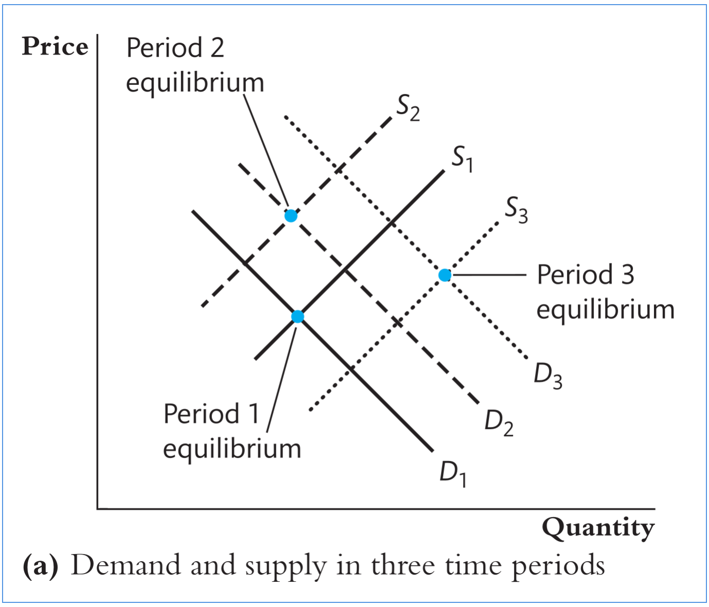
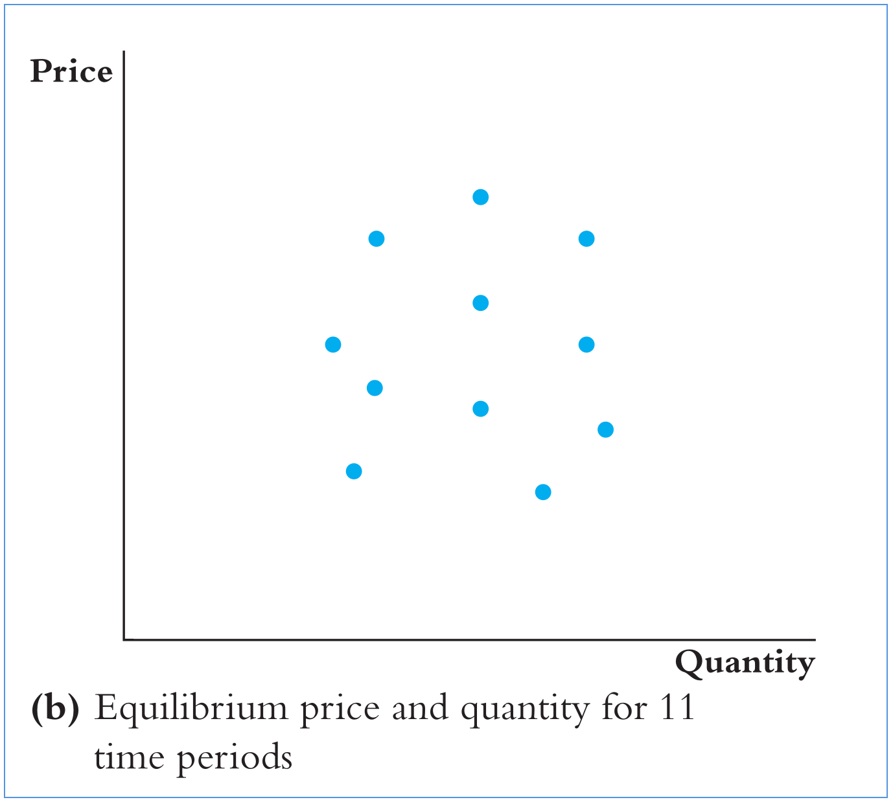
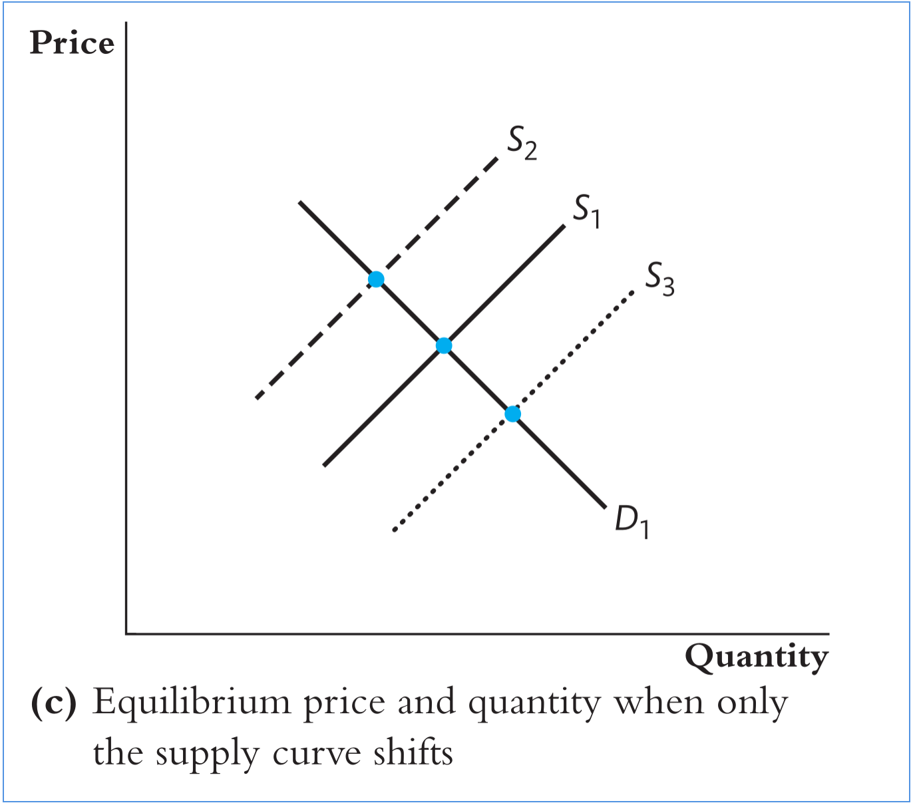

```{r setup, include=FALSE, eval=TRUE}
library(ggplot2)
library(broom)
library(dplyr)
library(tidyr)
library(ggdag)
library(ggraph)
options(digits=5)
```

## Objetivos de aprendizado

Nesta aula, formalizamos como utilizar o estimador de variáveis instrumentais para realizar inferência causal.

<br>

Ao final, o aluno deverá ser capaz de:

-   entender o problema de identificação

-   entender o método de variáveis instrumentais de MQ2E

-   entender como as hipóteses para inferência causal

## Referências

::: nonincremental
-   Capítulo 10 @stock_watson_2020 (1a Edição, português)

-   Capítulo 12 @stock_watson_2004 (4a Edição, apenas inglês)

:::

## O Problema de Philip Wright

::: {style="font-size: 70%;"}

- Philip Wright se preocupava com um tema central de sua época: como definir uma **tarifa de importação**. Para entender o efeito econômico de uma tarifa, era crucial obter **estimativas** das curvas de demanda e de oferta dos bens.
- Considere o problema de estimar a **elasticidade da demanda por manteiga** a partir da equação de demanda: $$\ln(Q_i^{\text{butter}}) = \beta_0 + \beta_1 \ln(P_i^{\text{butter}}) + u_i$$
  onde $Q_i^{\text{butter}}$ é a $i$-ésima observação do **consumo de manteiga**, $P_i^{\text{butter}}$ é o seu **preço**, e $u_i$ agrega outros fatores que afetam a demanda (renda, gostos, etc.).
- O coeficiente $\beta_1$ mensura a **elasticidade** de $Q$ em relação a $P$.
- Devido às **interações entre oferta e demanda**, o regressor $\ln(P_i^{\text{butter}})$ tende a ser **correlacionado** com o erro $u_i$ (endogeneidade).

:::

## Identificação em um modelo de oferta e demanda

::: columns
::: {.column width="50%"}

:::

::: {.column width="50%"}

::: {style="font-size: 70%;"}
- No ano $1$, as curvas são $D_1$ (demanda) e $S_1$ (oferta). O preço e a quantidade de equilíbrio do período são dados por sua **interseção**.
- No ano $2$, a demanda sobe $D_1 \to D_2$ e a oferta cai $S_1 \to S_2$. O novo equilíbrio é determinado pela nova interseção.
- No ano $3$, a demanda sobe novamente $D_3$ e a oferta sobe $S_3$. Um novo preço e quantidade de equilíbrio são determinados.
- Como os pontos são gerados por **mudanças simultâneas** em demanda **e** oferta, **não** é possível identificar isoladamente nenhuma das duas curvas a partir deles.
:::

:::
:::

## Identificação em um modelo de oferta e demanda (cont.)

::: columns
::: {.column width="50%"}
{width="90%"}

::: {style="font-size: 60%;"}
Considere o gráfico de dispersão de $(P,Q)$ de equilíbrio: ajustar uma reta **não** estima a curva de demanda **nem** a de oferta!
:::
:::

::: {.column width="50%"}
{width="90%"}

::: {style="font-size: 60%;"}
Para identificar a **demanda**, precisaríamos **fixar a oferta**; e vice-versa, para identificar a **oferta**, precisaríamos fixar a demanda.

:::
:::
:::

## O Problema de Philip Wright: (VI)

::: {style="font-size: 70%;"}

- Wright mostrou que precisamos de uma **terceira variável** — a **variável instrumental (VI)** — que **desloque a oferta** sem deslocar a demanda.
- A VI deve ser **correlacionada com o preço** (**relevância**).
  - A VI desloca a curva de oferta $\Rightarrow$ altera o preço de equilíbrio.
- A VI deve ser **não correlacionada com o erro** da demanda (**exogeneidade**).
  - A VI **não desloca a demanda** (não afeta diretamente a utilidade/gosto).
- Wright considerou o **clima** (chuvas) como instrumento:
  - **Chuvas abaixo da média** em região leiteira prejudicam a pastagem e **reduzem a produção** de manteiga a um dado preço $\Rightarrow$ deslocam a **oferta para a esquerda** e **elevam o preço** de equilíbrio.
- **Relevância do instrumento:** a chuva na região leiteira afeta **diretamente a oferta** de manteiga e, portanto, o **preço**.
- **Exogeneidade do instrumento:** a chuva na região leiteira **não afeta diretamente a demanda** por manteiga.

:::

## Generalizando: o Problema da Endogeneidade

```{r, include=TRUE, eval=TRUE, echo=FALSE}
node_colors <- tribble(
  ~name, ~`Variável`,
  "X", "Endógena",
  "Y", "Endógena",
  "Z", "Endógena",
  "I", "Exógena",
)

dag <- dagify(Y ~ X + Z,
              X ~ I + Z,
              outcome = "Y",
              exposure = "X") %>%
  tidy_dagitty(layout = "dh", seed = 256)

# Add node types/colors to DAG data
dag$data <- dag$data %>%
  left_join(node_colors, by = "name")

ggplot(data = dag) +
  aes(x = x, y = y, xend = xend, yend = yend) +
  geom_dag_point(size = 10, mapping = aes(color=`Variável`)) +
  geom_dag_edges(start_cap = circle(4, "mm"),
                 end_cap = circle(4, "mm")) +
  geom_dag_text(size = 5) +
  scale_adjusted() +
  theme_void() +
  theme(legend.position = "bottom")
```

## Entendendo as Variáveis Instrumentais

::: columns
::: {.column width="50%"}
::: {style="font-size: 70%;"}
- **X** e **Y** são correlacionadas.
- Existe uma variável de **Z** que satisfaz as condições do **viés de variável omitida**:
  1. Causa $Y$ (está presente no termo de erro $u$);
  2. É correlacionada com $X$.

- Relação causal entre $X$ e $Y$:
  1. $X \rightarrow Y$ (causal, via "porta da frente");
  2. $X \leftarrow Z \rightarrow Y$ (não causal, via "porta dos fundos").

:::
:::

::: {.column width="50%"}
::: {style="font-size: 70%;"}

- Considere a variável **I**, que causa **X**, mas **não** causa diretamente **Y**.

- A variável **I** não possui caminhos de "porta dos fundos" entre ela e $Y$.
  A única forma de chegar a $Y$ a partir de $I$ é **por meio de $X$**:  $I \rightarrow X \rightarrow Y$

- A variável **I** é um **bom instrumento** para $X$ se satisfizer duas condições:
  1. **Condição de relevância:** $I$ explica estatisticamente e de forma significativa $X$;
  2. **Condição de exclusão:** $I$ é não correlacionada com $u$, portanto **não afeta diretamente $Y$**.

:::
:::
:::

## Regressão com Variáveis Instrumentais (VI)

::: {style="font-size: 70%;"}

- **Regressão VI:** método para obter um estimador **consistente** dos coeficientes causais desconhecidos quando o regressor $X$ é **correlacionado** com o erro $u$.
- **Intuição da IV:** separar a variação de $X$ em duas partes:
  1. uma parte **correlacionada** com $u$;
  2. outra parte **não correlacionada** com $u$.
  Se conseguirmos isolar a parte não correlacionada, podemos eliminar a componente de $X$ que gera viés no estimador MQO.
  Essa informação é obtida por meio de **variáveis instrumentais**.
- Seja $\beta_1$ o **efeito causal** de $X$ sobre $Y$:
  $Y_i = \beta_0 + \beta_1 X_i + u_i$
  onde $u_i$ representa fatores omitidos que também determinam $Y_i$.
- Se $X_i$ e $u_i$ forem correlacionados, o estimador MQO será **inconsistente**.
- A estimação por variáveis instrumentais usa uma variável $Z$ para **isolar a parte de $X$** que é **não correlacionada** com $u$.

:::

## Lidando com cor$(X_i, u_i)$

::: {style="font-size: 70%;"}
- **Instrumentos válidos** devem satisfazer duas condições:

1. **Relevância do instrumento:** $cor(Z_i, X_i) \neq 0$
2. **Exogeneidade do instrumento:** $cor(Z_i, u_i) = 0$

- **Relevância:** a variação do instrumento está relacionada à variação do regressor explicativo.
- **Exogeneidade:** a parte da variação explicada pelo instrumento é **exógena** — não correlacionada com fatores não observados.
- **Definições:**
  - **Variável endógena:** correlacionada com o erro.
  - **Variável exógena:** não correlacionada com o erro.

:::

## Estimador de Mínimos Quadrados em Dois Estágios (MQ2E)

::: {style="font-size: 70%;"}

- **Etapa 1**
  A primeira etapa decompõe $X$ em dois componentes:
  - variação de $X$ determinada por $Z$ e, portanto, **exógena e não correlacionada com o erro**;
  - variação de $X$ determinada por outros fatores que não $Z$ e, portanto, **endógena e correlacionada** com o erro.

  $X_i = \underbrace{\pi_0 + \pi_1 Z_i}_{\text{exógena}} + \underbrace{v_i}_{\text{endógena}}$

  onde $\pi_0$ é o intercepto, $\pi_1$ é o coeficiente angular e $v_i$ é o termo de erro.
:::

. . .

::: {style="font-size: 70%;"}
- **Etapa 2**
  A segunda etapa usa a variação **exógena** de $X$ para estimar $\beta_1$.
  Regride-se $Y_i$ sobre o valor previsto $\hat{X}_i = \hat{\pi}_0 + \hat{\pi}_1 Z_i$:

  $Y_i = \beta_0 + \beta_1 \hat{X}_i + u_i$

  Os estimadores obtidos nessa segunda etapa são os estimadores **MQ2E**:
  $\hat{\beta}_0^{\text{MQ2E}}$ e $\hat{\beta}_1^{\text{MQ2E}}$.

:::

## Distribuição Amostral do Estimador MQ2E

::: {style="font-size: 70%;"}
- Para um único regressor $X$ e um único instrumento $Z$, o estimador MQ2E possui uma forma simples.
- O estimador MQ2E de $\beta_1$ é o **quociente** entre a covariância amostral entre $Z$ e $Y$ e a covariância amostral entre $Z$ e $X$:
  $\hat{\beta}_1^{\text{MQ2E}} = \dfrac{s_{ZY}}{s_{ZX}}$
- Em amostras grandes, $\hat{\beta}_1^{\text{MQ2E}}$ é **consistente** e **assintoticamente normal**:
  $\hat{\beta}_1^{\text{MQ2E}} \xrightarrow{p} \beta_1$
  $\hat{\beta}_1^{\text{MQ2E}} \sim \mathcal{N}(\beta_1, \sigma_{\hat{\beta}_1^{\text{MQ2E}}}^2)$
  $\sigma_{\hat{\beta}_1^{\text{MQ2E}}}^2 = \dfrac{1}{n} \dfrac{\operatorname{Var}[(Z_i - \mu_Z)u_i]}{[\operatorname{Cov}(Z_i, X_i)]^2}$
- Como $\hat{\beta}_1^{\text{MQ2E}}$ é **normalmente distribuído** em grandes amostras, testes de hipótese sobre $\beta_1$ podem ser realizados utilizando a **estatística $t$**.
:::

## A Demanda por Cigarros

::: {style="font-size: 70%;"}

- Usamos o **método MQ2E** (*Two-Stage Least Squares*) para estimar a **elasticidade-preço da demanda por cigarros**, utilizando dados anuais dos **48 estados contíguos dos EUA**, de **1985 a 1995**.
- **Variável dependente (Regressanda):** $Q^{\text{cigarettes}}$ — número de maços de cigarros vendidos **per capita** em cada estado.
- **Regressor:** $P^{\text{cigarettes}}$ — preço médio **real** por maço de cigarros (incluindo todos os impostos).
- **Instrumento:** $\text{SalesTax}$ — parcela do imposto sobre cigarros correspondente ao **imposto sobre vendas** geral, em dólares reais por maço.
- **Relevância do instrumento:** um imposto sobre vendas mais alto **aumenta** o preço final pago pelo consumidor.
- **Exogeneidade do instrumento:** o imposto sobre vendas afeta a demanda por cigarros **apenas indiretamente**, via preço, pois varia entre estados **por razões políticas**, não por fatores ligados à demanda.

:::

## A Demanda por Cigarros – MQ2E

::: {style="font-size: 70%;"}

**Primeira etapa:** estimação do preço em função do imposto sobre vendas$$\widehat{\ln(P^{\text{cigarettes}})} = 4{,}62 \,(0{,}03) + 0{,}031 \,(0{,}005)\,\text{SalesTax}$$

- $\bar{R}^2 = 0{,}47$
- **Impostos mais altos** estão associados a **preços mais altos**.
- A variação do imposto explica **47%** da variância dos preços entre estados.

:::

. . .

::: {style="font-size: 70%;"}
**Segunda etapa:** estimação da demanda de cigarros utilizando o preço previsto $$\widehat{\ln(Q^{\text{cigarettes}})} = 9{,}72 \,(1{,}53) - 1{,}08 \,(0{,}32)\, \widehat{\ln(P^{\text{cigarettes}})}$$

- Um **aumento de 1% no preço** reduz o consumo em **1,08%**.
- Isso sugere que a **demanda é elástica**, embora possam existir **variáveis omitidas** (como **renda**) que também influenciam o consumo.

:::

## O modelo geral de variáveis instrumentais

::: {style="font-size: 70%;"}
O modelo geral de regressão IV é dado por:$$Y_i = \beta_0 + \beta_1 X_{1i} + \ldots + \beta_k X_{ki} + \beta_{k+1} W_{1i} + \ldots + \beta_{k+r} W_{ri} + u_i$$

- $Y_i$: variável dependente.
- $X_{1i}, \ldots, X_{ki}$: $k$ regressores **endógenos**, potencialmente correlacionados com $u_i$.
- $W_{1i}, \ldots, W_{ri}$: $r$ regressores **exógenos**, não correlacionados com $u_i$ (controles).
- $u_i$: termo de erro, que captura erros de medição e/ou fatores omitidos.
- $Z_{1i}, \ldots, Z_{mi}$: $m$ variáveis instrumentais.

- A identificação dos coeficientes depende da relação entre o número de instrumentos ($m$) e o número de regressores endógenos ($k$):

  - **Sobreidentificado:** $m > k$
  - **Identificação exata:** $m = k$
  - **Subidentificado:** $m < k$

- A estimação do modelo IV requer **identificação exata** ou **sobreidentificação**.
:::

## O MQ2E do modelo geral

::: {style="font-size: 80%;"}
**Primeira Etapa:** Regrida cada uma das $k$ variáveis **endógenas** $X_{1i}, \ldots, X_{ki}$ sobre:
  - as $m$ variáveis **instrumentais** $Z_{1i}, \ldots, Z_{mi}$; e
  - as $r$ variáveis **exógenas** de controle $W_{1i}, \ldots, W_{ri}$.

Obtenha os $k$ valores ajustados $\hat{X}_{1i}, \ldots, \hat{X}_{ki}$.
:::

. . .

::: {style="font-size: 80%;"}
**Segunda Etapa:** Regrida a variável explicada $Y_i$ sobre:
  - os $k$ valores ajustados $\hat{X}_{1i}, \ldots, \hat{X}_{ki}$; e
  - as $r$ variáveis **exógenas** de controle $W_{1i}, \ldots, W_{ri}$.

Obtenha os $k + r + 1$ coeficientes estimados $\hat{\beta}_0^{\text{MQ2E}}, \ldots, \hat{\beta}_{k+r}^{\text{MQ2E}}$.
:::

. . .

::: {style="font-size: 80%;"}
- Cada variável **endógena** requer sua **própria regressão de primeira etapa**.

- Ambas as regressões são normalmente estimadas por **MQO**, incluindo o intercepto.
:::

## Duas Condições para Instrumentos Válidos

::: {style="font-size: 80%;"}
*O estimador MQ2E é consistente e possui distribuição amostral normal em grandes amostras **se** forem satisfeitas as duas condições abaixo:*

1. **Relevância do Instrumento**
   - Seja $\hat{X}_{1i}$ o valor ajustado da regressão de $X_{1i}$ sobre os instrumentos ($Z$) e as variáveis exógenas incluídas ($W$): $\hat{X}_{1i}, \ldots, \hat{X}_{ki}, W_{1i}, \ldots, W_{ri}, 1$ **não são perfeitamente multicolineares**,
     onde $1$ representa o intercepto.

2. **Exogeneidade do Instrumento**
   - Os instrumentos são **não correlacionados** com o termo de erro:$$cor(Z_{1i}, u_i) = \ldots = cor(Z_{mi}, u_i) = 0$$

:::

## Hipóteses para inferência causal

::: {style="font-size: 70%;"}
- **As variáveis devem satisfazer:**

  1. $\mathbb{E}[u_i \mid W_{1i}, \ldots, W_{ri}] = 0$
  2. $(X_{1i}, \ldots, X_{ki}, W_{1i}, \ldots, W_{ri}, Z_{1i}, \ldots, Z_{mi}, Y_i)$ são **i.i.d.** — amostras independentes e identicamente distribuídas de sua distribuição conjunta.
  3. $X$, $W$, $Z$ e $Y$ possuem **momentos de quarta ordem finitos e não nulos** (ou seja, outliers são improváveis).
  4. Os instrumentos são **válidos**, isto é, satisfazem:
     - **Relevância do instrumento**
     - **Exogeneidade do instrumento**

:::

## Propriedades do estimador MQ2E sob as 4 hipóteses

::: {style="font-size: 80%;"}
- **Estimador:**
  O estimador MQ2E é **consistente** e **assintoticamente normal** em grandes amostras.

- **Inferência:**
  Os testes de hipótese e intervalos de confiança são **válidos** sob esses pressupostos.

- **Erros-padrão:**
  Os erros-padrão da **segunda etapa** da regressão **não são corretos**!
  Utilize erros-padrão **robustos à heterocedasticidade**, obtidos em pacotes econométricos especializados.
:::

## A Demanda por Cigarros - modelo geral

::: {style="font-size: 70%;"}
- A regressão IV sofre de **viés por variável omitida**: devemos incluir a **renda** como variável de controle.

- **Um instrumento**: $\text{SalesTax}$
  $\widehat{\ln(Q^{\text{cigarettes}})} = 9{,}43 \,(1{,}26)\; -\; 1{,}14 \,(0{,}37)\,\ln(P^{\text{cigarettes}})\; +\; 0{,}21 \,(0{,}31)\,\ln(\text{Inc})$

- **Dois instrumentos**: $\text{SalesTax}$ e $\text{CigTax}$
  $\widehat{\ln(Q^{\text{cigarettes}})} = 9{,}89 \,(0{,}96)\; -\; 1{,}28 \,(0{,}25)\,\ln(P^{\text{cigarettes}})\; +\; 0{,}28 \,(0{,}25)\,\ln(\text{Inc})$

- O **erro-padrão** associado à elasticidade estimada da demanda é **menor** quando utilizamos **dois instrumentos**.

- Isso ocorre porque a regressão explica **mais da variação no preço dos cigarros**.
:::

## Referências {visibility="uncounted"}

::: {#refs}
:::
