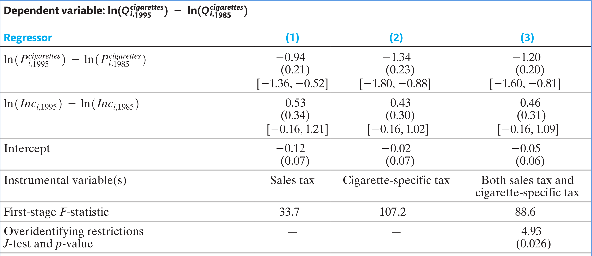
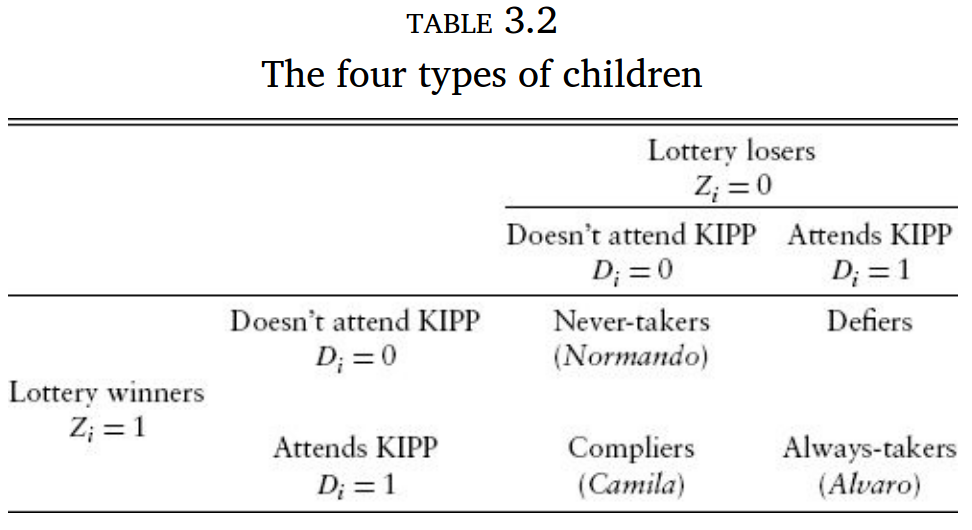
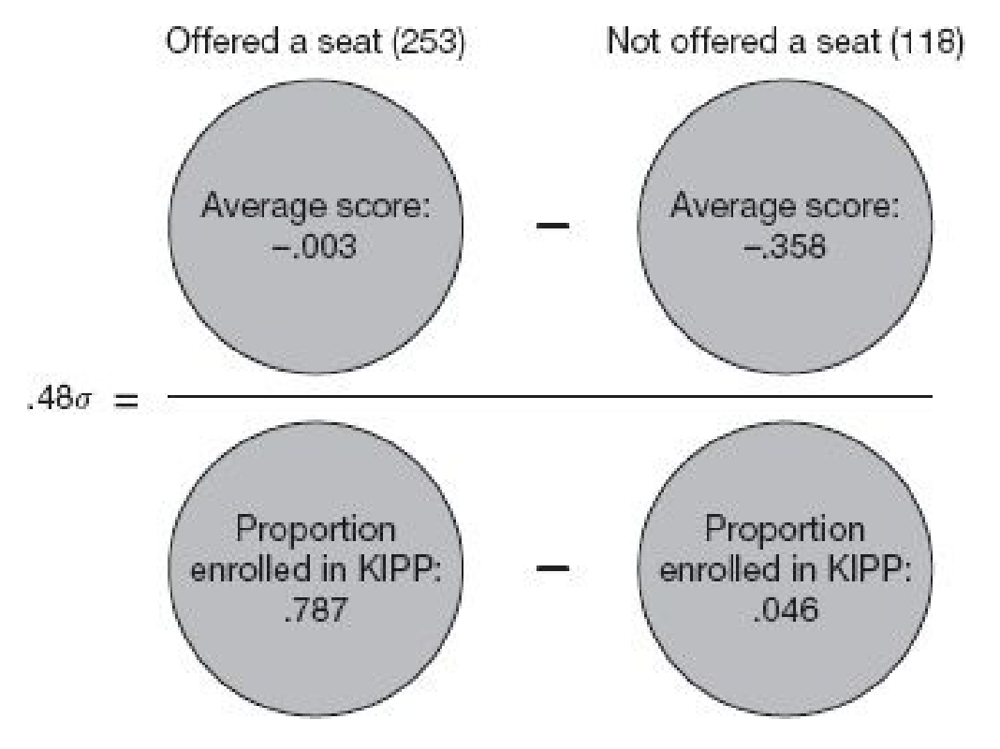

```{r setup, include=FALSE, eval=TRUE}
library(ggplot2)
library(broom)
library(dplyr)
library(tidyr)
library(ggdag)
library(ggraph)
options(digits=5)
```

## Objetivos de aprendizado

Nesta aula, discutimos a validade de instrumentos e efeito médio de tratamento local.

<br>

Ao final, o aluno deverá ser capaz de:

-   entender como testar a validade de instrumentos

-   entender como utilizar variáveis instrumentais

-   entender o efeito médio de tratamento local (LATE)

## Referências

::: nonincremental
-   Capítulo 10 @stock_watson_2020 (1a Edição, português)

-   Capítulo 12 @stock_watson_2004 (4a Edição, apenas inglês)

-   Capítulo 3 de @angrist_mastering_2015

:::

## Lidando com cor$(X_i, u_i)$

::: {style="font-size: 70%;"}
- **Instrumentos válidos** devem satisfazer duas condições:

1. **Relevância do instrumento:** $cor(Z_i, X_i) \neq 0$
2. **Exogeneidade do instrumento:** $cor(Z_i, u_i) = 0$

- **Relevância:** a variação do instrumento está relacionada à variação do regressor explicativo.
- **Exogeneidade:** a parte da variação explicada pelo instrumento é **exógena** — não correlacionada com fatores não observados.
- **Definições:**
  - **Variável endógena:** correlacionada com o erro.
  - **Variável exógena:** não correlacionada com o erro.

:::

## Mínimos Quadrados em Dois Estágios (MQ2E)

::: {style="font-size: 70%;"}

- **Etapa 1**
  A primeira etapa decompõe $X$ em dois componentes:
  - variação de $X$ determinada por $Z$ e, portanto, **exógena e não correlacionada com o erro**;
  - variação de $X$ determinada por outros fatores que não $Z$ e, portanto, **endógena e correlacionada** com o erro.

  $X_i = \underbrace{\pi_0 + \pi_1 Z_i}_{\text{exógena}} + \underbrace{v_i}_{\text{endógena}}$

  onde $\pi_0$ é o intercepto, $\pi_1$ é o coeficiente angular e $v_i$ é o termo de erro.
:::

. . .

::: {style="font-size: 70%;"}
- **Etapa 2**
  A segunda etapa usa a variação **exógena** de $X$ para estimar $\beta_1$.
  Regride-se $Y_i$ sobre o valor previsto $\hat{X}_i = \hat{\pi}_0 + \hat{\pi}_1 Z_i$:

  $Y_i = \beta_0 + \beta_1 \hat{X}_i + u_i$

  Os estimadores obtidos nessa segunda etapa são os estimadores **MQ2E**:
  $\hat{\beta}_0^{\text{MQ2E}}$ e $\hat{\beta}_1^{\text{MQ2E}}$.

:::

## O modelo geral de variáveis instrumentais

::: {style="font-size: 70%;"}
O modelo geral de regressão IV é dado por:$$Y_i = \beta_0 + \beta_1 X_{1i} + \ldots + \beta_k X_{ki} + \beta_{k+1} W_{1i} + \ldots + \beta_{k+r} W_{ri} + u_i$$

- $Y_i$: variável dependente.
- $X_{1i}, \ldots, X_{ki}$: $k$ regressores **endógenos**, potencialmente correlacionados com $u_i$.
- $W_{1i}, \ldots, W_{ri}$: $r$ regressores **exógenos**, não correlacionados com $u_i$ (controles).
- $u_i$: termo de erro, que captura erros de medição e/ou fatores omitidos.
- $Z_{1i}, \ldots, Z_{mi}$: $m$ variáveis instrumentais.

- A identificação dos coeficientes depende da relação entre o número de instrumentos ($m$) e o número de regressores endógenos ($k$):

  - **Sobreidentificado:** $m > k$
  - **Identificação exata:** $m = k$
  - **Subidentificado:** $m < k$

- A estimação do modelo IV requer **identificação exata** ou **sobreidentificação**.
:::

## Hipóteses para inferência causal

::: {style="font-size: 70%;"}
- **As variáveis devem satisfazer:**

  1. $\mathbb{E}[u_i \mid W_{1i}, \ldots, W_{ri}] = 0$
  2. $(X_{1i}, \ldots, X_{ki}, W_{1i}, \ldots, W_{ri}, Z_{1i}, \ldots, Z_{mi}, Y_i)$ são **i.i.d.** — amostras independentes e identicamente distribuídas de sua distribuição conjunta.
  3. $X$, $W$, $Z$ e $Y$ possuem **momentos de quarta ordem finitos e não nulos** (ou seja, outliers são improváveis).
  4. Os instrumentos são **válidos**, isto é, satisfazem:
     - **Relevância do instrumento**
     - **Exogeneidade do instrumento**

:::

## Propriedades do estimador MQ2E sob as 4 hipóteses

::: {style="font-size: 80%;"}
- **Estimador:**
  O estimador MQ2E é **consistente** e **assintoticamente normal** em grandes amostras.

- **Inferência:**
  Os testes de hipótese e intervalos de confiança são **válidos** sob esses pressupostos.

- **Erros-padrão:**
  Os erros-padrão da **segunda etapa** da regressão **não são corretos**!
  Utilize erros-padrão **robustos à heterocedasticidade**, obtidos em pacotes econométricos especializados.
:::

## Verificando a existência de instrumentos fracos

::: {style="font-size: 70%;"}
- **Regra prática para instrumentos fracos:**
  Para um único regressor endógeno, se $F_{\text{etapa-1}} < 10$, o instrumento é considerado **fraco**.

- A estatística $F$ da **primeira etapa** testa a hipótese de que os coeficientes dos instrumentos são **todos iguais a zero** na primeira regressão do MQ2E.

- Se os instrumentos forem fracos, o estimador MQ2E será **viesado mesmo em grandes amostras**. Neste caso, as estatísticas $t$ e os intervalos de confiança não são válidos.

- **O que fazer?**

  - Se houver muitos instrumentos, descarte os **instrumentos mais fracos**.
  - Com instrumentos fracos, os **erros-padrão não são válidos**.
  - Aplique o **teste $J$ de restrições sobreidentificadas**.
  - Tente encontrar **instrumentos mais fortes**.
  - Considere métodos **além do MQ2E**.

:::

## Teste de Sobreidentificação ($J$)

::: {style="font-size: 70%;"}
- Estime, por **MQO**, uma regressão dos **resíduos da estimação MQ2E** ($\hat{u}_i^{\text{MQ2E}}$) sobre os instrumentos ($Z$) e as variáveis exógenas ($W$): $$\hat{u}_i^{\text{MQ2E}} = \delta_0 + \delta_1 Z_{1i} + \ldots + \delta_m Z_{mi} + \delta_{m+1} W_{1i} + \ldots + \delta_{m+r} W_{ri} + e_i$$

  onde $e_i$ é o termo de erro da regressão.

- Utilize os coeficientes estimados $\hat{\delta}_0, \ldots, \hat{\delta}_m$ para testar a hipótese:  $$\delta_1 = \ldots = \delta_m = 0$$

- Seja $F$ a estatística $F$ sob homocedasticidade. A estatística do **teste de sobreidentificação** é: $J = mF$

- Sob a hipótese nula de que **todos os instrumentos são exógenos** e se $e_i$ for homocedástico, em grandes amostras $J$ segue uma distribuição $\chi^2_{m-k}$, onde $(m - k)$ é o **grau de sobreidentificação**.

:::

## A Demanda por Cigarros: Elasticidade de Longo Prazo

::: {style="font-size: 70%;"}

- Para estimar a **elasticidade-preço de longo prazo**, consideram-se as variações de **quantidade e preço** ocorridas em períodos de **10 anos**, utilizando dois instrumentos: $\text{SalesTax}$ e $\text{CigTax}$.
  Três modelos são estimados e comparados. O primeiro utiliza apenas um instrumento, $\text{SalesTax}$.

:::

. . .

- **Primeira etapa:**

::: {style="font-size: 60%;"}

$$
\begin{aligned}
\widehat{\ln(P_{1995}^{\text{cigarettes}}) - \ln(P_{1985}^{\text{cigarettes}})}
&= 0{,}53\,(0{,}03) - 0{,}22\,(0{,}22)\,[\ln(\text{Inc}_{1995}) - \ln(\text{Inc}_{1985})] \\
&\quad + 0{,}0255\,(0{,}0044)\,[\ln(\text{SalesTax}_{1995}) - \ln(\text{SalesTax}_{1985})]
\end{aligned}
$$

:::

::: {style="font-size: 70%;"}
- **Estatística $F$ da primeira etapa** para a hipótese nula:
  $H_0$: $\text{SalesTax}_{1995} - \text{SalesTax}_{1985} = 0$
  $F = t^2 = (0{,}0255 / 0{,}0044)^2 = 33{,}7$

- Como $F > 10$, o instrumento $\text{SalesTax}$ **não é fraco**.

:::

## A Demanda por Cigarros: Resultados



**Estimativas MQ2E da Demanda por Cigarros** usando dados em painel para **48 estados norte-americanos**.

## A Demanda por Cigarros: Discussão

::: {style="font-size: 80%;"}
- **Os instrumentos não são fracos:**
  - Em todos os casos, $F > 10$.

- As regressões das **colunas (1) e (2)** são **exatamente identificadas**
  - não é possível aplicar o teste $J$.

- A regressão da **coluna (3)** é **sobreidentificada**

- **A hipótese nula de que ambos os instrumentos são exógenos é rejeitada:**
  - A estatística $J$ da coluna (3) é $4{,}93$;
  - O valor crítico da distribuição $\chi^2_1$ com nível de significância de $5\%$ é $3{,}84$.

:::

## Escolas Charter: contexto

- Escolas *charter* são públicas, com maior autonomia curricular e de gestão; muitas seguem o modelo **No Excuses** (mais tempo de aula, disciplina, foco em leitura/matemática).
- Questão empírica: **frequentar uma escola charter melhora o desempenho?**
- Desafio de identificação: **auto-seleção** de famílias/alunos → comparação simples entre charter e escolas tradicionais é viesada.
- Ideia central para identificação: usar **loterias de admissão** como "quase-experimento".

## Loterias de admissão: desenho quase-experimental usando VI

- Em Massachusetts, quando há excesso de demanda, **vagas charter são sorteadas**.
- Sorteio define **oferta de vaga** (Z): ganhadores ↑ probabilidade de matrícula, perdedores ↓.
- Nem todos os ganhadores se matriculam e alguns perdedores entram por outras vias → o sorteio é um **instrumento (IV)** para **matrícula em charter** (D).
- Objetivo: estimar o **efeito causal** de **D** sobre **Y** (aprendizado).

## Sub-populações dos alunos potenciais de uma charter

::: columns
::: {.column width="50%"}

:::

::: {.column width="50%"}
::: {style="font-size: 70%;"}
- *Never-takers*: escolha da escola não é influenciada pela loteria, pois eles não vão para charter de forma alguma
- *Always-takers*: mesmo que percam a loteria, encontram uma forma de matricular na charter
- *Compliers*: seguem o resultado da loteria — se matriculam se são sorteados e não se matriculam se não são sorteados
- *Defiers*: se matriculam se não são sorteados, não se matriculam se são sorteados
:::
:::
:::

## Hipóteses para validade do IV da loteria

- **Relevância:** $Z$ afeta matrícula.
- **Exogeneidade/aleatoriedade:** $Z \perp (Y_{1},Y_{0},D_{1},D_{0})$ condicional à elegibilidade.
- **Exclusão:** $Z$ afeta $Y$ **apenas** via $D$ (não há efeitos diretos de ser sorteado sobre as notas).
- **Monotonicidade:** não há *defiers*.

## Local Average Treatment Effect (LATE)

::: {style="font-size: 60%;"}
Sob as condições anteriores, temos:

$$
\begin{aligned}
\text{Efeito da oferta de vaga sobre notas}
&= \text{Efeito da oferta de vaga sobre matrícula} \\[4pt]
&\quad\times\; \text{Efeito da matrícula sobre notas}
\end{aligned}
$$

:::

. . .

::: {style="font-size: 80%;"}
Rearranjando:

- $\text{efeito da matrícula sobre notas} = \frac{\text{efeito da oferta de vaga sobre notas}}{\text{efeito da oferta de vaga sobre matrículas}}$

- Interpretação: ao usar a loteria como variável instrumental, apenas variação gerada pelos **compliers** é utilizada na identificação do efeito causal. Por isso, esse efeito é chamado de **efeito tratamento local** dado que é o efeito para uma subpopulação.

:::

. . .

$$E[Y_{1i}-Y_{0i} \mid C_i = 1]$$

## LATE de frequentar uma escola charter

::: columns
::: {.column width="70%"}

:::
:::

## Referências {visibility="uncounted"}

::: {#refs}
:::
