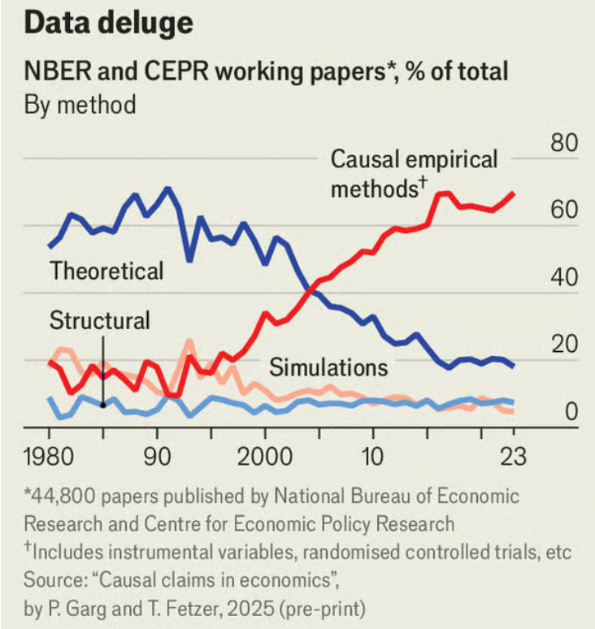
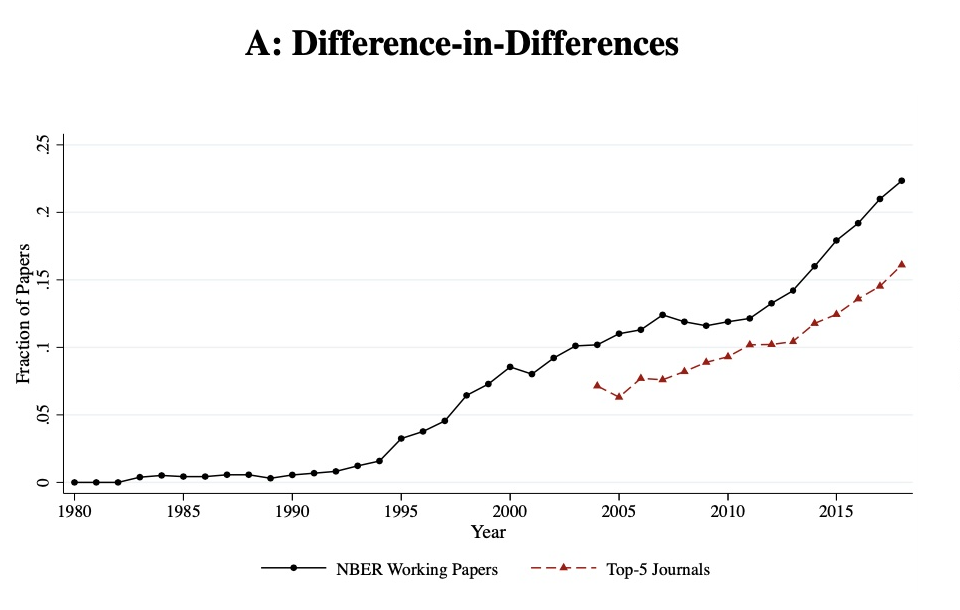
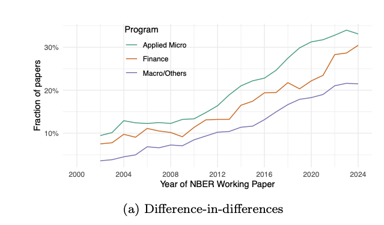
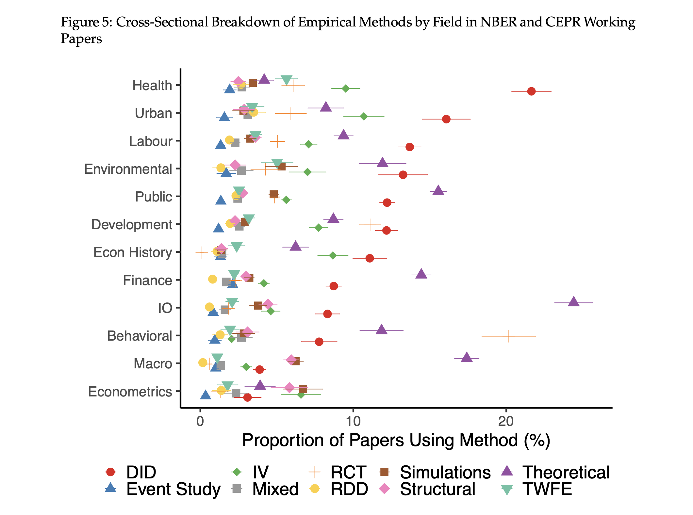
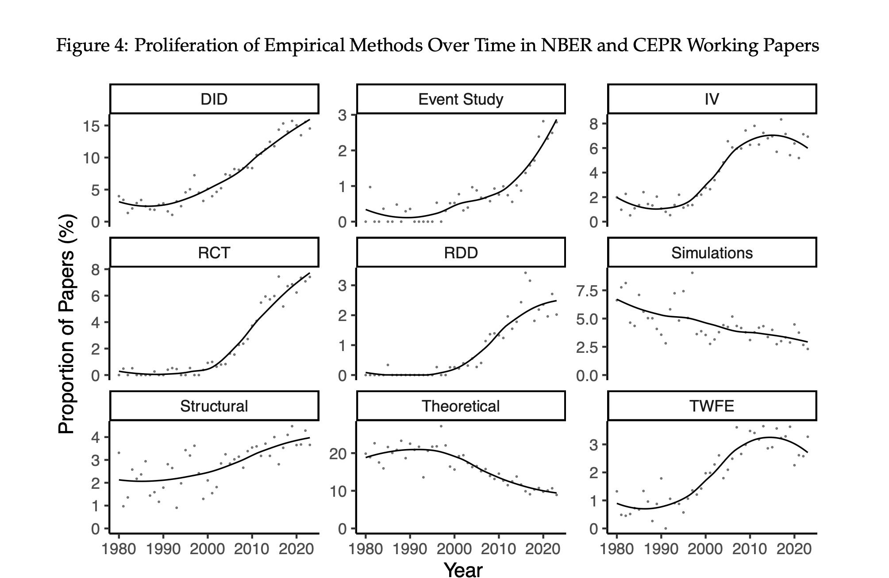
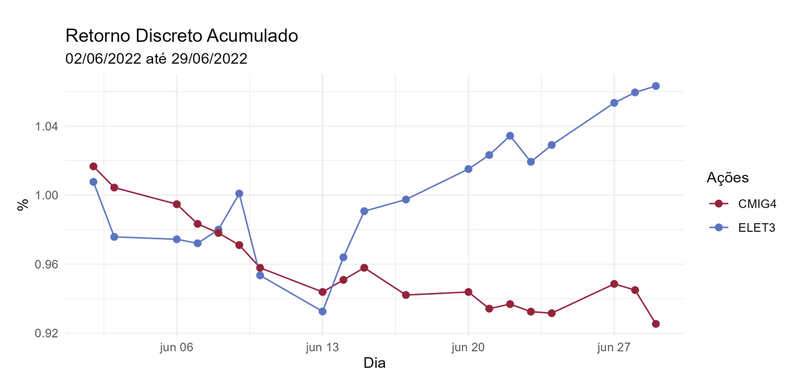

##

::: columns
::: {.column width="50%"}

:::

::: {.column width="50%"}
::: fragment

:::
:::
:::

## Objetivos de aprendizado

Nesta aula, apresentamos um contexto histórico do estimador de diferenças em diferenças e apresentamos sua intuição.

 

Ao final, o aluno deverá ser capaz de:

-   entender a relevância da metodologia atualmente

-   compreender a intuição do estimador

## Referências

::: nonincremental
-   Capítulo 11 (seção 11.3) @stock_watson_2020 (1a Edição, português)

-   Capítulo 13 (seção 13.4) @stock_watson_2004 (4a Edição, apenas inglês)

-   Capítulo 9 (seções 9.1 e 9.2.1) @Cunningham2021CausalInferenceMixtape

:::

## Por que estudar inferência causal em microeconometria?

## Por que estudar Dif-in-Dif?

## Dif-in-Dif por sub-área da economia

## Dif-in-Dif por sub-área da economia (crescimento)

## Dif-in-Dif por sub-área da economia (detalhe)

{width="80%"}

## John Snow e a cólera

::: {style="font-size: 80%;"}
-   Três grandes ondas de cólera em Londres no início e meados do século XIX, amplamente atribuídas a poluição

-   John Snow acreditava que a cólera era transmitida pela água do Tâmisa por meio de uma criatura invisível que entrava no corpo por comida e bebida, fazia o corpo expelir água, retornava ao rio e causava novas epidemias.

-   Londres aprovou uma lei exigindo que as companhias de água movessem os canos de captação rio acima, acima do centro da cidade, mas nem todas cumpriram.

-   Experimento natural: a companhia Lambeth moveu o cano entre 1849 e 1854; a Southwark e Vauxhall atrasaram.
:::

## Duas companhias de água em Londres, 1854

## Diferenças-em-diferenças: intuição

::: {style="font-size: 70%;"}
-   A intervenção/tratamento é água potável (D)
-   Mortalidade por cólera (Y)
-   Objetivo: estimar o efeito causal de D sobre Y
:::

::::::::::::::::::::::::: r-stack
::::: {.fragment .fade-in}
:::: {.fragment .fade-out}
::: {.callout-important appearance="minimal"}
Podemos identificar o efeito causal de $D$ se simplesmente compararmos as mortes por cólera em Lambeth com as de Southwark e Vauxhall em 1854 (após tratamento)?
:::

| **Empresa**          | **Resultado**    |
|----------------------|------------------|
| Lambeth              | $Y = L + D$      |
| Southwark e Vauxhall | $Y = SV$         |
| Diferença            | $Y = D + (L-SV)$ |
::::
:::::

::::: {.fragment .fade-in}
:::: {.fragment .fade-out}
::: {.callout-important appearance="minimal"}
Comparação entre unidades tem viés de seleção! Mas podemos comparar uma unidade com ela mesma antes e depois, certo?
:::

| Empresa   | Tempo  | Resultado       |
|-----------|--------|-----------------|
| Lambeth   | Antes  | $Y = L$         |
|           | Depois | $Y = L + (T+D)$ |
| Diferença |        | $Y = T+D$       |
::::
:::::

::::: {.fragment .fade-in}
:::: {.fragment .fade-out}
::: {.callout-important appearance="minimal"}
Boa! Eliminamos o efeito fixo de unidade (viés de seleção)! Porém, não conseguimos eliminar todo viés uma vez que agora o resultado é viesado pelas mudanças "naturais" na mortalidade ao longo do tempo (T: efeito fixo de tempo!).
:::

| Empresa   | Tempo  | Resultado       |
|-----------|--------|-----------------|
| Lambeth   | Antes  | $Y = L$         |
|           | Depois | $Y = L + (T+D)$ |
| Diferença |        | $Y = T+D$       |
::::
:::::

::::: {.fragment .fade-in}
:::: {.fragment .fade-out}
::: {.callout-important appearance="minimal"}
O que podemos fazer, então?
:::
::::
:::::

::::: {.fragment .fade-in}
:::: {.fragment .fade-out}
::: {.callout-important appearance="minimal"}
E se fizermos a diferença da diferença (dif-em-dif)?
:::
::::
:::::

:::::: {style="font-size: 70%;"}
::::: {.fragment .fade-in}
:::: {.fragment .fade-out}
::: {.callout-important appearance="minimal"}
Bingo! O estimador de dif-em-dif elimina o viés e conseguimos estimar o efeito causal da água potável sobre a mortalidade de colera!
:::

| Empresa | Tempo | Resultado | $\Delta$ | DID |
|----------------|--------------|--------------|--------------|--------------|
| Lambeth | Antes | $Y = L$ |  |  |
|  | Depois | $Y = L + (T+D)$ | $Y =  T+D$ |  |
| Southwark and Vauxhall | Antes | $Y = SV$ |  |  |
|  | Depois | $Y = SV + T$ | $Y =  T$ | $\textcolor{red}{D}$ |
::::
:::::
::::::

::::: {.fragment .fade-in}
:::: {.fragment .fade-out}
::: {.callout-important appearance="minimal"}
Qual foi a hipótese crucial utilizada acima para que o estimador funcionasse, ou seja, para que a estimativa obtida por dif-em-dif fosse igual ao efeito causal da água potável D?
:::
::::
:::::
:::::::::::::::::::::::::

## Exemplo numérico

| Empresa                           | 1849 | 1854 |
|-----------------------------------|:----:|:----:|
| Southwark and Vauxhall (controle) | 135  | 147  |
| Lambeth (tratamento)              |  85  |  19  |

Qual o efeito de $D$ em $Y$?

$$
\beta_{DD} = (19-85) - (147-135)
$$

$$
\beta_{DD} = -66 - 12 = - 78
$$

A intervenção de Lambeth reduziu a taxa de mortalidade em 78 mortes por 10.000 residentes.

## Visão Geral do estimador Dif-em-Dif

::: {style="font-size: 80%;"}
-   2 grupos: controle (C) e tratamento (T)

-   2 períodos: antes do tratamento e depois do tratamento

-   Ideia central: compare variação depois/antes (diferenças) nas variáveis de resultado

-   Estimador Dif-em-Dif (ou DID):$$
    \begin{aligned}
    \beta_{DD} &= (\bar{Y}^T_{depois} - \bar{Y}^T_{antes}) - (\bar{Y}^C_{depois} - \bar{Y}^C_{antes}) \\
             &= \Delta \bar{Y}^T - \Delta \bar{Y}^C
    \end{aligned}
    $$

-   O mesmo resultado é obtido fazendo: $$
    \beta_{DD} = (\bar{Y}^T_{depois} - \bar{Y}^C_{depois}) - (\bar{Y}^T_{antes} - \bar{Y}^C_{antes})
    $$
:::

## De volta à motivação inicial

Privatização da Eletrobrás ocorre em 14/06/2022.

. . .

## Afinal, o que é Dif-em-Dif?

- Dif-em-Dif é duas coisas:

1. É sempre um cálculo numérico: 4 médias e duas subtrações!

2. **Em alguns casos e sob certas condições** pode ter interpretação causal!

## Referências {visibility="uncounted"}

::: {#refs}
:::
