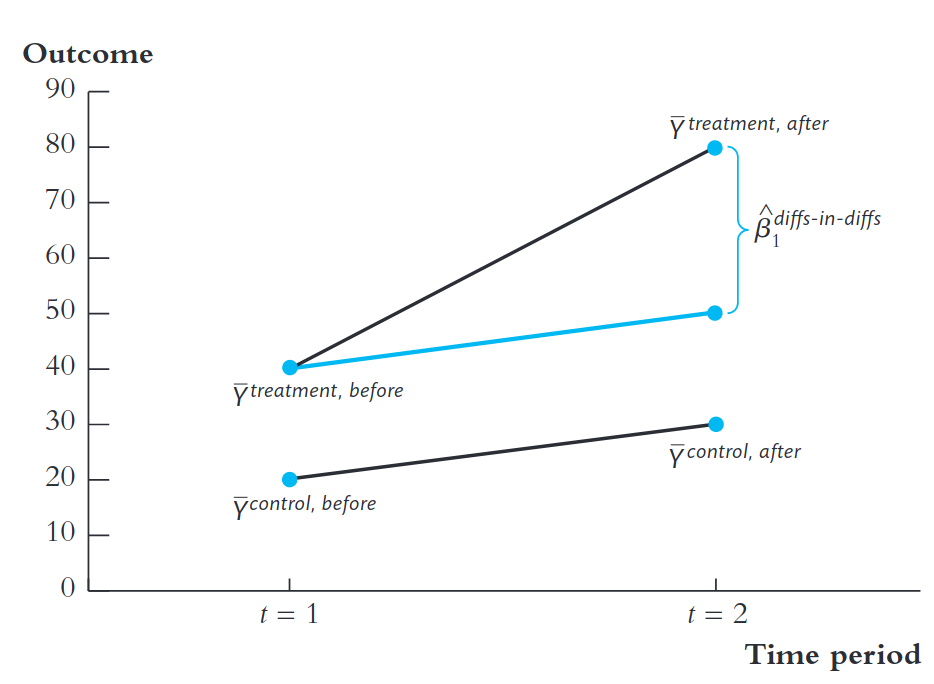
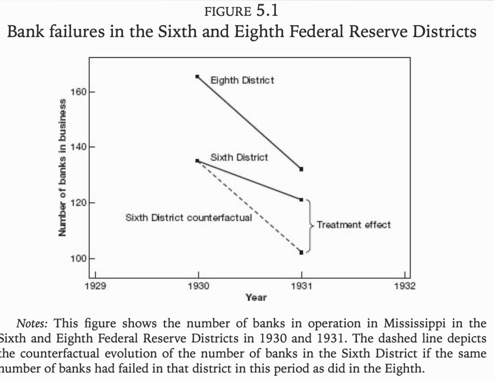
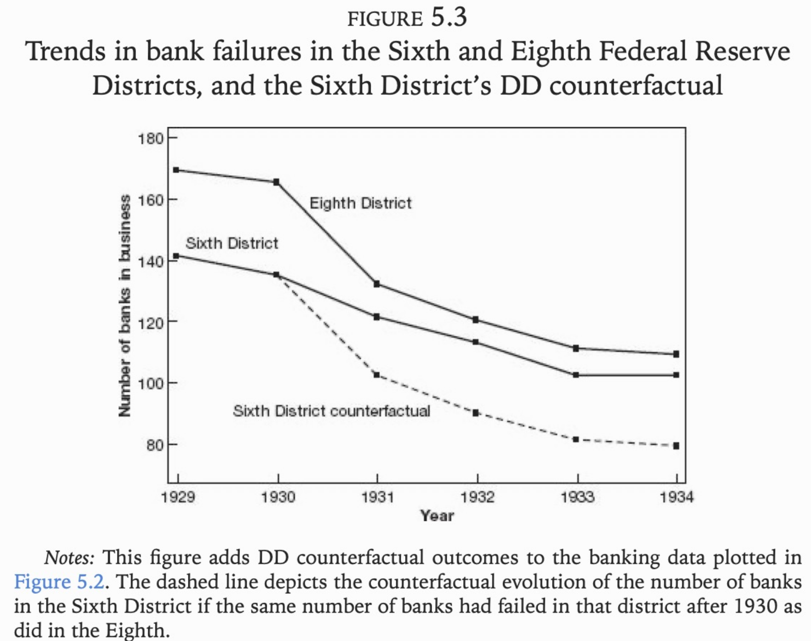
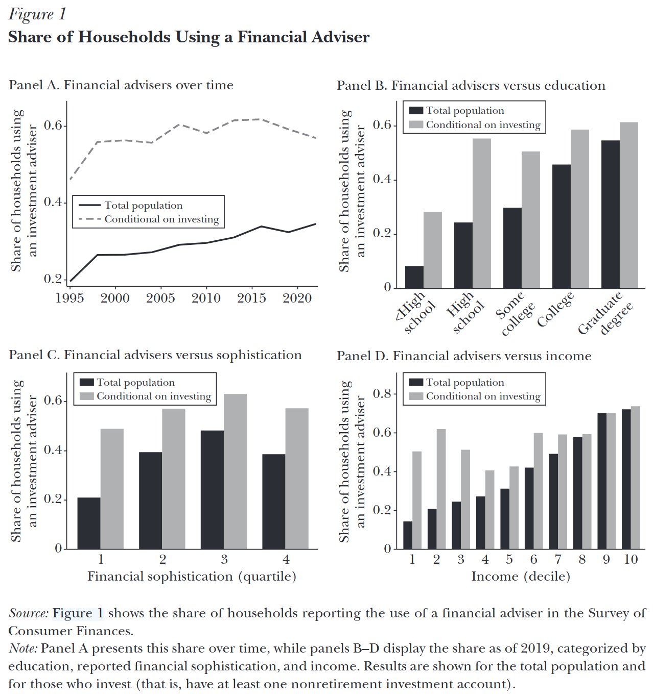
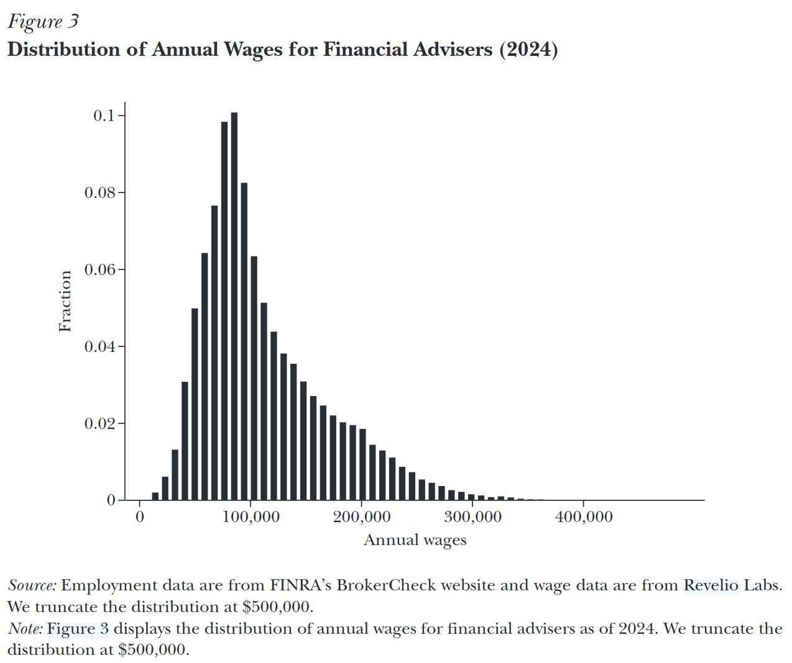
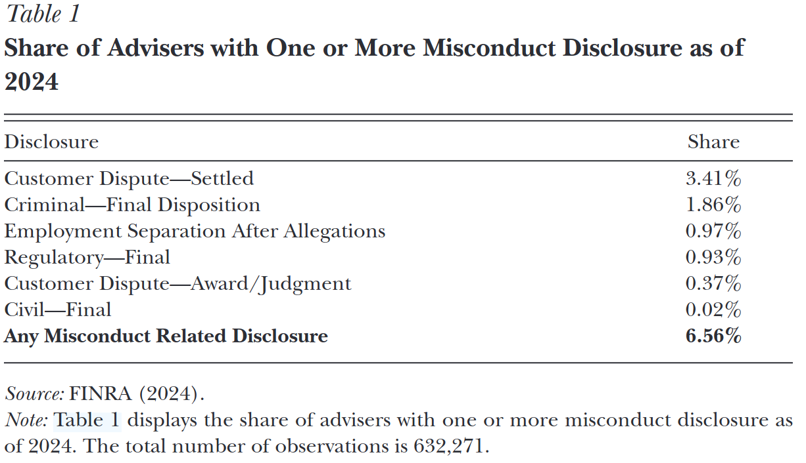
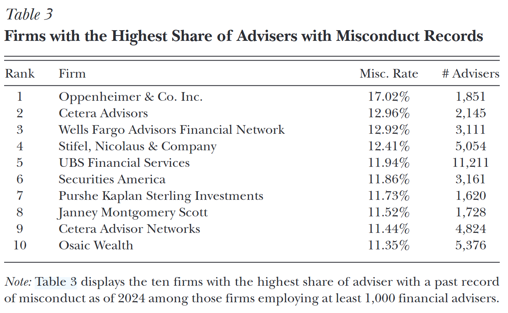
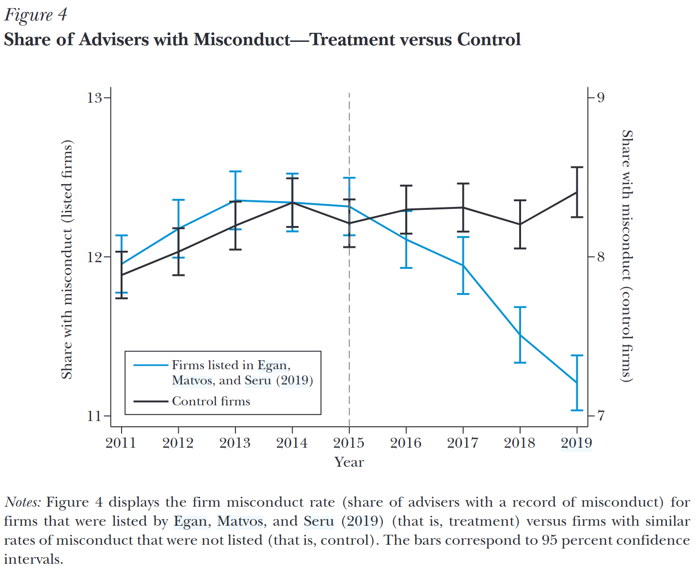

## Objetivos de aprendizado

Nesta aula, formalizamos como utilizar o estimador de diferenças-em-diferenças para realizar inferência causal.

 

Ao final, o aluno deverá ser capaz de:

-   entender conceitualmente o estimador DD

-   saber exatamente quais hipóteses são necessárias para fazer inferência causal

-   entender como o parâmetro pode ser estimado

## Referências

::: nonincremental
-   Capítulo 11 (seção 11.3) @stock_watson_2020 (1a Edição, português)

-   Capítulo 13 (seção 13.4) @stock_watson_2004 (4a Edição, apenas inglês)

-   Capítulo 9 (seções 9.1 e 9.2.1) @Cunningham2021CausalInferenceMixtape

:::

## O que é Dif-em-Dif?

::: columns
::: {.column width="50%"}
::: nonincremental
::: {style="font-size: 70%;"}
Dif-em-Dif é duas coisas:

1.  É sempre um cálculo numérico: 4 médias e duas subtrações!

2.  **Em alguns casos e sob certas condições** pode ter interpretação causal!
:::
:::
:::

::: {.column width="50%"}

:::
:::

## Visão Geral do estimador Dif-em-Dif

::: {style="font-size: 80%;"}
-   2 grupos: controle (C) e tratamento (T)

-   2 períodos: antes do tratamento e depois do tratamento

-   Ideia central: compare variação depois/antes (diferenças) nas variáveis de resultado

-   Estimador Dif-em-Dif (ou DID):$$
    \begin{aligned}
    \beta_{DD} &= (\bar{Y}^T_{depois} - \bar{Y}^T_{antes}) - (\bar{Y}^C_{depois} - \bar{Y}^C_{antes}) \\
             &= \Delta \bar{Y}^T - \Delta \bar{Y}^C
    \end{aligned}
    $$

-   O mesmo resultado é obtido fazendo: $$
    \beta_{DD} = (\bar{Y}^T_{depois} - \bar{Y}^C_{depois}) - (\bar{Y}^T_{antes} - \bar{Y}^C_{antes})
    $$
:::

## Hipótese crucial de identificação: tendências paralelas

::: columns
::: {.column width="55%"}
::: nonincremental
::: {style="font-size: 70%;"}
-   *Viés de seleção:* grupos de tratamento e controle **não são comparáveis** $$
    E(\textcolor{blue}{Y_{0i}} \mid \textcolor{red}{D_i = 1}) \neq E(\textcolor{blue}{Y_{0i}} \mid \textcolor{blue}{D_i = 0})
    $$
-   Mas suponha que os resultados potenciais se movam **sincronizados ao longo do tempo**:\
    $$
    E(\textcolor{blue}{\Delta Y_{0i}} \mid \textcolor{red}{D_i = 1})
    = E(\textcolor{blue}{\Delta Y_{0i}} \mid \textcolor{blue}{D_i = 0})
    $$
-   Podemos comparar as **mudanças observadas** nos resultados em torno do tratamento para estimar o efeito causal médio:\
    $$
    E(\Delta Y_i \mid \textcolor{red}{D_i = 1})
    - E(\Delta Y_i \mid \textcolor{blue}{D_i = 0})
    = \textcolor{green}{\kappa}
    $$
:::
:::
:::

::: {.column width="45%"}

:::
:::

## Derivação formal: definições

::: {style="font-size: 80%;"}
::: nonincremental
-   Assuma que os **resultados potenciais** são determinados como segue:$$
    \bar{Y}_{0st} = \gamma_s + \lambda_t
    $$

-   $\bar{Y}_{0st}$ = resultado potencial médio no grupo $s$ no tempo $t$\

-   $s = T$ (tratamento) ou $C$ (controle)\

-   $t =$ antes ou depois do tratamento\

-   $\gamma_s =$ efeito fixo específico do grupo\

-   $\lambda_t =$ efeito específico do tempo

-   Assuma efeito causal médio constante do tratamento:$$
    \textcolor{red}{\bar{Y}_{1st}} - \textcolor{blue}{\bar{Y}_{0st}} = \textcolor{green}{\kappa}
    $$
:::
:::

## Derivação formal: $\beta_{DD}$ identifica ATE

::::::::: {style="font-size: 70%;"}
::::: columns
::: {.column width="50%"}
$$
\textcolor{blue}{\bar Y_{0st}} \;=\; \gamma_s + \lambda_t
$$
:::

::: {.column width="50%"}
$$
\textcolor{red}{\bar Y_{1st}} \;=\; \textcolor{blue}{\bar Y_{0st}} \;+\; \textcolor{green}{\kappa}
$$
:::
:::::

::::: columns
::: column
$$
\begin{aligned}
\textcolor{blue}{\bar Y^{C}_{antes}}
&= \textcolor{blue}{\bar Y_{0,C,antes}}
= \gamma_C + \lambda_{antes} \\[4pt]
\textcolor{blue}{\bar Y^{T}_{antes}}
&= \textcolor{blue}{\bar Y_{0,T,antes}}
= \gamma_T + \lambda_{antes}
\end{aligned}
$$
:::

::: column
$$
\begin{aligned}
\textcolor{blue}{\bar Y^{C}_{depois}}
&= \textcolor{blue}{\bar Y_{0,C,depois}}
= \gamma_C + \lambda_{depois} \\[4pt]
\textcolor{red}{\bar Y^{T}_{depois}}
&= \textcolor{red}{\bar Y_{1,T,depois}}
= \gamma_T + \lambda_{depois} + \textcolor{green}{\kappa}
\end{aligned}
$$
:::
:::::

$$
\begin{aligned}
\textcolor{blue}{\beta_{DD}}
&= \big(\textcolor{red}{\bar Y^{T}_{depois}}-\textcolor{blue}{\bar Y^{T}_{antes}}\big)
 - \big(\textcolor{blue}{\bar Y^{C}_{depois}}-\textcolor{blue}{\bar Y^{C}_{antes}}\big) \\[6pt]
&= \Big[(\gamma_T+\lambda_{depois}+\textcolor{green}{\kappa})-(\gamma_T+\lambda_{antes})\Big]
 - \Big[(\gamma_C+\lambda_{depois})-(\gamma_C+\lambda_{antes})\Big] \\[6pt]
&= \textcolor{green}{\kappa}
\end{aligned}
$$
:::::::::

## Derivação formal: cancelamento dos efeitos fixos

::::::::::::: {style="font-size: 70%;"}
$$
\textcolor{blue}{\beta_{DD}}
= \big(\textcolor{red}{\bar Y^{T}_{depois}} - \textcolor{blue}{\bar Y^{T}_{antes}}\big)
 - \big(\textcolor{blue}{\bar Y^{C}_{depois}} - \textcolor{blue}{\bar Y^{C}_{antes}}\big)
$$

:::::::::::: r-stack
::::::: {.fragment .fade-in}
:::::: {.fragment .fade-out}
$$
= \Big[(\textcolor{red}{\cancel{\gamma_T}} + \lambda_{depois} + \textcolor{green}{\kappa})
 - (\textcolor{red}{\cancel{\gamma_T}} + \lambda_{antes})\Big]
 - \Big[(\textcolor{red}{\cancel{\gamma_C}} + \lambda_{depois})
 - (\textcolor{red}{\cancel{\gamma_C}} + \lambda_{antes})\Big]
$$

$$
= \textcolor{green}{\kappa}
$$

::::: columns
::: column
[Ao tomar diferenças ao longo do tempo, eliminamos os efeitos fixos de grupo $\gamma_T$ e $\gamma_C$.]{style="color:red; font-size:115%"}
:::

::: column
:::
:::::
::::::
:::::::

:::::: {.fragment .fade-in}
$$
= \Big[(\textcolor{red}{\cancel{\gamma_T}} + \textcolor{green}{\cancel{\lambda_{depois}}} + \textcolor{green}{\kappa})
 - (\textcolor{red}{\cancel{\gamma_T}} + \textcolor{green}{\cancel{\lambda_{antes}}})\Big]
 - \Big[(\textcolor{red}{\cancel{\gamma_C}} + \textcolor{green}{\cancel{\lambda_{depois}}})
 - (\textcolor{red}{\cancel{\gamma_C}} + \textcolor{green}{\cancel{\lambda_{antes}}})\Big]
$$

$$
= \textcolor{green}{\kappa}
$$

::::: columns
::: column
[Ao tomar diferenças ao longo do tempo, eliminamos os efeitos fixos de grupo $\gamma_T$ e $\gamma_C$.]{style="color:red; font-size:115%"}
:::

::: column
[Ao subtrair a variação do grupo de controle da variação do grupo de tratamento, eliminamos os efeitos comuns de tempo $\lambda_{depois}$ e $\lambda_{antes}$.]{style="color:green; font-size:115%"}
:::
:::::
::::::
::::::::::::
:::::::::::::

## Derivação formal: conclusão

::::::: {style="font-size: 70%;"}
::::: columns
::: {.column width="50%"}
-   DiD funciona se $\textcolor{blue}{\bar Y_{0st}} = \gamma_s + \lambda_t$

-   Sem tratamento, grupos diferem por um efeito fixo específico $\gamma_s$

-   Mas os efeitos específicos do tempo $\lambda_t$ são comuns

-   $\Rightarrow$ **tendências comuns**:$$
        \Delta \textcolor{blue}{\bar Y_{0,T,t}} = \Delta \textcolor{blue}{\bar Y_{0,C,t}} = \lambda_{depois} - \lambda_{antes}
        $$
:::

::: {.column width="50%"}
-   DiD **não** funciona se $\textcolor{blue}{\bar Y_{0st}} = \gamma_s + \lambda_{ts}$

-   Sem tratamento, grupos seguem tendências de tempo diferentes

-   Então: $$
    \begin{aligned}
        \textcolor{blue}{\beta_{DD}}
        = \textcolor{green}{\kappa} + \\
        &\textcolor{red}{(\lambda_{depois,T} - \lambda_{antes,T}) -} \\
        & \textcolor{red}{(\lambda_{depois,C} - \lambda_{antes,C})} \\
        &= \textcolor{green}{\kappa} + (\Delta \bar Y_{0T} - \Delta \bar Y_{0C})
        \end{aligned}
        $$
:::
:::::
:::::::

. . .

::: {.callout-important appearance="minimal"}
Tratamento e controle podem diferir em **características fixas**, mas devem estar sujeitos aos **mesmos fatores variando no tempo**.
:::

## Como estimar $\beta_{DD}$?

::: {style="font-size: 70%;"}
::: nonincremental
1.  **Regressão padrão**

$$
Y_{it}
= \textcolor{blue}{\beta_0}
+ \textcolor{blue}{\beta_1}\, Trat_i
+ \textcolor{blue}{\beta_2}\, Depois_t
+ \textcolor{blue}{\beta_{DD}}\,(Trat_i \times Depois_t)
+ u_{it}
$$
:::
:::

::: nonincremental
::: {style="font-size: 80%;"}
$$
\begin{aligned}
\textcolor{blue}{\hat\beta_0} &= \textcolor{red}{\bar Y^{C}_{antes}} \\
\textcolor{blue}{\hat\beta_0} + \textcolor{blue}{\hat\beta_1} &= \textcolor{red}{\bar Y^{T}_{antes}} \\
\textcolor{blue}{\hat\beta_0} + \textcolor{blue}{\hat\beta_2} &= \textcolor{red}{\bar Y^{C}_{depois}} \\
\textcolor{blue}{\hat\beta_0} + \textcolor{blue}{\hat\beta_1} + \textcolor{blue}{\hat\beta_2} + \textcolor{blue}{\hat\beta_{DD}} &= \textcolor{red}{\bar Y^{T}_{depois}}
\end{aligned}
$$

$$
\textcolor{red}{\Downarrow}
$$

$$
\textcolor{blue}{\hat\beta_{DD}}
= \big(\textcolor{red}{\bar Y^{T}_{depois}} - \textcolor{red}{\bar Y^{T}_{antes}}\big)
 - \big(\textcolor{red}{\bar Y^{C}_{depois}} - \textcolor{red}{\bar Y^{C}_{antes}}\big)
$$
:::
:::

## Três formas equivalentes de estimar $\beta_{DD}$

::: {style="font-size: 80%;"}
1.  **Regressão DiD padrão** $$Y_{it} = \textcolor{blue}{\beta_0} + \textcolor{blue}{\beta_1}\, Trat_i + \textcolor{blue}{\beta_2}\, Depois_t + \textcolor{blue}{\beta_{DD}}\,(Trat_i \times Depois_t) + u_{it}$$
:::

. . .

::: {style="font-size: 80%;"}
2.  **Regressão DiD com efeitos fixos** $$Y_{it} = \textcolor{blue}{\alpha_i} + \textcolor{blue}{\beta_2}\, Depois_t + \textcolor{blue}{\beta_{DD}}\,(Trat_i \times Depois_t) + u_{it}$$
:::

. . .

::: {style="font-size: 80%;"}
3.  **Regressão DiD nas diferenças** $$ \Delta Y_i = \textcolor{blue}{\beta_0} + \textcolor{blue}{\beta_{DD}}\, Trat_i + u_i $$
:::

## O Banco Central deve apoiar bancos durante uma crise bancária?

::: columns
::: {.column width="50%"}

:::

::: {.column width="50%"}
::: nonincremental
::: {style="font-size: 70%;"}
-   Contexto: Grande Depressão (1929–1933)
-   Banco **Caldwell & Company** colapsa em 1930, gerando pânico bancário.
-   Federal Reserve dividido em distritos:
    -   **6º Distrito (Atlanta Fed):** política de crédito fácil.
    -   **8º Distrito (St. Louis Fed):** política restritiva ("Real Bills Doctrine").
-   A fronteira corta o estado do Mississippi, gerando um experimento natural.
:::
:::
:::
:::

## Estratégia de Diferenças-em-Diferenças (DD)

::: nonincremental
-   **Tratamento (6º Distrito):** expansão de crédito (+40% em 4 semanas).
-   **Controle (8º Distrito):** contração de crédito (−10% no mesmo período).
-   Resultado em 1931:
    -   121 bancos abertos (6º Distrito)
    -   132 bancos abertos (8º Distrito)
-   Mas havia diferenças prévias. Não basta comparar níveis.
:::

. . .

-   $Y_{t}^d$ = nº de bancos em operação no distrito $d$ no ano $t$.

$$
    \delta_{DD} = (Y_{1931}^6 - Y_{1930}^6) - (Y_{1931}^8 - Y_{1930}^8)
$$

## Resultado principal

::: columns
::: {.column width="50%"}
::: {style="font-size: 80%;"}
$$
\begin{aligned}
    \delta_{DD} &= (Y_{1931}^6 - Y_{1930}^6) - (Y_{1931}^8 - Y_{1930}^8) \\
                &= (121-135) - (132-165) \\
                &= -14 - (-33) = 19
\end{aligned}
$$
Estima-se que o Atlanta Fed salvou **cerca de 19 bancos** (~10% dos existentes em 1930).
:::
:::

::: {.column width="50%"}

:::
:::

## Evidências de tendências paralelas

::: columns
::: {.column width="50%"}

:::

::: {.column width="50%"}
::: {style="font-size: 80%;"}
Evidência adicional para validade DD:

-   $6^o$ e $8^o$ distritos moviam em paralelo antes da crise

    -   tendências prévias similares

-   Divergência nos resultados começa **precisamente** quando a crise chega

    -   e depois se estabiliza
:::
:::
:::

## Mecanismos de reputação e transparência podem disciplinar o comportamento de assessores financeiros?

-   Crescimento do uso de assessores financeiros nos EUA: ~20% (1995) → ~30% (2019).
-   Entre lares com contas não-previdenciárias: ~60% usam assessor.
-   Indústria grande (~700 mil profissionais) e percebida como pouco confiável.
-   Indúsitria que remunera muito bem.

Fonte: [@egan2024]

## Percentual de famílias que utilizam assessores financeiros

{width="50%"}

## Distribuição do salário anual dos assessores financeiros

{width="50%"}

## Economia da má conduta

::: columns
::: {.column width="50%"}
::: nonincremental
::: {style="font-size: 70%;"}
-   **Credence goods:** clientes não conseguem avaliar qualidade antes ou depois.
-   Incentivos desalinhados: comissões, conflito fiduciário.
-   Má conduta varia muito entre condados/firmas.
-   Em 2024, ~6,6% dos assessores tiveram casos de má conduta.
-   Em algumas firmas, >30% dos assessores com histórico de má conduta.
:::
:::
:::

::: {.column width="50%"}

:::
:::

## O desenho DiD (2016)

::: columns
::: {.column width="50%"}
::: nonincremental
::: {style="font-size: 70%;"}
-   **Tratadas:** top 20 firmas em má conduta → "naming & shaming".
-   **Controle:** firmas 21–40 do ranking.
-   Janela 2011–2019 (±4 anos).
-   Desfecho: % de assessores com histórico de má conduta.
-   Tendências **paralelas** pré-2016.
-   Estimador: $$
    \hat\beta_{DD}
    =(\bar Y^{T}_{post}-\bar Y^{T}_{pre})-(\bar Y^{C}_{post}-\bar Y^{C}_{pre})
    $$
:::
:::
:::

::: column

:::
:::

## Resultados e implicações

::: columns
::: {.column width="50%"}
::: nonincremental
::: {style="font-size: 70%;"}
-   Efeito: **queda de 1,3 p.p.** (≈ –10% sobre média de 12%).
-   Interpretação: transparência disciplina firmas.
-   Reforça eficiência em mercados de produtos e de trabalho.
-   Implicações:
    -   Divulgação pública (BrokerCheck)
    -   Monitoramento regulatório
    -   Educação financeira de assessores
:::
:::
:::

::: column

:::
:::

## Referências {visibility="uncounted"}

::: {#refs}
:::
