```{r setup, include=FALSE, eval=TRUE}
library(ggplot2)
library(broom)
library(dplyr)
library(tidyr)
library(ggdag)
library(ggraph)
options(digits=5)
```

## Objetivos de aprendizado

Nesta aula, formalizamos como utilizar o desenho de regressões descontínuas para realizar inferência causal.

<br>

Ao final, o aluno deverá ser capaz de:

-   entender intuitivamente como RDD funciona

-   entender as hipóteses de identificação de sharp RDD

-   entender como estimar sharp RDD

## Referências

::: nonincremental
-   Capítulo 6 de @Cunningham2021CausalInferenceMixtape

-   Capítulo 4 de @angrist_mastering_2015

-   Capítulo 6 de @gertler_avaliacao_2018

-   Seção 13.4 de @stock_watson_2004 (4a Edição, apenas inglês)

:::

## O que é regressão descontínua?

- RDD (*regression discontinuity design*) é um tipo particular de desenho de pesquisa bastante popular

- Foi inventado por Donald Campbell (1960), um psicólogo da educação. Essa estratégia empírica ficou dormente até cerca de 1999 quando foi "redescoberta" por Angrist, Lavy e Black

## Popularidade do RDD

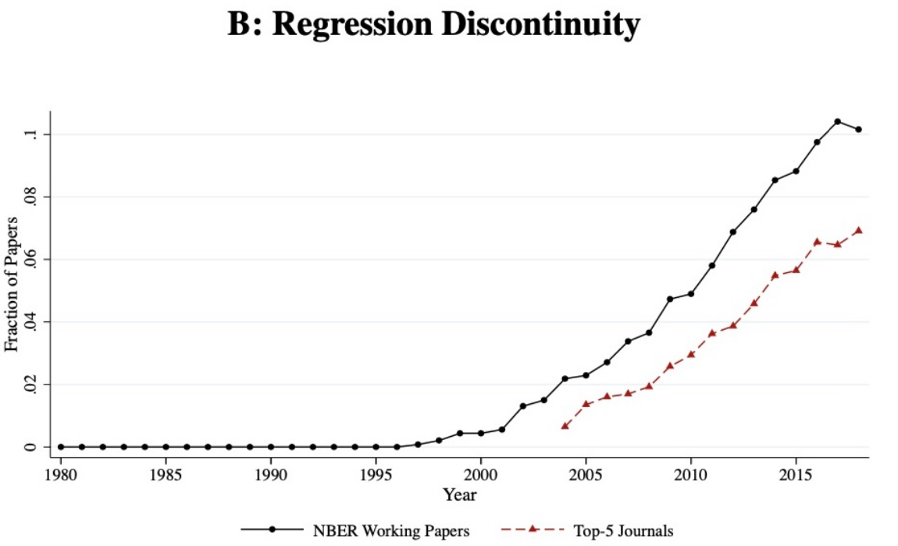

## Popularidade do RDD (cont.)

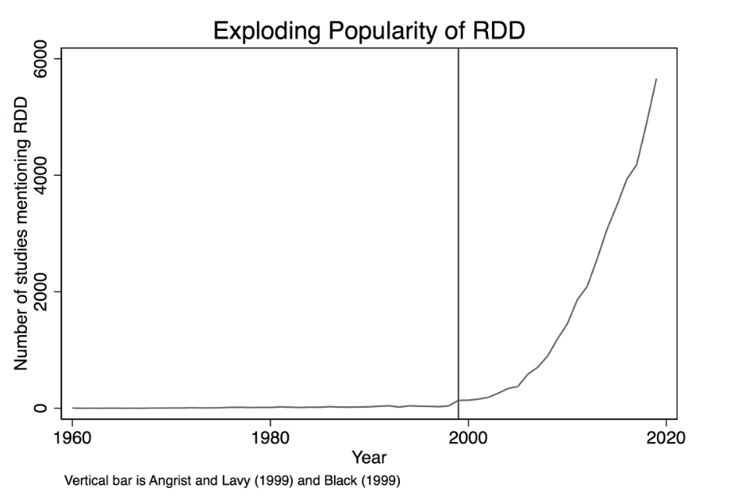

## Desenho de regressão descontínua: RDD

::: {style="font-size: 80%;"}

- Queremos estimar o **efeito causal** de um tratamento sobre um determinado resultado.
- Mas não podemos simplesmente comparar dois grupos (tratados e não tratados) porque existe auto-seleção, o que gera **viés de seleção**.
- E se a atribuição ao tratamento fosse imposta por uma regra externa? Por exemplo, uma política pública divide a amostra em grupos de tratamento e controle baseando-se em uma **variável contínua** e um determinado valor de **limite** (*threshold*)?
- O método de regressão descontínua (RDD) formaliza esse cenário e, sob certas hipóteses, **identifica o efeito causal médio local (LATE)**.

:::

## Uma figura vale mais que mil palavras

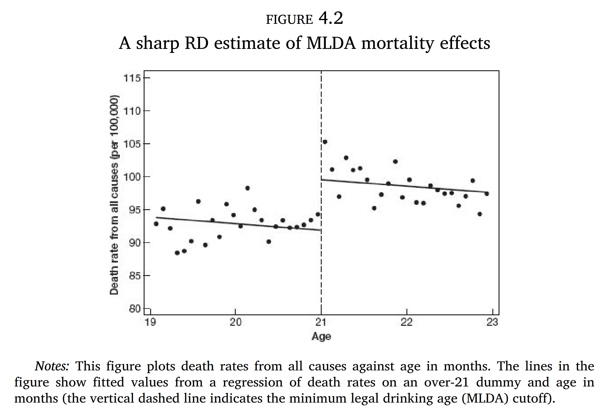

## Uma figura vale mais que mil palavras (cont.)

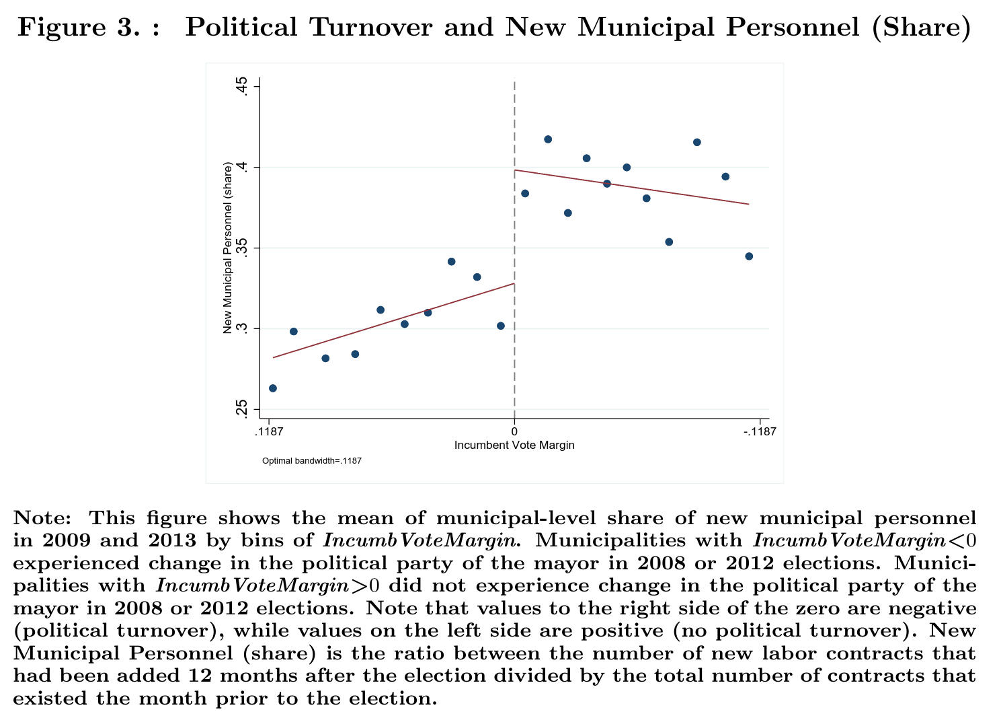

## Vocabulário/Terminologia

::: {style="font-size: 80%;"}

- **Variável de atribuição (*running variable*):** variável/índice contínuo que uma instituição/política/regra usa para **atribuir tratamento** às unidades.

- **Tendências:** referem-se a **mudanças graduais nos resultados** ao longo da variável de atribuição. *OBS:* diferente de tendências temporais

- **Ponto de corte (*cutoff/threshold*):** valor específico da variável de atribuição a partir do qual a instituição/política/regra **atribui o tratamento**.

- **Descontinuidade e/ou salto:** como estamos estimando as quebras na variável de resultado à direita do ponto de corte, quando isso acontece dizemos que existe **descontinuidade**.

- **Regressão:** estimações típicas incluem diferença simples de médias, regressões locais por MQO ou regressões globais por MQO em torno do ponto de corte.

:::

## Tipos comuns de RDD

::: {style="font-size: 80%;"}

- **Arredondamento:** quando notas em avaliações são contínuas e os valores divulgados são arredondados (ex: Yelp arredonda as avaliações para a **meia estrela mais próxima**, embora a nota subjacente seja contínua).

- **Eleições acirradas:**
  Votação majoritária, com ponto de corte em 50% dos votos válidos, atribui o poder a diferentes partidos e tipos de candidatos.

- **Algoritmos:** Preços baseados em algoritmos (ex. UBER) são definidos com base em medidas contínuas de demanda, criando limiares onde o preço "salta".

- **Biologia:** Idade mínima para beber legalmente (21 anos nos EUA); peso ao nascer determinando internação em UTI neonatal, idade mínima para aposentadoria.

:::

## Requisitos de dados em RDD

::: {style="font-size: 80%;"}

- Amostras **grandes** são uma característica essencial do método de descontinuidade em regressão (RDD).

- Se houver tendências significativas na variável de atribuição, é necessário **ainda mais dados** para estimar o salto com precisão.

- Quando tem muito ruído nas observações (muita variância perto do corte), também precisamos de mais dados.

- É preciso ter um número suficiente de observações em torno do ponto de corte para realização de testes de hipótese.

- O método favorece quem tem acesso a dados em nível de firma ou dados administrativos, pois esses bancos de dados tendem a ter muitas observações.

:::

## Resultados potenciais

::: {style="font-size: 70%;"}
Lembre das definições sobre $Y$, $Y^0$ e $Y^1$:

1. Os resultados potenciais têm sobrescritos: $Y_i^1$, $Y_i^0$.
   Eles se referem aos resultados hipotéticos de um indivíduo $i$ nos mundos com ou sem tratamento, **independentemente** do que realmente aconteceu.

2. Um desses dois resultados é observado quando o tratamento $D_i$ é definido, de acordo com a equação de comutação: $$Y_i = D_i Y_i^1 + (1 - D_i) Y_i^0$$

3. Os **resultados observados** não têm sobrescritos ($Y_i$): representam o resultado de fato observado, selecionado entre os dois potenciais, no caso de um tratamento binário.

:::

. . .

**Observação:** A ideia de contrafactual se baseia em (1) e não em (2).

## Por que isso é importante?

- No método de **RDD** a sutileza dos resultados potenciais é ainda mais delicada.
- As **hipóteses de identificação** são expressas em termos de $E[Y^1]$ e $E[Y^0]$.
- Contudo, na prática, observamos mudanças em $E[Y]$, o que pode gerar confusão.
- Lembre-se: passamos de resultados potenciais para resultados realizados com base na **atribuição do tratamento**.

## Sharp vs. Fuzzy RDD

::: {style="font-size: 70%;"}
- Existem dois tipos RDD:

1. **Sharp RDD (nítido):** O tratamento é uma **função determinística da variável de atribuição** ($X$).
   - Exemplo: quem é eleito em uma eleição majoritária (metade dos votos +1).

2. **Fuzzy RDD (difuso):** Há uma **descontinuidade na probabilidade de tratamento** quando $X > c_0$. Neste caso, o ponto de corte funciona como um **instrumento (IV)** para o tratamento. (próxima aula)

:::

. . .

::: {style="font-size: 70%;"}
**Observações:**

- O desenho **fuzzy** é um tipo de **estratégia de variáveis instrumentais (IV)** e requer estimadores explícitos como o **2SLS**.

- O **sharp**, por outro lado, é uma forma **reduzida** de IV e não requer estimadores desse tipo.

:::

## Sharp *vs* Fuzzy RDD

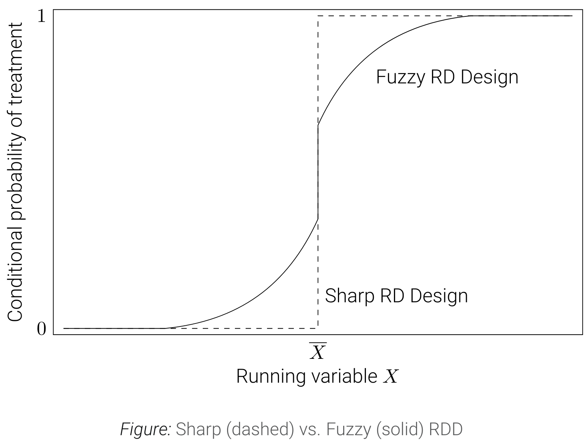

## Questões comuns em RDD

::: {style="font-size: 80%;"}

- **Suporte comum:** Não há unidades tratadas e de controle ao longo de toda a variável de atribuição, o que torna comparações diretas impossíveis.

- **Extrapolação:** Sem suporte comum, precisamos extrapolar usando modelos — como regressões ou métodos não paramétricos — comparando unidades logo abaixo e acima do ponto de corte.

    - Porém, isso é sensível a tendências, *bandwidths* e ao número de observações.

- **Efeitos do tratamento:** Estimamos efeitos médios do tratamento, mas apenas **para as pessoas no ponto de corte**. Logo, com RDD estimamos o LATE!

     - Resultados podem não ser representativos longe do ponto de corte, especialmente em contextos de alta heterogeneidade.

:::

## Atribuição do tratamento no Sharp RDD

::: {.callout-tip}
## Atribuição determinística do tratamento ("Sharp RDD")

No desenho **Sharp RDD**, o status de tratamento é uma **função determinística e descontínua** de uma variável $X_i$:

$$
D_i =
\begin{cases}
1, & \text{se } X_i \geq c_0 \\
0, & \text{se } X_i < c_0
\end{cases}
$$

onde $c_0$ é um **ponto de corte conhecido**.

Em outras palavras, se conhecemos o valor de $X_i$ para uma unidade $i$, sabemos **com certeza** se ela recebeu o tratamento ou não.
:::

## Extrapolação, suporte comum e forma funcional

- RDDs Sharp criam problemas de suporte comum, pois **nunca** haverá unidades tratadas e não tratadas ao mesmo tempo ao longo da variável de atribuição.

- Isso exige **extrapolação**: prever resultados fora do suporte dos dados (ou seja, onde o tratamento muda de status no ponto de corte).

- Por isso, as escolhas de modelagem, especialmente a **forma funcional**, são cruciais e representam uma **hipótese crucial**.

## Modelo Linear com discontinuidade

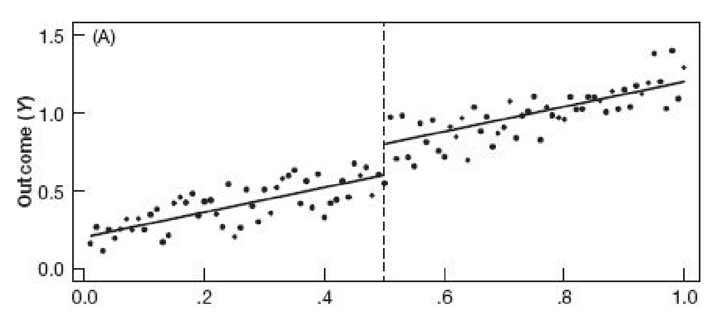

## Modelo não-linear com discontinuidade

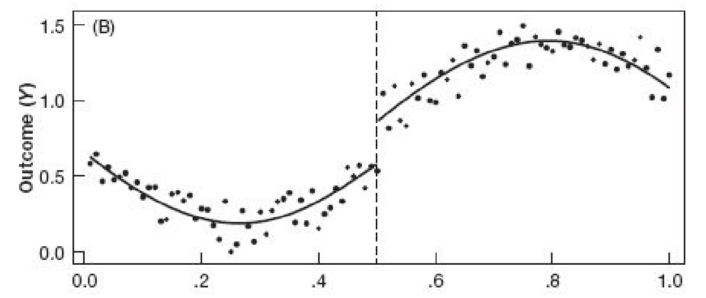

## Não linearidade confundida com descontinuidade {#fig-spurious}

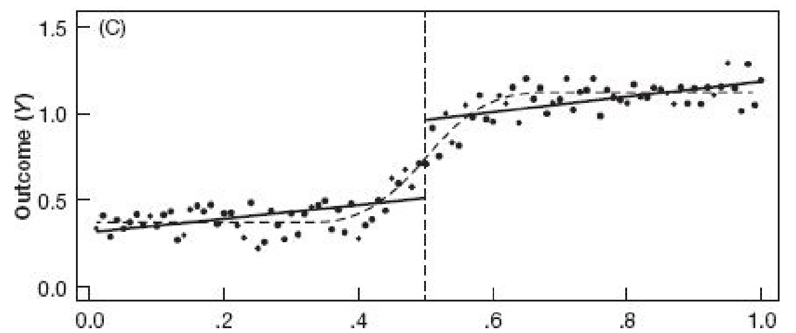

## Definição e estimação do efeito do tratamento

::: {.callout-tip}
## Definição do efeito do tratamento

O parâmetro de efeito do tratamento $\delta$ é a **descontinuidade** na função de expectativa condicional:

$$
\begin{aligned}
\delta &= \lim_{X_i \to c_0^+} E[Y_i^1|X_i=c_0]
        - \lim_{X_i \to c_0^-} E[Y_i^0|X_i=c_0] \\[4pt]
        &= \lim_{X_i \to c_0^+} E[Y_i|X_i=c_0]
        - \lim_{X_i \to c_0^-} E[Y_i|X_i=c_0]
\end{aligned}
$$

A estimação do **Sharp RDD** é interpretada como um **efeito causal médio local (LATE)** do tratamento ($D$) no ponto de descontinuidade ($c_0$):

$$
\delta_{SRD} = E[Y_i^1 - Y_i^0 \mid X_i = c_0]
$$
:::

## Revisão sobre hipóteses de identificação

::: {style="font-size: 70%;"}

**1. Hipóteses de independência**: típicas em situações com randomização, elimina o viés de seleção.

- Experimentos aleatórios (RCTs)
- Métodos de pareamento e MQO com seleção em observáveis (controles)
- Variáveis instrumentais (IV)

**2. Restrições sobre resultados potenciais**: associadas a RDD e Diferenças-em-Diferenças (DiD)

- RDD impõe continuidade em $E[Y^0]$ e $E[Y^1]$ em torno do ponto de corte.
- Diferenças-em-Diferenças impõe que $E[Y^0 | D=1]$ mude ao longo do tempo de modo restrito (tendências paralelas).

:::

## Suavidade como hipótese de identificação

::: {.callout-tip}
## Suavidade das funções de expectativa condicional dos resultados potenciais

$E[Y_i^0 | X=c_0]$ e $E[Y_i^1 | X=c_0]$ são **contínuas (suaves)** em $X$ no ponto $c_0$.
:::

- Se as médias populacionais dos **resultados potenciais** $E[Y^1]$ e $E[Y^0]$ forem funções **suaves** de $X$ ao redor do corte $c_0$, então **não haverá salto** esperado em $c_0$.

- Isso implica que outros determinantes que poderiam gerar viés (*confounders*) também evoluem suavemente em torno do ponto de corte.

## Suavidade vs. Efeito do Tratamento

::: columns
::: column
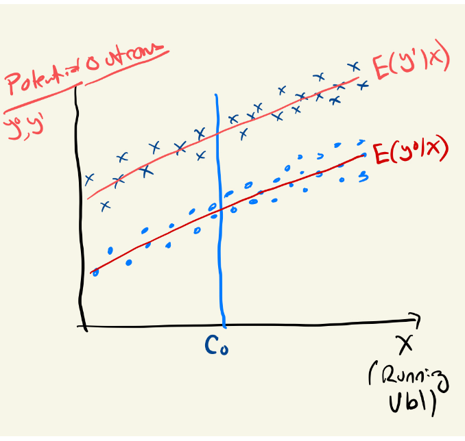{width="81%"}
:::
::: column
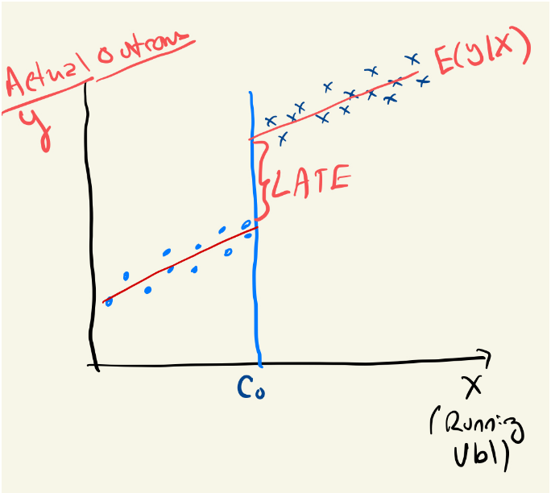{width="87%"}
:::
:::

::: {style="font-size: 70%;"}
**Discussão:** Por que a figura da esquerda difere da da direita? Para onde foram as duas linhas?
:::

## Resultados potenciais e observados

::: {style="font-size: 80%;"}

- **Suavidade** se refere aos **resultados potenciais**:
  - Eles mudam suavemente em média ao longo do ponto de corte.
  - Mas, ao cruzar o ponto de corte, passamos de um conjunto de resultados potenciais a outro.

- **Descontinuidade** se refere aos **resultados realizados**:
  - O ponto de corte **é o mecanismo de atribuição**.
  - Ele alterna os resultados potenciais antes e depois do ponto de corte.
  - Assim, se há um **efeito do tratamento**, observamos um **salto** nos resultados realizados mas requer **extrapolação** para estimação.

:::

## Suavidade permite extrapolação

- A suavidade **justifica o uso de regressões** para extrapolar resultados potenciais faltantes de um lado do corte para o outro.

- O **efeito causal médio** é definido **no ponto de corte**, mas a estimação usa dados **à esquerda e à direita** em torno do ponto de corte.

- Lembre-se: **identificação** e **estimação** não são a mesma coisa! É a **suavidade** que permite dar **interpretação causal** às estimativas.

- Estimação se refere a como vamos obter o valor do LATE.

## Aproximando a forma funcional

::: {style="font-size: 80%;"}

Duas maneiras de estimar o efeito do tratamento em $X = c_0$:

1. Usar **regressões**, com $f(X_i)$ sendo um polinômio de ordem $p$ (altamente sensível à forma funcional).

2. Usar **métodos não-paramétricos**, como **regressões lineares locais** ou **kernels** (menos sensíveis à forma funcional escolhida).

:::

. . .

::: {.callout-warning}
Não iremos cobrir (2) nesse curso pois métodos não-paramétricos não fazem parte da ementa.
:::

## Estimação com extrapolação

- Utilizamos extrapolação para estimar o **efeito médio causal do tratamento** no *Sharp RDD*. A estimativa é não-viesada sob a hipótese de **suavidade**.

- Os modelos predizem contrafactuais esperados usando dados do **lado oposto do ponto de corte**.

## Centralizando a variável de atribuição

Suponha a seguinte função linear: $$Y_i = \alpha + \beta X_i + \delta D_i + \varepsilon_i$$

Frequentemente centralizamos subtraindo $c_0$ de $X_i$:$$Y_i = \alpha + \beta (X_i - c_0) + \delta D_i + \varepsilon_i$$

- Essa transformação **não altera a interpretação** do efeito do tratamento ($\delta$), apenas modifica o intercepto da regressão.

## Exemplo: Medicare e idade 65

::: {style="font-size: 80%;"}
Centralizar a variável de atribuição (idade) subtraindo 65:

$$
\begin{aligned}
Y &= \beta_0 + \beta_1(\text{Idade}) + \beta_2 \text{Edu} + \varepsilon \\
  &= \beta_0 + \beta_1(\text{Idade}-65) + \beta_2 \text{Edu} + \varepsilon \\
  &= \beta_0 + \beta_1 \text{Idade} - \beta_1 65 + \beta_2 \text{Edu} + \varepsilon \\
  &= \alpha + \beta_1 \text{Idade} + \beta_2 \text{Edu} + \varepsilon
\end{aligned}
$$

onde $\alpha = \beta_0 - 65 \beta_1$. Quando centralizamos o ponto de corte passa a ser em zero.

:::

::: {.callout-warning}
Todos os demais coeficientes mantêm a **mesma interpretação** apenas o intercepto muda.
:::

## Suavidade mas não linearidade dos resultados potenciais esperados

::: {style="font-size: 70%;"}
- A hipótese de suavidade diz respeito ao comportamento dos **resultados potenciais médios condicionais** quando atravessamos a variável de atribuição e o ponto de corte.

- Isso **não implica linearidade**: a relação pode ser suave **e não linear**.

- Se $E[Y_i^0|X_i]$ não apresenta salto em $c_0$, mas é **não linear**, podemos obter **resultados espúrios** ao assumir uma forma linear incorreta.

- Suponha que a relação não linear seja $E[Y_i^0|X_i] = f(X_i)$ para alguma função suave $f(X_i)$ (por exemplo, quadrática em $X_i$).

- Nesse caso, estimamos:$Y_i = f(X_i) + \delta D_i + \eta_i$

- A função $f(X_i)$ **modela os valores contrafactuais** de $Y^0$. Como estamos extrapolando, precisamos de um **estimador apropriado** que capture bem essa extrapolação.

- Por isso, é comum empregar **transformações polinomiais de ordem mais alta** da variável de atribuição.

:::

## Idade mínima legal para beber e mortalidade

::: columns
::: column
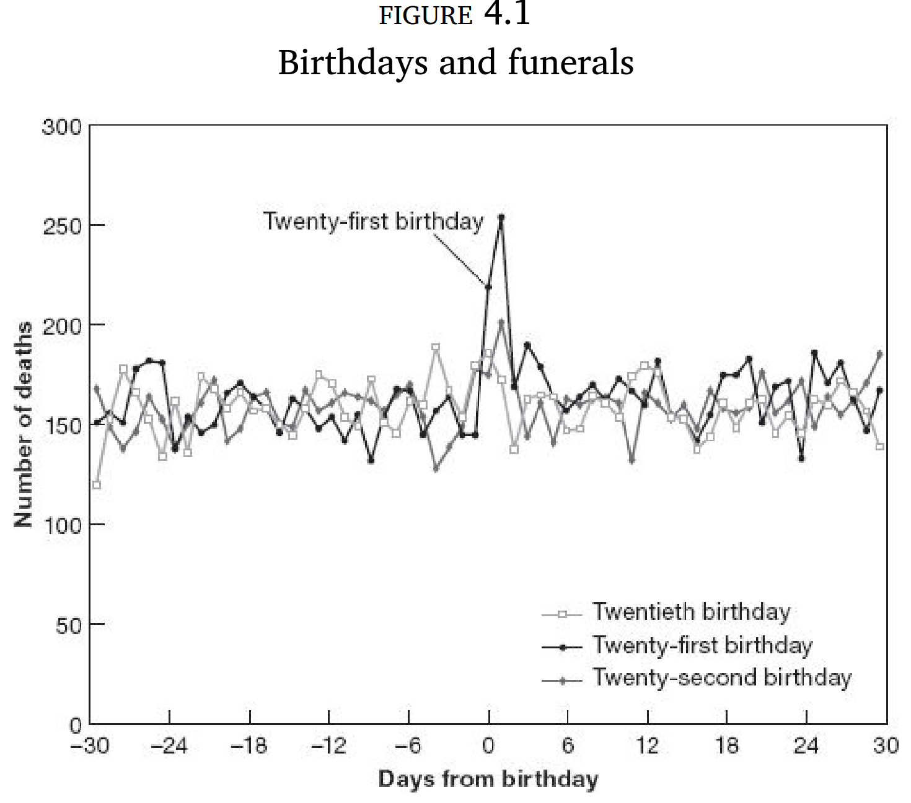
:::
::: column
::: {style="font-size: 70%;"}
- Questão: **beber causa mais mortes entre jovens adultos?**
- Evidência: nos EUA a **idade legal mínima para beber é 21 anos**.
- Isso cria uma variável de corte **exógena**: antes e depois do aniversário de 21.
- Ao comparar pessoas logo abaixo e acima desse limite, obtemos um **quase-experimento**.
- Ideia: se nada mais muda de forma descontínua aos 21 anos, qualquer salto em mortalidade pode ser atribuído ao consumo de álcool.
:::
:::
:::

## RDD: MLDA

::: {style="font-size: 80%;"}

**Variável de atribuição (running variable):** idade ($X_i$)
**Cutoff:** $c = 21$
**Tratamento:** $D_i = 1$ se $X_i \ge 21$, $0$ caso contrário
**Desfecho:** mortalidade (geral, por acidentes, etc.)

$$
Y_i = \alpha + \tau D_i + f(X_i - c) + \varepsilon_i
$$

O **parâmetro de interesse $\tau$** é a **mudança discreta** em $Y$ no ponto de corte:$$
\tau = \lim_{x \downarrow c} E[Y_i|X_i=x] - \lim_{x \uparrow c} E[Y_i|X_i=x]
$$

:::

## Evidência visual e interpretação

::: columns
::: column

:::
::: column
::: {style="font-size: 70%;"}
- Grande salto em **mortes por acidentes de carro** no aniversário de 21 anos.
- Interpretação: aumento repentino no consumo de álcool leva a mais mortes.
- A relação causal é identificada **localmente** (ao redor do cutoff).
- RD fornece um **efeito causal local (LATE)** em torno do limiar.
:::
:::
:::

## Resultados (figura)

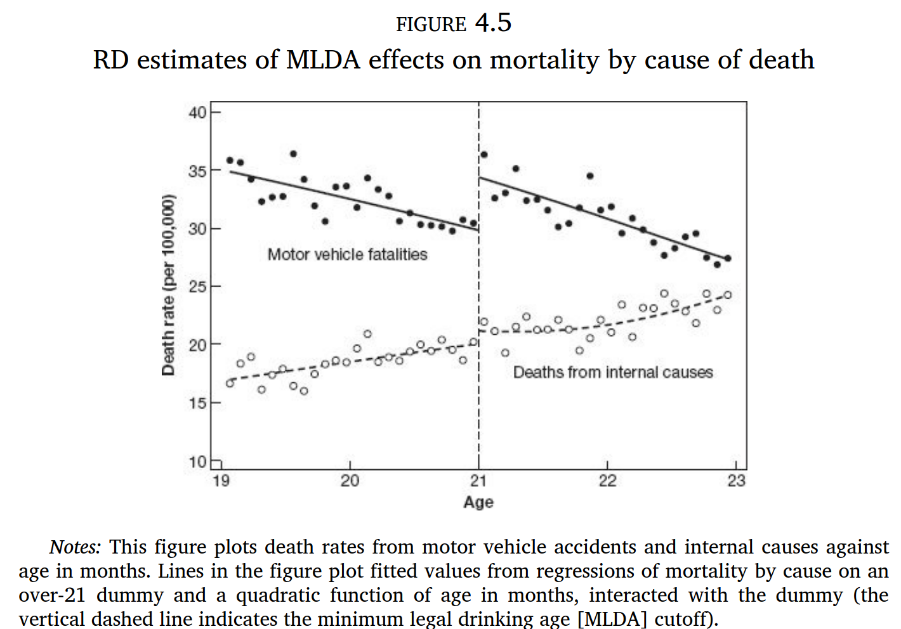

## Resultados (tabela)

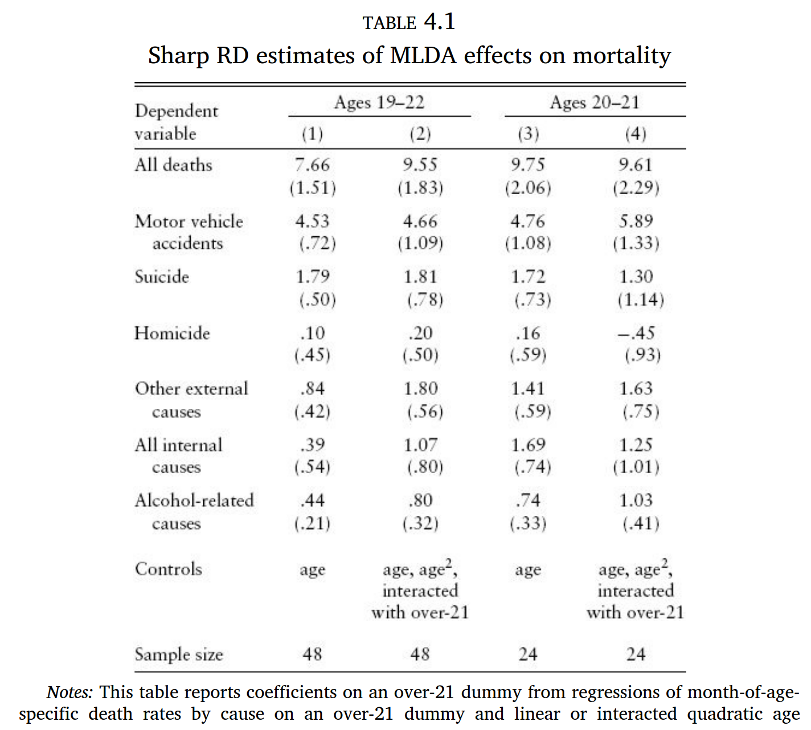

## Political Turnover, Bureaucratic Turnover and the Quality of Public Services

::: {style="font-size: 90%;"}
- @Akhtari_Moreira_Trucco investigam **como a rotatividade política em eleições municipais afeta a burocracia e a qualidade dos serviços públicos** no Brasil.
- Foco principal: **impacto da mudança de partido do prefeito** sobre a provisão de educação pública municipal.
- Questão central: A substituição política de burocratas após uma eleição melhora ou prejudica a qualidade dos serviços públicos?

- Motivação: Em contextos onde políticos controlam nomeações, **a mudança de governo pode gerar substituições generalizadas** com possíveis efeitos negativos sobre continuidade, conhecimento institucional e desempenho do serviço público.

:::

## Contexto e Motivação

::: {style="font-size: 80%;"}

- O estudo analisa **eleições municipais brasileiras**, onde prefeitos controlam fortemente o funcionalismo local, incluindo diretores e professores de escolas municipais.
- O Brasil é um dos países com **maior discricionariedade política** sobre cargos públicos na América Latina.
- A literatura sugere que:
  - Mudanças políticas podem gerar **benefícios políticos de curto prazo** (lealdade, patronagem).
  - Mas também podem implicar **perda de capital humano e disrupção organizacional**.
- A educação é o setor ideal para estudar esse efeito, pois:
  - É **responsabilidade central dos municípios** (≈30% do orçamento).
  - Há **dados ricos sobre desempenho** (testes padronizados e registros administrativos).

:::

## Dados e Estratégia de Identificação

::: {style="font-size: 80%;"}

- **Base de dados combinada:**
  - Resultados eleitorais do TSE (2004–2012).
  - Dados administrativos de pessoal (RAIS).
  - Censo Escolar e Prova Brasil (INEP).
  - Finanças municipais (FINBRA) e dados socioeconômicos (IBGE/IPEA).

- **Estratégia causal:**
  - **Regressão descontínua (RDD)** em eleições municipais.
  - Compara municípios onde o partido incumbente **venceu por pequena margem** (sem troca) com aqueles onde **perdeu por pequena margem** (com troca).
  - Suposição de identificação: Em eleições acirradas, a vitória ou derrota do partido é "quase aleatória".
- Isso permite estimar o **efeito causal da mudança partidária** sobre a rotatividade burocrática e a qualidade da educação (testes de alunos).

:::

## Timeline e estratégia empírica

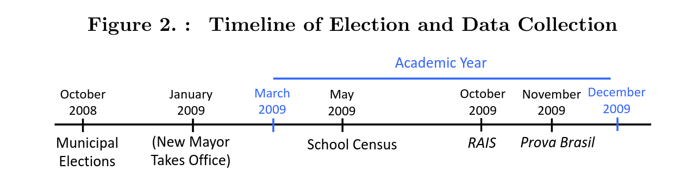

## Resultados: contratação de novos funcionários


## Resultados: notas 4a. série

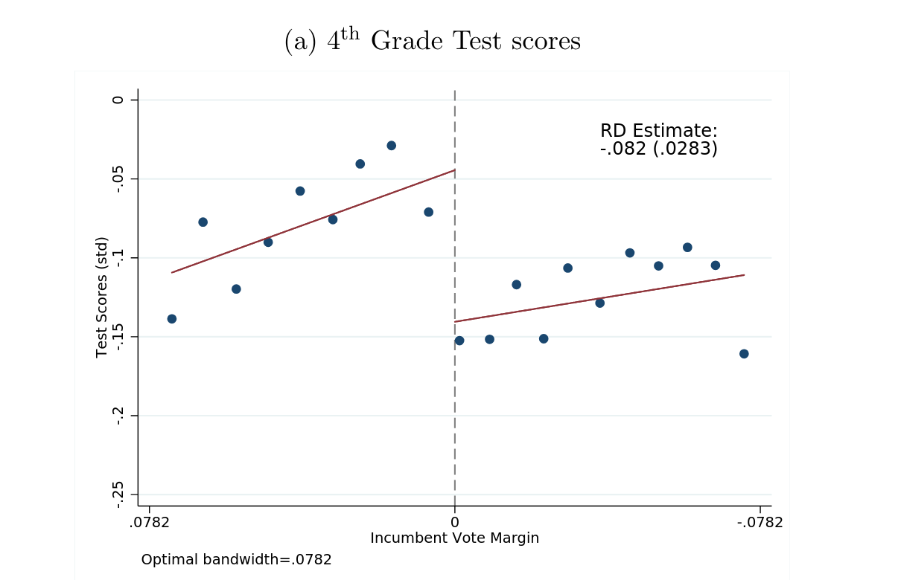

## Resultados: notas 8a. série

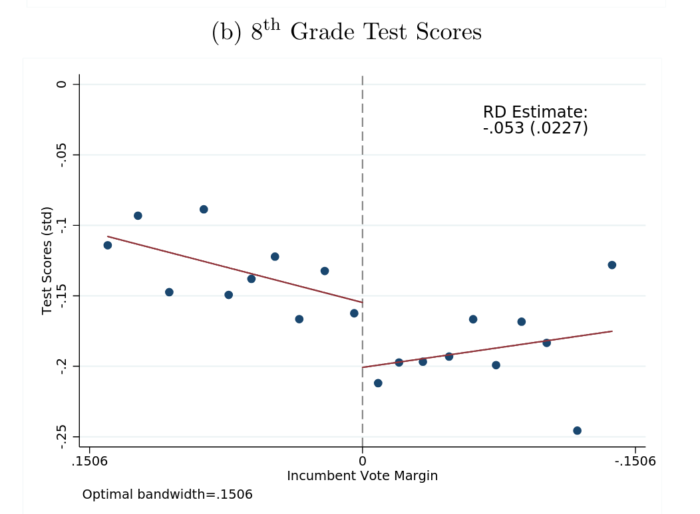

## Resultados: mudanças de diretores

::: columns
::: column
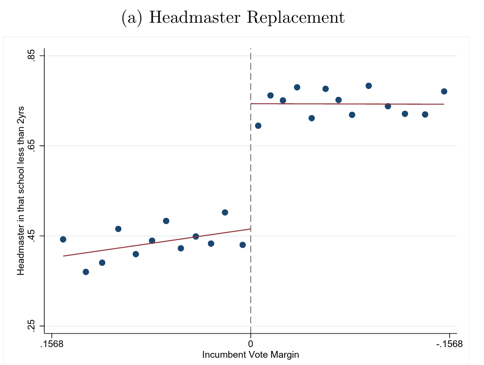
:::
::: column
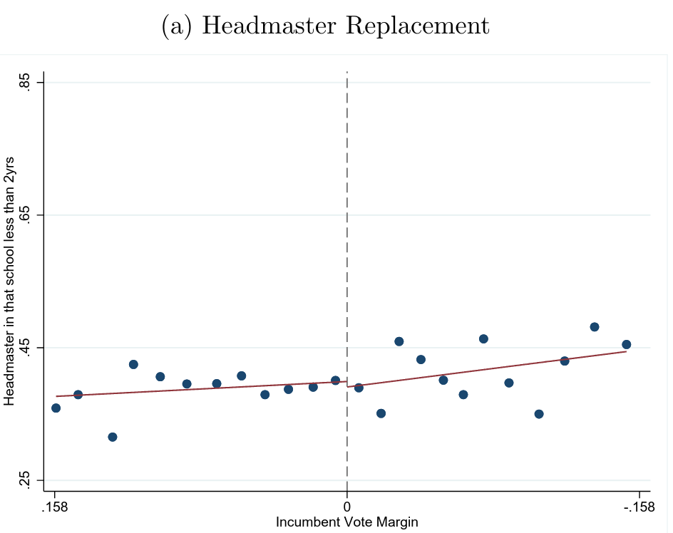
:::
:::

## Resultados: mudanças de professores

::: columns
::: column
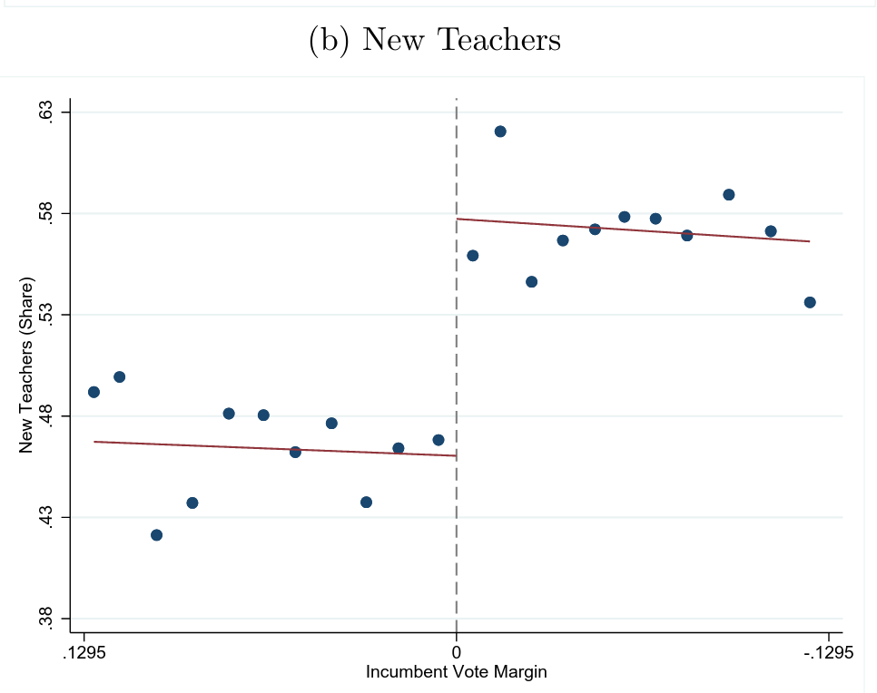
:::
::: column
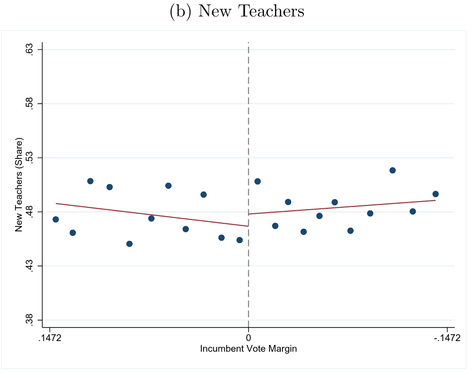
:::
:::

## Referências {visibility="uncounted"}

::: {#refs}
:::
