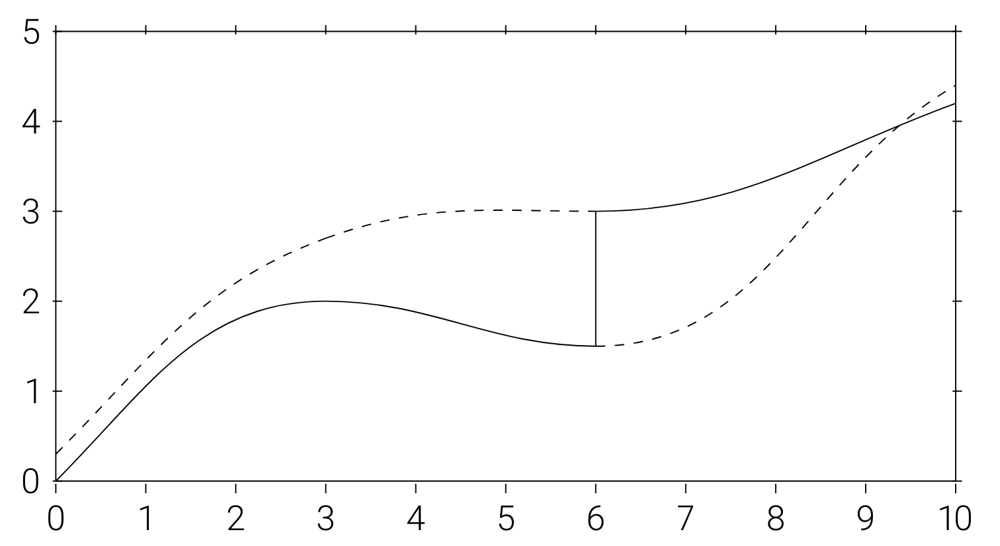
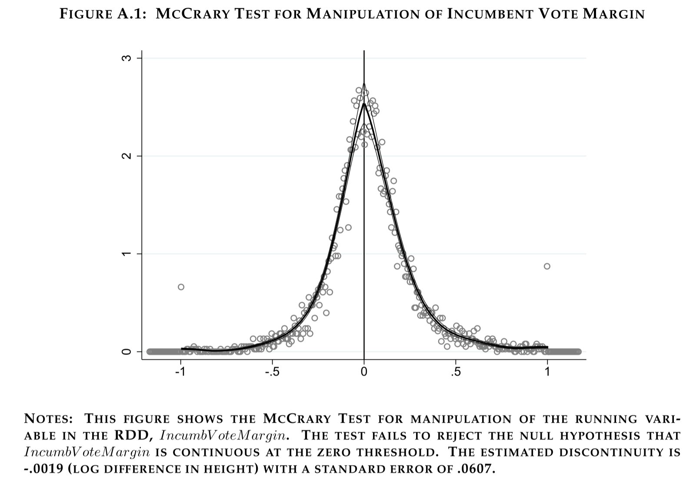

```{r setup, include=FALSE, eval=TRUE}
library(ggplot2)
library(broom)
library(dplyr)
library(tidyr)
library(ggdag)
library(ggraph)
options(digits=5)
```

## Objetivos de aprendizado

Nesta aula, formalizamos como utilizar o desenho de regressões descontínuas para realizar inferência causal.

<br>

Ao final, o aluno deverá ser capaz de:

-   entender intuitivamente como RDD funciona

-   entender as hipóteses de identificação de fuzzy RDD

-   entender como estimar fuzzy RDD

## Referências

::: nonincremental
-   Capítulo 6 de @Cunningham2021CausalInferenceMixtape

-   Capítulo 4 de @angrist_mastering_2015

-   Capítulo 6 de @gertler_avaliacao_2018

-   Seção 13.4 de @stock_watson_2004 (4a Edição, apenas inglês)

:::

## Não conformidade

- **Fuzzy RDD**: abordagem usada quando a atribuição ao tratamento **não é totalmente determinística**, possibilitando que ocorra **viés de seleção**.
- Dado que as probabilidades de receber tratamento não são zero abaixo do ponto de corte e, possivelmente, menores que 1 acima dele, é necessário usar **variáveis instrumentais (IV)**.
- Em outras palavras, o **Fuzzy RDD** é um **desenho de variáveis instrumentais**, em que o **instrumento é o ponto de corte**, e toda a discussão anterior sobre IV se aplica aqui.

## Probabilidade de tratamento salta na descontinuidade

::: {.callout-tip}
## Atribuição probabilística de tratamento ("Fuzzy RDD")

A probabilidade de receber tratamento muda de forma **descontínua** no ponto de corte $c_0$, mas **não precisa ir de 0 a 1**:

$$
\lim_{X_i \rightarrow c_0^+} Pr(D_i = 1 \mid X_i = c_0)
\neq
\lim_{X_i \rightarrow c_0^-} Pr(D_i = 1 \mid X_i = c_0)
$$

**Exemplos:** os incentivos para participar de um programa podem mudar de forma descontínua no ponto de corte, mas não são fortes o bastante para mover todos da não participação para a participação.
:::

## Determinístico (Sharp) vs. Probabilístico (Fuzzy)

- No **Sharp RDD**, $D_i$ é **determinado** por $X_i \ge c_0$.
- No **Fuzzy RDD**, a **probabilidade condicional** de tratamento **salta** em $c_0$.

## Visualização da estratégia de identificação (suavidade)

- $E[Y^0|X]$ e $E[Y^1|X]$ para $D=0,1$ são as funções contínuas tracejadas/cheias ao longo de todo $X$.
- $E[Y|X]$ é a linha cheia que salta em $X=6$.

. . .

{width="65%"}

## RDD como IV

- Os desenhos **fuzzy** RDD são numericamente equivalentes e **conceitualmente semelhantes** a IV.

    - **"Forma reduzida" (numerador):** o salto na regressão do resultado sobre a variável de atribuição $X$.
    - **"Primeiro estágio" (denominador):** o salto na regressão do indicador de tratamento sobre $X$.

- As mesmas **hipóteses de IV**, advertências sobre *compliers* vs. *defiers*, e testes estatísticos (como o teste $F$ para instrumentos fracos) se aplicam.

## Estimador de Wald

::: {.callout-tip}
## Estimador de Wald do efeito do tratamento no Fuzzy RDD

O efeito causal médio do tratamento é o parâmetro IV de Wald:

$$
\delta_{\text{Fuzzy RDD}} =
\frac{
\lim_{X \rightarrow c_0^+} E[Y \mid X=c_0]
- \lim_{X \rightarrow c_0^-} E[Y \mid X=c_0]
}{
\lim_{X \rightarrow c_0^+} E[D \mid X=c_0]
- \lim_{X \rightarrow c_0^-} E[D \mid X=c_0]
}
$$
:::

## Fuzzy RDD como MQ2E: Primeiro Estágio

::: {style="font-size: 70%;"}
- Pode-se usar tanto $Z_i$ quanto os termos de interação como instrumentos para $D_i$.

- Se utilizarmos apenas $Z_i$ como IV, o modelo é justamente identificado.

- No caso justamente identificado, o primeiro estágio seria:$$
D_i = \gamma_0 + \gamma_1 X_i + \gamma_2 X_i^2 + \dots + \gamma_p X_i^p + \pi Z_i + \varepsilon_{1i}$$ onde $\pi$ é o **efeito causal de $Z$** sobre a probabilidade condicional de tratamento.

- A forma reduzida do Fuzzy RD é:$$Y_i = \mu + \kappa_1 X_i + \kappa_2 X_i^2 + \dots + \kappa_p X_i^p + \rho \pi Z_i + \varepsilon_{2i}$$

:::

## Fuzzy RDD como MQ2E: Segundo Estágio

::: {style="font-size: 70%;"}
- Assim como no caso **Sharp RDD**, pode-se permitir que a função suave seja diferente nos dois lados da descontinuidade.

- O modelo de segunda etapa com termos de interação é o mesmo que antes:$$
\begin{aligned}
Y_i &= \alpha + \beta_{01}\tilde{x}_i + \beta_{02}\tilde{x}_i^2 + \dots + \beta_{0p}\tilde{x}_i^p \\
&\quad + \rho D_i + \beta_1^* D_i \tilde{x}_i + \beta_2^* D_i \tilde{x}_i^2 + \dots + \beta_p^* D_i \tilde{x}_i^p + \eta_i
\end{aligned}
$$ onde $\tilde{x}$ está agora não apenas normalizado em relação a $c_0$, mas também representa os **valores ajustados obtidos da regressão do primeiro estágio**.
:::

## Limitações do LATE

- O **Fuzzy RDD** possui as mesmas hipóteses do **modelo IV padrão**: exclusão, independência, primeiro estágio não nulo e monotonicidade.

- Assim como em outros IVs binários, o Fuzzy RDD estima o **LATE**, ou seja, o **efeito médio local do tratamento** para o grupo de *compliers*.

- Em RDD, os *compliers* são aqueles cujo status de tratamento muda quando movemos o valor de $x_i$ de **logo à esquerda** para **logo à direita** de $c_0$.

## Teste de manipulação da variável de atribuição

- O Teste de Densidade de McCrary é amplamente utilizado para verificar **manipulação na variável de atribuição** em RDD.

- Hipóteses:

    - **$H_0$ (Nula):** a densidade da variável de atribuição é **contínua** no ponto de corte.
    - **$H_a$ (Alternativa):** existe uma **descontinuidade** (salto) na densidade da variável de atribuição, sugerindo **manipulação** dos valores em torno do corte.

## Interpretação

- Uma **descontinuidade significativa** na densidade indica **manipulação**, violando as hipóteses básicas de RDD.

- Não rejeitar $H_0$ **não garante** validade: alguns tipos de manipulação **não são detectáveis** por esse teste.

- Se houver **manipulação bilateral** (em ambos os lados do ponto de corte), o teste **não conseguirá detectá-la**.

## Teste de McCrary



## Referências úteis para intuição

[ShinyApp sobre bandwidths](https://mixtape.shinyapps.io/RD-Bandwidth/)

[Animação de Regressão Linear Local](https://twitter.com/page_eco/status/958687180104245248)

## Referências {visibility="uncounted"}

::: {#refs}
:::
