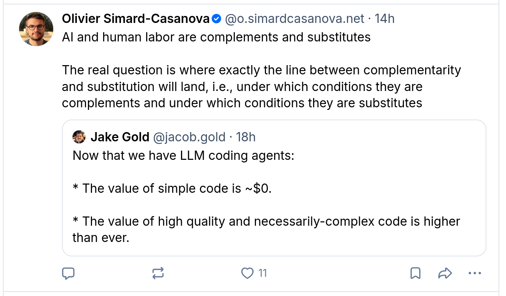
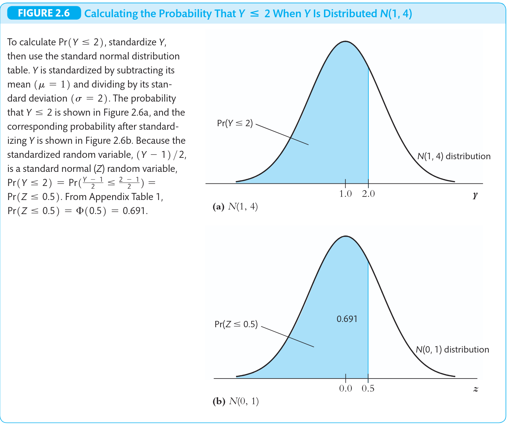
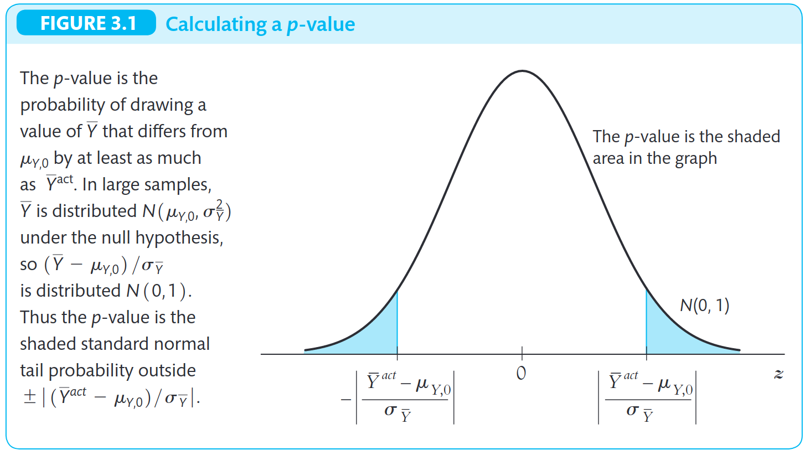

```{r}
#| include: false
library(countdown)
```


## Para reflexão




# Revisão de Probabilidade

## Variáveis Aleatórias e Distribuições de Probabilidade

-   Uma variável aleatória (VA) é uma quantificação numérica de um resultado de um experimento aleatório.
-   Existem dois tipos principais de variáveis aleatórias:
    -   **Variável Aleatória Discreta:** Pode assumir um número finito ou contável de valores.
    -   **Variável Aleatória Contínua:** Pode assumir qualquer valor em um intervalo específico.

## Distribuição de Probabilidade de uma VA Discreta

A distribuição de probabilidade de uma VA discreta é uma lista de todos os valores possíveis da VA e as probabilidades associadas a cada valor.

-   Função de Probabilidade:
    -   $P(Y = y_i)$ para cada valor $y_i$.
    -   A soma de todas as probabilidades deve ser igual a 1.

## Distribuição Acumulada

A Função de Distribuição Acumulada (FDA) para qualquer VA é a probabilidade de que a VA seja menor ou igual a um determinado valor:

-   $F(y) = P(Y \le y)$.
-   Para VA discreta: $F(y) = \sum P(Y = y_i)$ para $y_i \le y$.
-   Para VA contínua: $F(y) = \int_{-\infty}^{y} f(t) dt$.

## Distribuições Conjuntas

Distribuição de Probabilidade Conjunta: Descreve a probabilidade de duas ou mais VAs ocorrerem simultaneamente.

-   $P(X=x, Y=y)$ para discretas. 

-   $f(x,y)$ para contínuas.
    
## Distribuições Marginais

Distribuição de Probabilidade Marginal: A distribuição de probabilidade de uma única VA, obtida a partir da distribuição conjunta.

-   Para discretas: $P(Y=y) = \sum_x P(X=x, Y=y)$ para todos os $x$.

-   Para contínuas: $f(y) = \int_{-\infty}^{\infty} f(x,y) dx$.

## Distribuições Condicionais

A distribuição de probabilidade condicional de $Y$ dado $X=x$ é a distribuição de $Y$ para uma dada observação de $X$:

-   $P(Y=y | X=x) = P(X=x, Y=y) / P(X=x)$.

-   $f(y|x) = f(x,y) / f(x)$.

## Independência Estatística

$X$ e $Y$ são independentes se a distribuição condicional de $Y$ dado $X$ é igual à distribuição marginal de $Y$: $P(Y=y | X=x) = P(Y=y)$.

Uma condição equivalente é que a distribuição conjunta seja o produto das distribuições marginais.

-   $P(X=x, Y=y) = P(X=x) P(Y=y)$.

. . . 

::: callout-important
Se $X$ e $Y$ são independentes, saber o valor de $X$ não fornece informação sobre $Y$!
:::

## Esperança Matemática (Média)

A esperança matemática ou valor esperado de uma VA é sua média ou valor central.

-   Para VA discreta: $E(Y) = \sum y_i P(Y=y_i)$.

-   Para VA contínua: $E(Y) = \int y f(y) dy$.

-   Representa o valor médio de $Y$ em um grande número de experimentos ou ocorrências repetidas.

<!-- ## Propriedades da Esperança Matemática -->

<!-- -   Linearidade da esperança: -->
<!--     -   $E(a + bY) = a + b E(Y)$. -->
<!--     -   $E(X + Y) = E(X) + E(Y)$. -->
<!-- -   Estas propriedades são úteis para simplificar cálculos e derivações. -->

## Variância e Desvio Padrão

A variância mede a dispersão ou o espalhamento da distribuição de $Y$ em torno de sua média.

-   $Var(Y) = E[(Y - E(Y))^2]$.

-   $Var(Y) = E(Y^2) - [E(Y)]^2$.

. . . 

O desvio padrão $\sigma_Y$ é a raiz quadrada da variância.

. . . 

::: callout-important
O desvio padrão tem a mesma unidade de medida da VA original!
:::

## Covariância

A covariância mede o grau de associação linear entre duas VAs.

-   $Cov(X,Y) = E[(X - E(X))(Y - E(Y))]$.

-   $Cov(X,Y) = E(XY) - E(X)E(Y)$.

. . . 

::: {.r-stack}
::: {.fragment .fade-in-then-out}
Qual a interpretação se $Cov(X,Y) > 0$? 
:::

::: {.fragment .fade-in-then-out}
E se $Cov(X,Y) < 0$? 
:::

::: {.fragment .fade-in}
E se $Cov(X,Y) = 0$? 
:::
:::

. . . 

::: callout-important
Se $X$ e $Y$ são independentes, $Cov(X,Y) = 0$!
:::


## Correlação

-   O coeficiente de correlação $\rho_{XY}$ normaliza a covariância, tornando-a uma medida sem unidade.
-   $\rho_{XY} = \frac{Cov(X,Y)}{\sigma_X \sigma_Y}$.
-   Os valores variam de -1 a +1.
    -   +1 indica uma relação linear positiva perfeita.
    -   -1 indica uma relação linear negativa perfeita.
    -   0 indica ausência de relação linear.

## Esperança Condicional

A esperança condicional é a média de $Y$ quando $X$ assume um valor específico $x$.

-   Para discretas: $E(Y|X=x) = \sum y P(Y=y|X=x)$.

-   Para contínuas: $E(Y|X=x) = \int y f(y|x) dy$.

-   A esperança condicional é uma função de $X$.

. . . 

::: callout-important
A experança condicional é um conceito chave para a análise de regressão.
:::


## Lei das Expectativas Iteradas

A Lei das Expectativas Iteradas afirma que a esperança incondicional de $Y$ é a esperança da esperança condicional de $Y$ dado $X$.

-   $E(Y) = E[E(Y|X)]$.

. . . 

::: callout-tip
Isso significa que a média geral de $Y$ pode ser calculada como uma média ponderada das médias condicionais de $Y$ para cada valor de $X$.
:::


## Variância Condicional

A variância condicional é a variância de $Y$ quando $X$ assume um valor específico $x$.

-   $Var(Y|X=x) = E[(Y - E(Y|X=x))^2 | X=x]$.

-   É uma medida da dispersão de $Y$ em torno de sua média condicional.

. . . 

Relembrando: Qual a relação deste conceito com o termo homocedásticidade?


## A Distribuição Normal

-   A distribuição normal é caracterizada por dois parâmetros:
    -   $\mu$ (média)
    -   $\sigma^2$ (variância)

-   Representada como $N(\mu, \sigma^2)$.

-   A distribuição normal padrão é um caso especial da distribuição normal com $\mu=0$ e $\sigma^2=1$.
-   Qualquer VA normal $Y$ pode ser padronizada para $Z$ usando a transformação: $Z = \frac{Y - \mu}{\sigma}$.

## A Distribuição Normal



## Lei dos Grandes Números 

-   A Lei dos Grandes Números (LLN) estabelece que a média amostral ($\bar{Y}$) de uma sequência de VAs independentes e identicamente distribuídas (i.i.d.) converge em probabilidade para a média populacional ($\mu_Y$) à medida que o tamanho da 
amostra ($n$) aumenta.
-   Formalmente: $\bar{Y}$ $\xrightarrow{p}$ $\mu_Y$.
-   A LLN garante que a média amostral é um estimador consistente da média populacional.


## Simulação da LLN

```{r}
#| echo: true
#| code-fold: true
#| code-summary: "Veja o código"

# Utilizar conjunto de pacotes tidyverse
library(tidyverse)

# Parâmetros para Simulação

set.seed(123) # Para reprodutibilidade dos resultados
prob_sucesso <- 0.7 # A "verdadeira" média populacional (p) para uma distribuição Bernoulli
max_amostra <- 5000 # Tamanho máximo da amostra para simular

# Criar uma base de dados para receber os dados simulados
# Usar função 'map' (do pacote purrr) para aplicar funções a cada linha
sim_data <- tibble(n = 1:max_amostra) %>%
  mutate(
    # Gerar 'n' observações de uma Bernoulli para cada 'n'
    amostras = map(n, ~rbinom(.x, size = 1, prob = prob_sucesso)),
    # Calcular a média de cada amostra gerada
    mean_sample = map_dbl(amostras, mean)
  )

# --- Visualização dos Resultados com 'ggplot2' ---
ggplot(sim_data, aes(x = n, y = mean_sample)) +
  # Linha que representa a evolução da média amostral
  geom_line(aes(color = "Média Amostral"), linewidth = 0.8) +
  # Linha horizontal para a verdadeira média populacional
  geom_hline(aes(yintercept = prob_sucesso, color = "Média Populacional"),
             linetype = "dashed", linewidth = 1) +
  # Configurações de cores e legendas para as linhas
  scale_color_manual(
    name = NULL, # Remove o título da legenda
    values = c("Média Amostral" = "darkblue", "Média Populacional" = "red"),
    labels = c(
      "Média Amostral" = "Média Amostral",
      "Média Populacional" = paste("Média Populacional (p =", prob_sucesso, ")")
    )
  ) +
  # Títulos e rótulos dos eixos
  labs(
    title = "Demonstração da Lei dos Grandes Números",
    x = "Tamanho da Amostra (n)",
    y = "Média Amostral"
  ) +
  # Limita o eixo Y para a escala de 0 a 1 (adequado para Bernoulli)
  ylim(0, 1) +
  # Tema visual minimalista para o gráfico
  theme_minimal() +
  # Ajustes finos no tema (título centralizado, posição da legenda)
  theme(
    plot.title = element_text(hjust = 0.5, face = "bold"),
    legend.position = "topright"
  )
```

## Teorema do Central do Limite 

O Teorema Central do Limite (CLT) afirma que, sob certas condições (principalmente variância finita), a distribuição da média amostral ($\bar{Y}$) se aproxima de uma distribuição normal à medida que o tamanho da amostra ($n$) se torna grande.


-   Formalmente: $Z \xrightarrow{d} N(0,1)$.

::: callout-important
-   O TLC é crucial porque permite a inferência estatística para grandes 
amostras mesmo que a população original não seja normalmente distribuída.
:::

## Simulação do CLT

```{r}
#| echo: true
#| code-fold: true
#| code-summary: "Veja o código"
#| 
library(tidyverse)

# Parâmetros para Simulação
reps <- 10000
sample_sizes <- c(2, 5, 25, 100)
set.seed(123)

# 1. Criar a estrutura de dados simulados
df_sim <- crossing(
    rep = 1:reps, 
    n = sample_sizes
  ) %>%
  # Para cada combinação, geramos a média de n sorteios de Bernoulli(0.5)
  # Usamos rowwise() ou agrupamos por rep e n
  group_by(rep, n) %>% 
  mutate(
    sample_mean = mean(rbinom(n, 1, 0.5))
  ) %>% 
  ungroup() %>%
  # Calculamos a estatística padronizada
  mutate(
    std_sample_mean = sqrt(n) * (sample_mean - 0.5) / 0.5,
    n_label = str_glue("n = {n}") # Cria labels melhores para o gráfico
  ) %>% 
  # Garantir que a ordem dos painéis siga a ordem numérica de n
  mutate(n_label = fct_reorder(n_label, n))

# 2. Criar o gráfico
ggplot(df_sim, aes(x = std_sample_mean)) +
  geom_histogram(aes(y = after_stat(density)), 
                 bins = 40, 
                 fill = "steelblue", 
                 color = "white") +
  stat_function(fun = dnorm, 
                color = "darkred", 
                linewidth = 1) +
  facet_wrap(~ n_label, scales = "fixed") +
  coord_cartesian(xlim = c(-3, 3), ylim = c(0, 0.8)) +
  labs(
    title = "Teorema Central do Limite",
    subtitle = "Aproximação da Bernoulli(0.5) para a Normal Padrão",
    x = "Estatística de Teste Padronizada",
    y = "Densidade"
  ) +
  theme_minimal()
```

# Revisão de Estatística

## Amostragem e a Média Amostral

-   Uma amostra aleatória simples consiste em $n$ observações $Y_1, Y_2, \dots, Y_n$ independentes e identicamente distribuídas (*i.i.d.*) da população.

-   A média amostral é um **estimador** da média populacional $\mu_Y$: $\bar{Y} = \frac{1}{n} \sum_{i=1}^{n} Y_i$

. . . 

::: {.r-stack}

::: {.fragment .fade-in-then-out}
::: callout-important
Um **estimador** é uma função de uma amostra de dados selecionados aleatoriamente. Uma **estimativa** é o valor número do estimador para uma amostra específica.
:::
:::

::: {.fragment .fade-in-then-out}
::: callout-important
Um **estimador** é uma variável aleatória! Uma **estimativa** é um número não aleatório!
:::
:::

::: {.fragment .fade-in-then-out}
A média amostral é o único estimador possível da média populacional?
:::

::: {.fragment .fade-in-then-out}
Quais outros estimadores para média populacional vocês conseguem pensar? 
:::

::: {.fragment .fade-in-then-out}
Se existem vários estimadores para o mesmo parâmetro, como escolher entre eles? 
:::

:::


## Propriedades do Estimador de Média {.smaller}

-   **Não-viesado (Unbiased):** $E(\bar{Y}) = \mu_Y$.
    -   Em média, o estimador acerta o verdadeiro valor do parâmetro populacional.
    
-   **Consistente (Consistent):** $\bar{Y}$ $\xrightarrow{p}$ $\mu_Y$.
    -   À medida que o tamanho da amostra aumenta, o estimador converge para o verdadeiro valor do parâmetro. 
    
. . . 

::: {.fragment .fade-in}
Qual dos conceitos vistos anteriormente garante que o estimador da média é consistente?
:::

::: {.fragment .fade-in}
R: Lei dos Grandes Números!
:::

. . . 

-   **Variância:** $Var(\bar{Y}) = \sigma_Y^2 / n$.
    -   A variância da média amostral diminui com o aumento do tamanho da amostra.

## Estimador da Variância

-   A variância amostral ($s_Y^2$) é um estimador da variância populacional ($\sigma_Y^2$).
    -   $s_Y^2 = \frac{1}{n-1} \sum_{i=1}^{n} (Y_i - \bar{Y})^2$.
-   O denominador $(n-1)$ é usado para garantir que $s_Y^2$ seja um estimador **não-viesado** de $\sigma_Y^2$.
-   O desvio padrão amostral ($s_Y$) é a raiz quadrada de $s_Y^2$.

## Erro Padrão do Estimador

-   O **erro padrão** de um **estimador** é o desvio padrão de sua **distribuição amostral**.
-   Para a média amostral: $SE(\bar{Y}) = \sigma_Y / \sqrt{n}$.
-   Na prática, $\sigma_Y$ é desconhecido e é substituído pelo desvio padrão amostral $s_Y$: $SE(\bar{Y}) = s_Y / \sqrt{n}$.
-   O erro padrão mede a **precisão** com que o estimador é capaz de estimar o parâmetro populacional.

## Testes de Hipóteses 

::: {style="font-size: 80%;"}
-   Um **teste de hipóteses** é um procedimento para tomar uma decisão sobre uma afirmação (hipótese) referente a um **parâmetro populacional**.
-   **Hipótese Nula ($H_0$):** A afirmação a ser testada (e.g., $\mu_Y = \mu_{Y,0}$).
-   **Hipótese Alternativa ($H_1$):** A afirmação que se aceita se $H_0$ for rejeitada (e.g., $\mu_Y \ne \mu_{Y,0}$, $\mu_Y > \mu_{Y,0}$, $\mu_Y < \mu_{Y,0}$).


<!-- ::: {.r-stack} -->

::: {.fragment .fade-in}
::: callout-note
A **inferência estatística** é o processo de tirar conclusões sobre uma **população** a partir da análise de uma **amostra aleatória**. 
:::
:::

::: {.fragment .fade-in}
::: callout-tip
Não confundir com **inferência causal** quando o objetivo é tirar conclusões de **causa e efeito**.
:::
:::

<!-- ::: -->
:::

## Estatística de Teste t

-   Para testar hipóteses sobre a média populacional $\mu_Y$, usamos a estatística de teste $t$.
-   Estatística $t = \frac{\bar{Y} - \mu_{Y,0}}{SE(\bar{Y})}$.
-   Em grandes amostras, $t \sim \mathcal{N}(0,1)$ **sob a hipótese nula**.

. . . 

::: {.fragment .fade-in}
Qual dos conceitos vistos anteriormente garante que a estatísta $t$ converge para normal padrão?
:::

::: {.fragment .fade-in}
R: Teorema Central do Limite!
:::


## Valor-p (p-value)

-   O valor-p é a probabilidade de observar um valor da estatística de teste tão extremo ou mais extremo do que o valor realmente observado na amostra, **sob a hipótese nula**.

-   Um valor-p pequeno sugere que a evidência da amostra é inconsistente com a hipótese nula.

## Nível de Significância e Decisão 

::: {style="font-size: 80%;"}

-   **Nível de Significância ($\alpha$):** Um limite pré-determinado (e.g., 0,10, 0,05, 0,01) para o valor-p. Representa a probabilidade de rejeitar $H_0$ quando ela é verdadeira (Erro Tipo I).

-   **Regra de Decisão:**
    -   Se valor-p $< \alpha$: Rejeite $H_0$. Há evidência estatística contra a hipótese nula.
    -   Se valor-p $\ge \alpha$: Não rejeite $H_0$. Não há evidência estatística suficiente para rejeitar a hipótese nula.

:::

. . .

::: callout-important
Não rejeitar $H_0$ não significa que $H_0$ é verdadeira, apenas que os dados não fornecem evidência para rejeitá-la.
:::


## Visualização valor-p/significância




## Intervalos de Confiança (IC)

::: {style="font-size: 80%;"}

Um intervalo de confiança para a média populacional $\mu_Y$ é um intervalo de valores plausíveis para $\mu_Y$, construído a partir dos dados amostrais.

-   Um IC de 95% para $\mu_Y$ é:
    -   $\bar{Y} \pm 1.96 \times SE(\bar{Y})$ (para grandes amostras).
    -   $1.96$ é o valor crítico da distribuição normal padrão para um nível de confiança de 95%.

:::

::: {.r-stack}

::: {.fragment .fade-in-then-out}
::: callout-important
Um IC de $X$% significa que, **se repetirmos o processo de amostragem e construção do IC um grande número de vezes**, $X$%  desses intervalos conteriam o verdadeiro valor do parâmetro populacional.
:::
:::

::: {.fragment .fade-in-then-out}
::: callout-important
Não significa que **há $X$% de probabilidade** de que o intervalo específico contenha o verdadeiro valor!
:::
:::

::: {.fragment .fade-in-then-out}
::: callout-important
Há uma relação direta entre testes de hipóteses e intervalos de confiança: se um valor estiver fora do IC, então a hipótese nula seria rejeitada ao nível de significância definido.
:::
:::

::: {.fragment .fade-in-then-out}
"Professor, na prova vamos ter que consultar as tabelas para fazer os testes e interpretar os resultados?"
:::

::: {.fragment .fade-in-then-out}
::: callout-tip
Não! Vamos usar uma regra de bolso: se o valor absoluto da estimativa for maior que o dobro do erro-padrão, o valor está fora do IC e rejeita-se $H_0$. 
:::
:::

:::


## Outras distribuições

::: {style="font-size: 80%;"}
-   **Distribuição Qui-quadrado ($\chi^2$)**:
    
    -   **Uso:** utilizada em testes de hipóteses de restrições múltiplas (e.g., Teste de Wald) e para a distribuição amostral de variâncias. 
    
-   **Distribuição F**

    -   **Uso:** utilizada para testar hipóteses conjuntas sobre coeficientes de regressão (e.g., Teste F) e para comparar variâncias de populações.
    
-   **Distribuição Uniforme**

    -    **Uso:** probabilidade constante sobre um determinado intervalo. Base para amostragem aleatória e para modelagem de incerteza em alguns contextos.
    
:::

## Outras distribuições (cont.)

-  **Distribuição Bernoulli / Binomial**

    -   **Uso:** Para eventos binários ) ou para a contagem de sucessos em um número fixo de tentativas. Base para modelos de escolha discreta (e.g., Probit, Logit).
    
-   **Distribuição de Poisson**

    -   **Uso:** Para a contagem de eventos que ocorrem em um intervalo fixo de tempo ou espaço (e.g., número de acidentes, de patentes, de visitas a um site).


