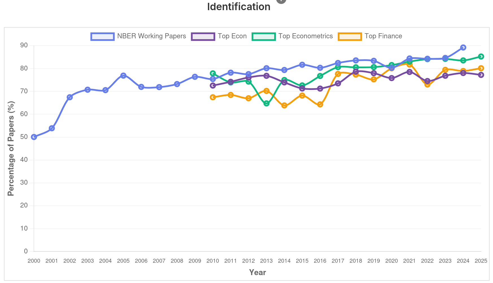
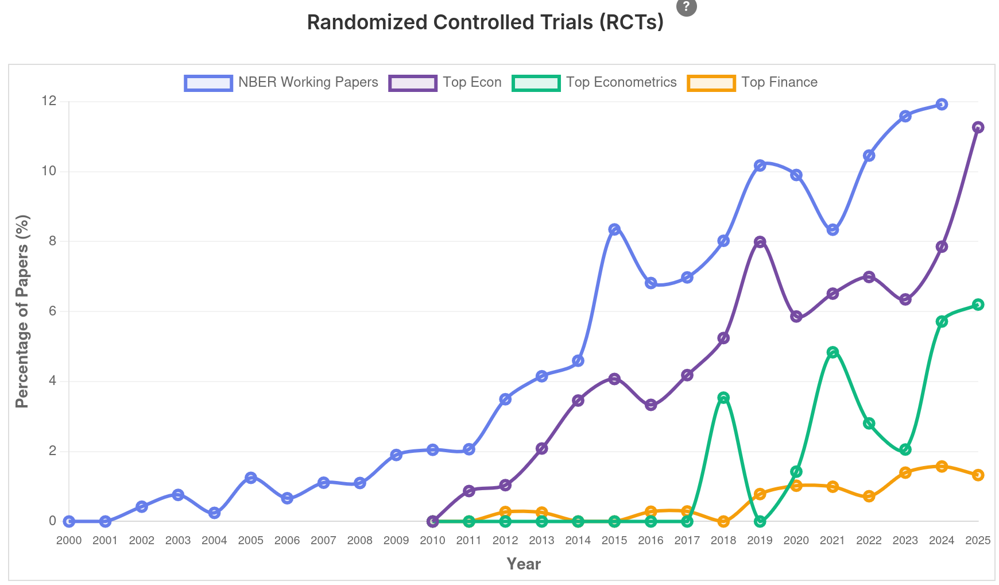
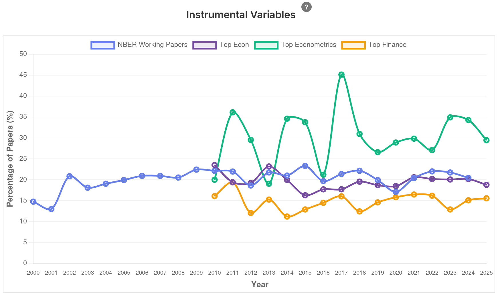
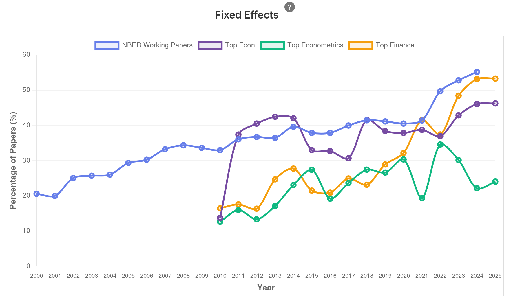
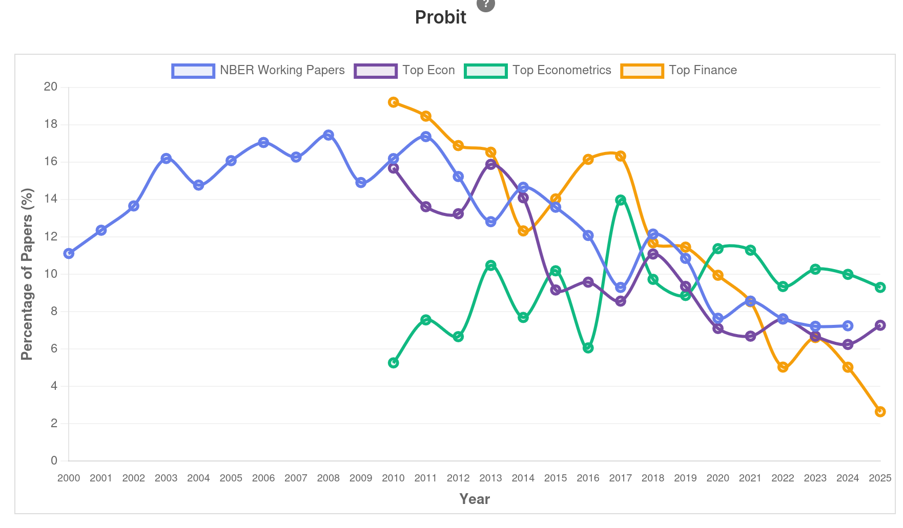
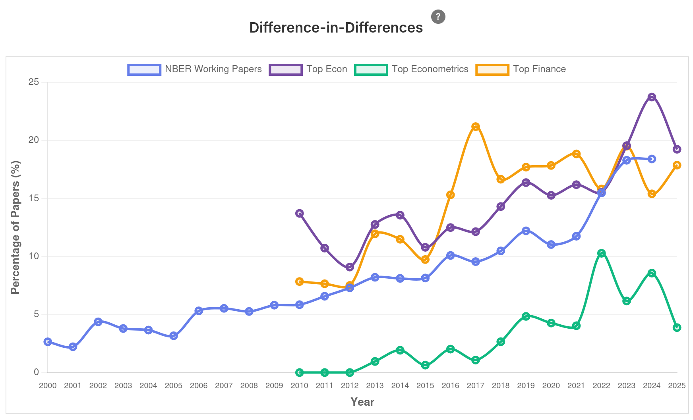
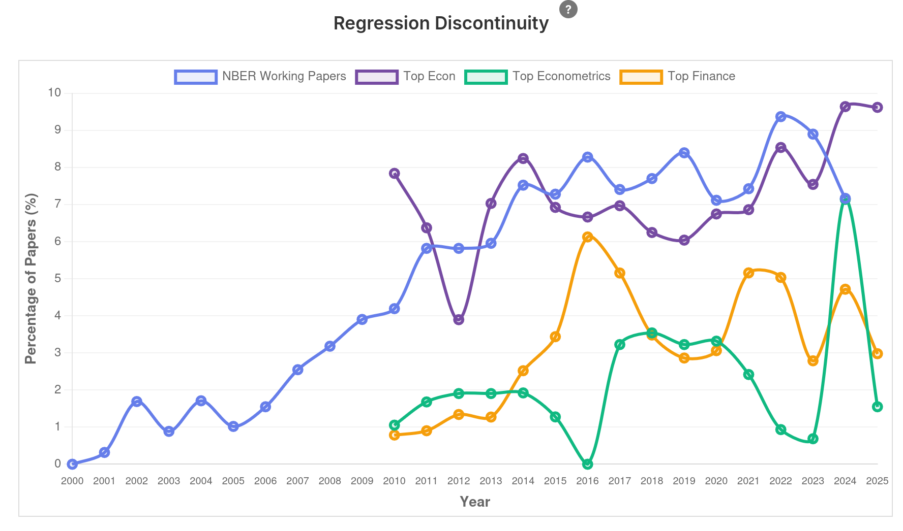
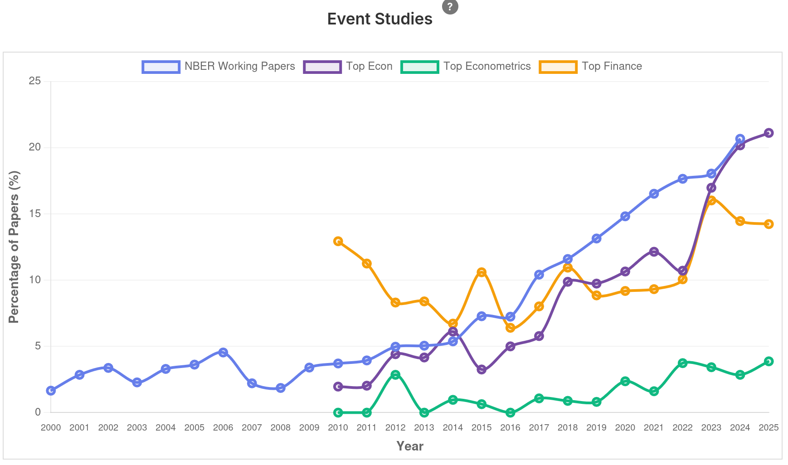
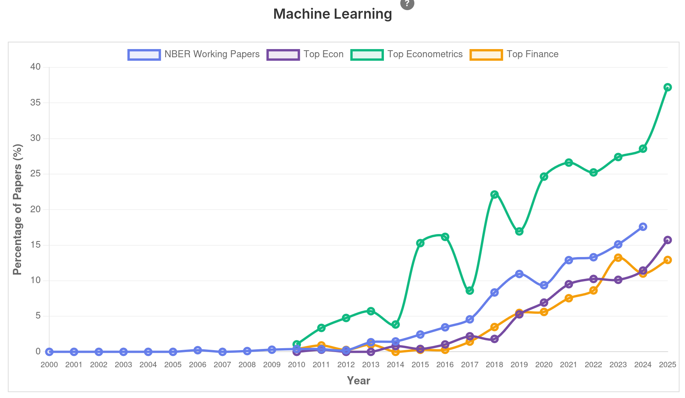

```{r}
#| include: false
library(countdown)
```


## Para reflexão

{fig-align="center"}

## Pesquisa Empírica: perguntas e objetivos


- Responder perguntas sobre como o mundo funciona usando dados.

- Produzir respostas **claras, úteis e interpretáveis e precisas**.

- Ir além de descrições: buscar evidência sistemática.

## Modelos e Causalidade

::: {style="font-size: 90%;"}
Um dos principais objetivos da pesquisa econômica é realizar inferências causais, ou seja, fazer inferência de relações de causa e efeito.  

Qual é o papel dos modelos nesse processo?

- uma visão (por exemplo, Heckman): a causalidade é baseada em teoria, ou seja, a causalidade só existe **dentro da estrutura de uma teoria** que diz “x causa y”.

- uma visão oposta (por exemplo, Holland): a causalidade é baseada em desenho de pesquisa, ou seja, uma afirmação de causalidade exige que seja possível **realizar uma manipulação** na qual “x causa y”.

:::

## Inferência causal: uma definição

::: {style="font-size: 0.8em;"}
> "Causal inference is the leveraging of **theory** and deep **knowledge of institutional details** to **estimate the impact** of events and choices on a given **outcome of interest**."
:::

Fonte: Cunningham [p. 4.]

## Credibility Revolution

::: {style="font-size: 0.8em;"}
> "Empirical microeconomics has experienced a **credibility revolution**, with a consequent increase in **policy relevance and scientific impact**. Sensitivity analysis played a role in this, but as we see it, the **primary engine driving improvement** has been a focus on the quality of **empirical research designs**."
:::

Fonte:  Angrist e Pischke (2009) [p. 3]

## Desenho de pesquisa: definição {#sec-design}

::: {style="font-size: 80%;"}

- Um desenho de pesquisa (causal) é uma descrição estatística e/ou econômica de como um artigo empírico estimará a relação entre duas (ou mais) variáveis que é de natureza
causal: como X causa Y?

- Como veremos logo mais, obter estimativas de efeitos causais exigem a estimação de um **contrafactual não observável**: um desenho de pesquisa descreve **quais pressupostos** são necessários para estimar contrafactuais para um determinado modelo estatístico.

- Como discutiremos em aula, esses desenhos de pesquisa podem ser divididos em dois tipos de pressupostos: 

    - baseados em modelos: identificação obtida por pressupostos sobre a modelagem dos resultados potenciais. 
    
    - baseados em desenho: identificação obtida por pressupostos sobre variável de tratamento.

:::

## Identificação:

::: {style="font-size: 80%;"}

Identificação é o processo de determinar **qual parte da variação dos dados** responde à sua pergunta de pesquisa.  

- Garante que o cálculo realizado **isole um único mecanismo teórico de interesse**.  

- Evita interpretações enganosas: separa o que realmente importa do que é apenas ruído.

Qual o papel da identificação no processo científico: 

- Pergunta de pesquisa leva da teoria à hipótese  garantindo que a hipótese testada seja relevante para a teoria.

- Identificação leva da hipótese aos dados, garantindo que estamos testando a hipótese correta nos dados e evitando testar, inadvertidamente, outra hipótese.

:::

## Exemplo de visão ingênua sobre identificação e causalidade

::: {style="font-size: 80%;"}

-   Alienígenas estimam um modelo mostrando que existe correlação sistemática entre mortes por COVID e ventiladores mecânicos.

-   Eles concluem que os médicos estão matando os pacientes com os ventiladores. Logo, eles vêm à Terra para libertar os pacientes, piorando a situação.

-   O erro dos alienígenas foi que eles confundiram correlação com causalidade. Pior que isso: eles não entenderam como o mundo funciona.

:::

. . .

::: {style="font-size: 75%;"}

::: {.callout-warning}
Nós somos os alienígenas nas nossas pesquisas!
:::

:::

## Causalidade e correlação não são a mesma coisa

-   Pergunta causal: "Se o médico colocar o paciente no ventilador mecânico $(D)$, os sintomas do paciente irão melhorar $(Y)$?"

-   Correlação: $\rho_{D,Y} = \frac{\mathrm{Cov}(D, Y)}{\sigma_D \sigma_Y}$

- Erros são extrapolados em modelos preditivos que não se baseiam em abordagens causais.

## Antecedência não significa causalidade 

- Toda manhã o galo canta quando o sol nasce

- O cantar do galo fez o sol nascer? ou O nascer do sol fez o galo cantar?

- E se uma raposa comer o galo?


## Causalidade pode mascarar correlações

{fig-align="center"}

. . .

::: {.callout-tip}
## Otimização e endogeneidade

O que aconteceria se o BACEN conseguisse antecipar e otimizar com 100% de precisão a política monetária?
:::


## E o curso?

::: {.r-stack}

::: {.fragment .fade-in-then-out}
{fig-align="center"}
:::

::: {.fragment .fade-in-then-out}
{fig-align="center"}
:::

::: {.fragment .fade-in-then-out}
{fig-align="center"}
:::

::: {.fragment .fade-in-then-out}
{fig-align="center"}
:::

::: {.fragment .fade-in-then-out}
{fig-align="center"}
:::


::: {.fragment .fade-in-then-out}
{fig-align="center"}
:::


::: {.fragment .fade-in-then-out}
{fig-align="center"}
:::

::: {.fragment .fade-in-then-out}
{fig-align="center"}
:::

::: {.fragment .fade-in-then-out}
{fig-align="center"}
:::

::: {.fragment .fade-in}
Fonte: [Economics Literature Search](https://paulgp.com/econlit-pipeline/index.html)
:::

:::


## Intervalo (5min)


## Resultados Potenciais: modelo de Rubin


## Tudo o mais constante...

Qual o impacto ou efeito causal de um determinado programa sobre uma variável de resultado de interesse?

- Necessário observar **a mesma unidade de observação** (pessoa, firma, etc) em dois estados da natureza: tratado e não tratado.

- Porém, só é possível observar **um dos estados** para cada unidade!

  - pelo menos não ao mesmo tempo e exatamente sob as mesmas circunstâncias.

## Resultados Potenciais

::: {style="font-size: 90%;"}
Para cada unidade (indivíduo, firma, país, etc.) $i$ em uma população, definimos dois *resultados potenciais*:

- $Y_{i1}$: resultado para a unidade $i$ se ela recebesse o tratamento

- $Y_{i0}$: resultado para a unidade $i$ se ela **não** recebesse o tratamento (controle)

:::

::: {.callout-important}
## Resultados potenciais são contrafactuais

Para um dado indivíduo, apenas um dos resultados potenciais pode ser observado!
:::


## Atribuição de Tratamento

::: {style="font-size: 90%;"}
Seja $D_i$ uma variável binária que indica o status de tratamento da unidade $i$:

- $D_i = 1$: a unidade $i$ recebeu o tratamento

- $D_i = 0$: a unidade $i$ **não** recebeu o tratamento (controle)

::: {.callout-important}
## Resultados observado

O resultado observado para a unidade $i$, denotado por $Y_i$, depende dos resultados potenciais e do status de tratamento: $Y_i = D_i Y_{i1} + (1 - D_i) Y_{i0}$
:::

:::

. . . 

::: {style="font-size: 90%;"}
- Observamos $Y_{i1}$ se $D_i=1$

- Observamos $Y_{i0}$ se $D_i=0$
:::


## Efeito Tratamento Individual

- O efeito causal do tratamento para a unidade $i$ é definido como: $\tau_i = Y_{i1} - Y_{i0}$

- É o efeito que **gostaríamos** de conhecer para cada unidade

::: {.callout-important}
## O efeito tratamento individual é não observável

Não é possível observar $\tau_i$ diretamente, pois apenas um dos resultados potenciais é observado para cada unidade.
:::

## Efeito Tratamento Médio (ATE)

- Existe uma distribuição dos efeitos de tratamento

- Podemos trabalhar com características dessa distribuição, como a média

- Interesse em estimar o **efeito tratamento médio**:$\text{ATE} = E[Y_1 - Y_0] = E[\tau_i]$

- Representa a diferença esperada nos resultados se toda a população recebesse o tratamento versus se ninguém recebesse

## Efeito Tratamento Médio no Grupo Tratado (ATT)

- ATT: $\text{ATT} = E[Y_1 - Y_0 \mid D=1]$

- Efeito médio do tratamento para aqueles que realmente receberam o tratamento

- Útil em avaliações de políticas

- Mede o efeito sobre os realmente afetados

## Efeito Tratamento Médio no Grupo dos Não Tratados (ATU)

- ATU: $\text{ATU} = E[Y_1 - Y_0 \mid D=0]$

- Efeito médio do tratamento para aqueles que não receberam o tratamento

- Menos intuitivo, mas importante para entender hipóteses de viés de seleção.

## O Problema Fundamental da Inferência Causal

::: {style="font-size: 85%;"}
Não observamos os resultados contrafactuais, pois para qualquer unidade $i$, observamos:

- $Y_i = Y_{i1}$ se $D_i=1$
- $Y_i = Y_{i0}$ se $D_i=0$

Como nunca observamos ambos simultaneamente, não podemos calcular $\tau_i = Y_{i1} - Y_{i0}$ para nenhuma unidade específica.

:::

. . . 

::: {.callout-tip}
## Necessidade de hipóteses

Inferir efeitos causais requer **hipóteses** adicionais (baseadas em modelos ou desenho, ver slide @sec-design)! 
:::


## Suposições Chave para Identificação

::: {style="font-size: 70%;"}
SUTVA (Stable Unit Treatment Value Assumption): garante que os resultados potenciais sejam bem definidos

::: {.columns}
::: {.column width="50%"}
**Não Interferência**

- O tratamento de uma unidade não afeta os resultados potenciais de outra unidade

- $Y_{i1}$ e $Y_{i0}$ não dependem do tratamento de outras unidades

- Não existem *spillovers* ou efeitos de rede
:::

::: {.column width="50%"}
**Consistência do Tratamento**

- Não há diferentes versões do tratamento

- $D_i=1$ e $D_i=0$ significam a mesma coisa para todas as unidades tratadas
:::

:::

:::

## Não-confundimento (Unconfoundedness) ou Independência Condicional

::: {style="font-size: 70%;"}

- Suposição crucial para identificação em muitos métodos causais:
$$(Y_{i0}, Y_{i1}) \perp D_i \mid X_i$$

- Condicionando em $X_i$, o tratamento é "como se fosse aleatório"

- Diferenças médias entre tratados e não tratados dentro de cada estrato de $X_i$ podem ser atribuídas ao tratamento

- Sem essa suposição, a seleção para tratamento depende de fatores que também afetam os resultados

- Isso gera *viés de seleção*!

:::

<!-- ## Exemplo 1: Plano de saúde nos EUA -->

<!--  -->

<!-- ## Resultados potenciais -->

<!-- <div style="border: 2px solid #ccc; padding: 9px; border-radius: 15px; margin-bottom: 10px;"> -->

<!-- ::: {#def-potential-outcomes} -->

<!-- Defina as seguintes variáveis: -->

<!-- $Y_{0i} =$ Resultado potencial sem tratamento -->

<!-- $Y_{1i} =$ Resultado potencial com tratamento -->

<!-- O efeito causal do programa é igual a diferença entre os resultados potenciais $Y_{1i}-Y_{0i}$. -->

<!-- ::: -->

<!-- </div> -->

<!-- - $Y_i =$ Variável de interessse observada -->

<!-- ## Um exemplo simplificado -->


<!-- |  | Kuzdar | Maria | -->
<!-- |----------|----------|----------| -->
<!-- | Resultado Potencial sem plano: $Y_{0i}$ | 3 | 5 | -->
<!-- | Resultado Potencial com plano: $Y_{1i}$ | 4 | 5 | -->
<!-- | Tratamento: $D_i$ | 1 | 0 | -->
<!-- | Condição de saúde observada | 4 | 5 | -->
<!-- | Efeito tratamento | 1 | 0 -->


<!-- ## Visualizando o viés de seleção -->

<!-- ::: {style="font-size: 75%;"} -->
<!-- <div style="border: 2px solid #ccc; padding: 9px; border-radius: 15px; margin-bottom: 10px;"> -->

<!-- Comparação entre variáveis de interesse: -->

<!-- $$ -->
<!-- \begin{aligned} -->
<!-- Y_{K} - Y_{M} &= Y_{1,K} - Y_{0,M} -->
<!-- \end{aligned} -->
<!-- $$ -->

<!-- </div> -->
<!-- ::: -->

<!-- . . . -->

<!-- ::: {style="font-size: 75%;"} -->
<!-- <div style="border: 2px solid #ccc; padding: 9px; border-radius: 15px; margin-bottom: 10px;"> -->


<!-- Mostrando viés de seleção: -->

<!-- $$ -->
<!-- \begin{aligned} -->
<!-- Y_{K} - Y_{M} &= Y_{1,K} - Y_{0,M} \\ -->
<!--               &= -->
<!--               \underbrace{Y_{1,K} - Y_{0,K}}_{\text{1}} -->
<!--               + -->
<!--               \underbrace{Y_{0,K} - Y_{0,M}}_{\text{-2}} -->
<!-- \end{aligned} -->
<!-- $$ -->
<!-- </div> -->
<!-- ::: -->

<!--  - Primeiro termo  =  <span class="highlight">efeito causal ou tratamento</span> -->

<!--  - Segundo termo  =  <span class="highlight">viés de seleção</span> -->