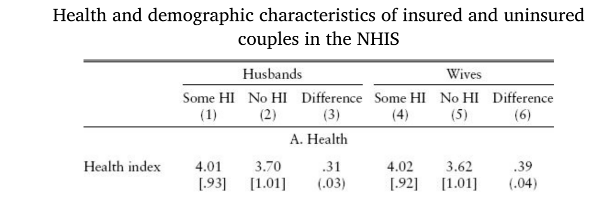
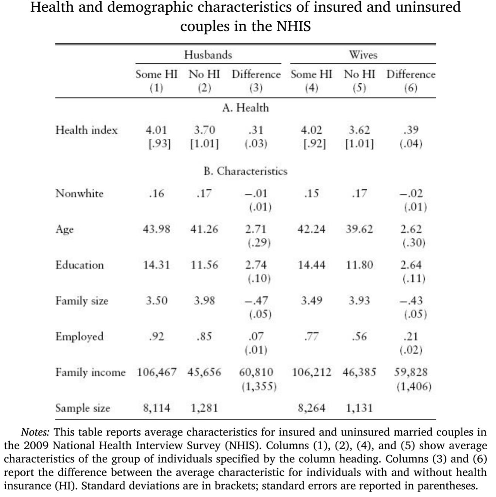
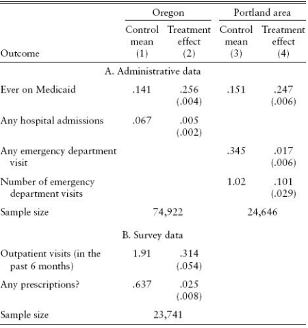
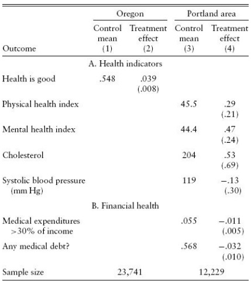
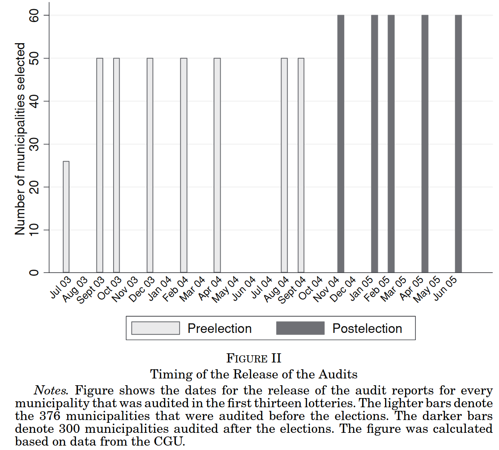
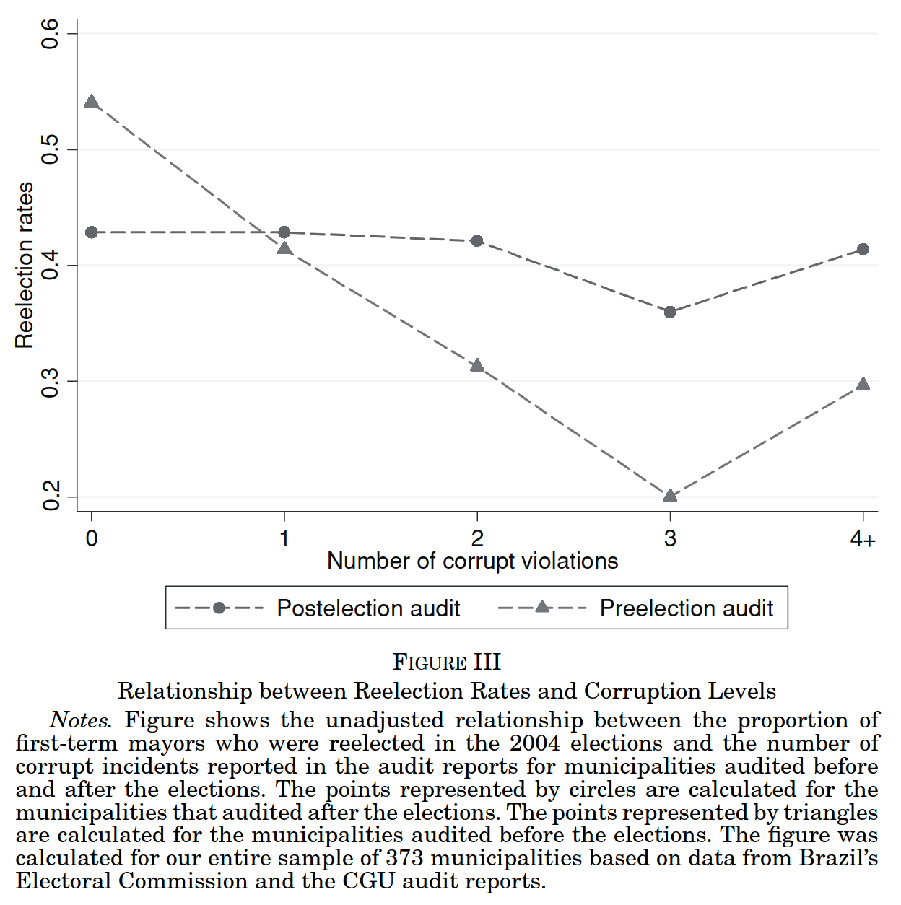
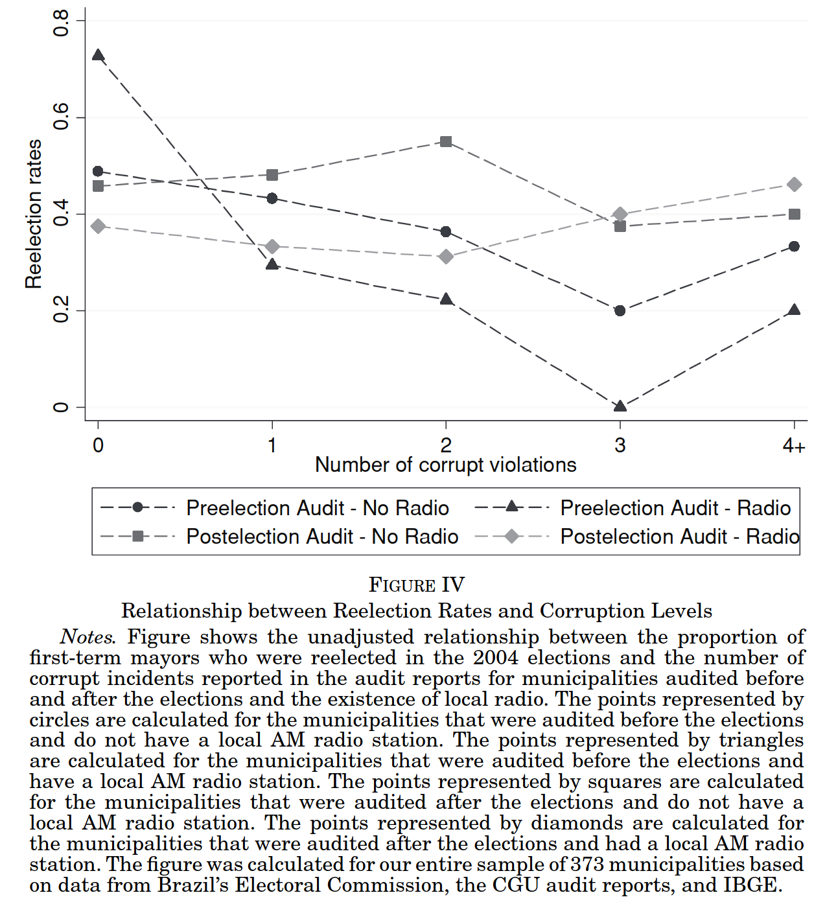
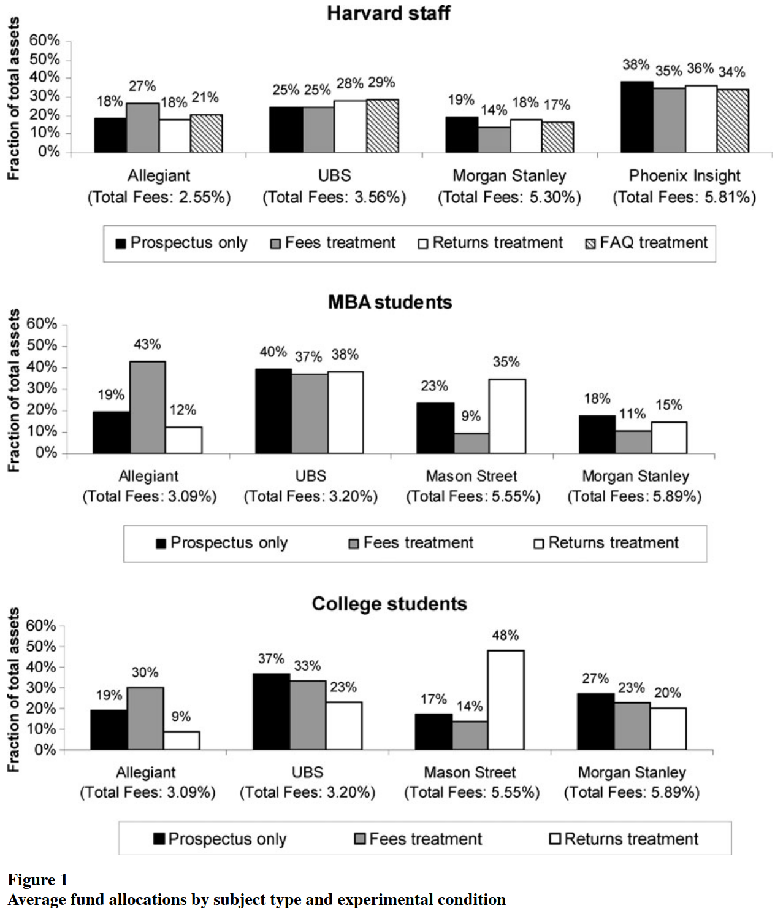
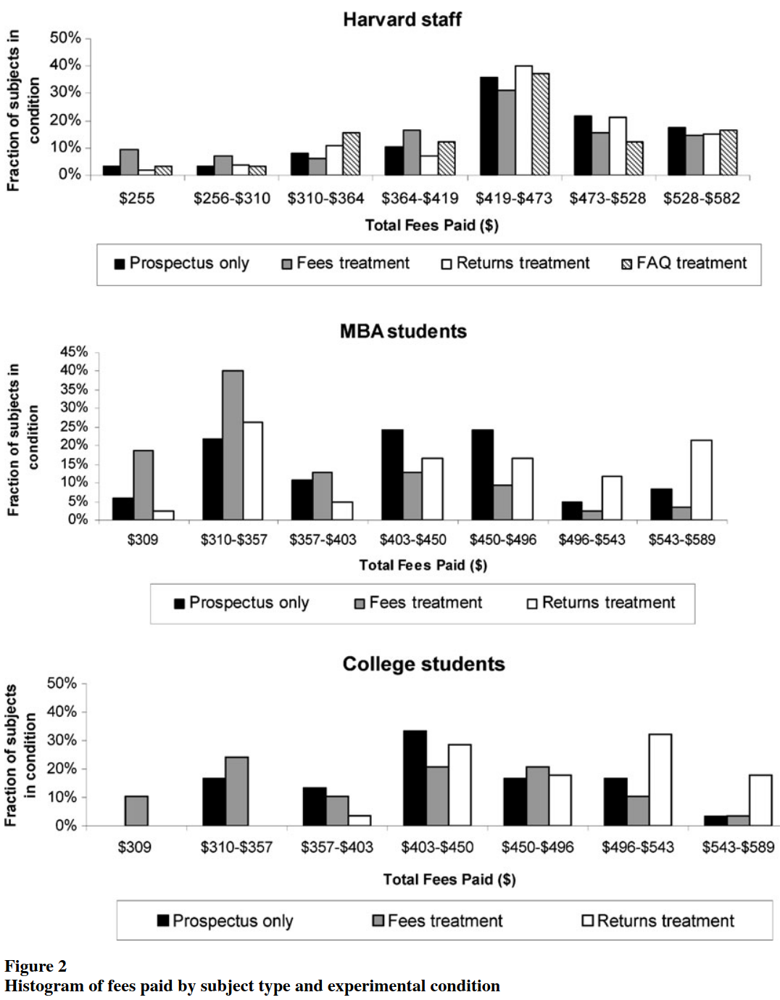

```{r}
#| include: false
library(countdown)
```


## Para reflexão

{fig-align="center"}

## Aula passada: resultados potenciais 

::: {style="font-size: 70%;"}
Para cada unidade $i$ em uma população, definimos dois resultados potenciais:

- $Y_{i1}$: resultado para a unidade $i$ se ela recebesse o tratamento

- $Y_{i0}$: resultado para a unidade $i$ se ela **não** recebesse o tratamento (controle)

:::

. . . 

::: {style="font-size: 70%;"}
Seja $D_i$ uma variável binária que indica o status de tratamento da unidade $i$:

- $D_i = 1$: a unidade $i$ recebeu o tratamento

- $D_i = 0$: a unidade $i$ **não** recebeu o tratamento (controle)

::: {.callout-important}
## Resultados observado

O resultado observado para a unidade $i$, denotado por $Y_i$, depende dos resultados potenciais e do status de tratamento: $Y_i = D_i Y_{i1} + (1 - D_i) Y_{i0}$. Observamos $Y_{i1}$ se $D_i=1$ e  $Y_{i0}$ se $D_i=0$
:::

:::

## Aula passada: efeitos tratamento

::: {style="font-size: 70%;"}
- O efeito causal do tratamento para a unidade $i$ é definido como: $\tau_i = Y_{i1} - Y_{i0}$
:::

. . . 

::: {style="font-size: 70%;"}

::: {.callout-important}
## O efeito tratamento individual é não observável

Não é possível observar $\tau_i$ diretamente, pois apenas um dos resultados potenciais é observado para cada unidade.
:::

- O efeito tratamento médio é definido como: $$\text{ATE} = E[Y_1 - Y_0] = E[\tau_i]$$

- O efetio tratamento médio sobre os tratados é definido como: $$\text{ATT} = E[Y_1 - Y_0 \mid D=1]$$

- O efetio tratamento médio sobre os **não** tratados é definido como: $$\text{ATU} = E[Y_1 - Y_0 \mid D=0]$$

:::

## Na saúde e na doença 

::: {style="font-size: 70%;"}

- Os EUA gastam muito do PIB em saúde, mas possuem indicadores piores que outros países que possuem um sistema universal.

- O Medicare atende idosos e o Medicaid atende alguns grupos de baixa renda, mas a maioria dos trabalhadores permanecem sem seguro por escolha ou falta de oferta a preços acessíveis.

- Em 2010, o governo Obama sancionou o Affordable Care Act (ACA) para tentar melhorar a situação. 

- O ACA exige que americanos comprem plano de saúde sob pena de multa fiscal

- Democratas e Republicanos têm visões distintas do ACA desde o início. 


:::

. . . 

::: {.callout-caution icon=false}
## 🤔 Pergunta Empírica
Qual o impacto de ter plano de saúde sobre as condições de saúde da população?
:::
    
## Por que não comparar as médias de dois grupos?


{fig-align="center"}

::: {style="font-size: 70%;"}
NHIS: *National Health Interview Survey. Dados de 2009. 

Health Index: variável categórica que vai de 1 a 5 codificada pela resposta do entrevistado a pergunta: "Você diria que seu estado geral de saúde é excelente, muito bom, bom, regular ou ruim?"
:::

## Um exemplo ilustrativo

::: {style="font-size: 70%;"}
- Dois alunos estrangeiros chegam ao MIT e tem que escolher entre pagar por plano de saúde ou não

- Kuzdar (cazaque) vem de um país com sistema universal e receio de ficar muito doente com o frio de MA

- Maria (chilena) já está acostumada com o frio e decidi usar o dinheiro do plano de saúde para outras coisas

- A tabela abaixo mostra os **resultados potenciais** de ambos e suas escolhas.


|  | Kuzdar | Maria |
|----------|----------|----------|
| Resultado Potencial sem plano: $Y_{0i}$ | 3 | 5 |
| Resultado Potencial com plano: $Y_{1i}$ | 4 | 5 |
| Tratamento: $D_i$ | 1 | 0 |
| Condição de saúde observada | 4 | 5 |
| Efeito tratamento | 1 | 0


:::

## Visualizando o viés de seleção

Comparação entre variáveis de interesse:

$$
\begin{aligned}
Y_{K} - Y_{M} &= Y_{1,K} - Y_{0,M}
\end{aligned}
$$


. . .


Mostrando viés de seleção:

::: {.r-stack}

::: {.fragment .fade-in-then-out}

$$
\begin{aligned}
Y_{K} - Y_{M} &= Y_{1,K} - Y_{0,M} \\
              &=
              \underbrace{Y_{1,K} \color{red}{- Y_{0,K}}}_{\text{=1}}
              \color{red}{+}
              \underbrace{\color{red}{Y_{0,K}} - Y_{0,M}}_{\text{=-2}}
\end{aligned}
$$
:::


::: {.fragment .fade-in}

$$
\begin{aligned}
Y_{K} - Y_{M} &= Y_{1,K} - Y_{0,M} \\
              &=
              \underbrace{Y_{1,K} \color{red}{- Y_{0,K}}}_{\text{efeito tratamento =1}}
              \color{red}{+}
              \underbrace{\color{red}{Y_{0,K}} - Y_{0,M}}_{\text{viés de seleção = -2}}
\end{aligned}
$$

:::

::: 

## Utilizar médias elimina o viés de seleção? 

$$
\begin{aligned}
 Avg_n[Y_{1i} -Y_{0i}] &= \frac{1}{n}\sum_{i=1}^{n}Y_{1i} - \frac{1}{n}\sum_{i=1}^{n}Y_{0i} \\
              & =Avg_n[Y_i \mid D_i=1] - Avg_n[Y_i \mid D_i=0]  \\
              &= Avg_n[Y_{1i} \mid D_i=1] - Avg_n[Y_{0i} \mid D_i=0] \\
              & \color{red}{\neq} Avg_n[Y_{1i}-Y_{0i}] = \text{ATE}
\end{aligned}
$$


## Hipótese: efeito causal constante e homogêneo

$$
\begin{aligned}
Y_{1i} & =Y_{0i}+\kappa \\
Y_{1i}-Y_{0i} &= \kappa
\end{aligned}
$$

. . . 

- $\kappa$ é tanto o efeito individual quanto o efeito médio!

. . . 

- Como a comparação de médias se relaciona com $\kappa$?

## Diferença Simples de Médias

::: {style="font-size: 80%;"}

$$
\begin{aligned}
    DSM &= \color{red}{Avg_n[Y_{1i} \mid D_i = 1]} - Avg_n[Y_{0i} \mid D_i = 0] \\
    &= \color{red}{Avg_n[Y_{0i} + \kappa \mid D_i = 1]} - Avg_n[Y_{0i} \mid D_i = 0] \\
    &= \underbrace{\color{red}{\kappa}}_{\color{blue}{\text{Efeito causal médio}}}
       \color{red}{+} \underbrace{\color{red}{Avg_n[Y_{0i} \mid D_i = 1]} - Avg_n[Y_{0i} \mid D_i = 0]}_{\color{blue}{\text{Viés de seleção}}}
\end{aligned}
$$
:::


::: {.callout-important}
## Diferença Simpes de Médias

Utilizando a diferença simples de médias como estimador do efeito tratamento obtemos como resultado **efeito causal médio** $+$ **viés de seleção**. 
:::

- $Y_{0i}$ é tudo aquilo que afeta a saúde da pessoa para além do status de participação no plano de saúde.


## Exemplo 1: Plano de saúde nos EUA


:::::: columns
::: {.column width="50%"}
{fig-align="center"}

:::

::: {.column width="50%"}
::: {.incremental style="font-size: 75%;"}

- Painel B na tabela mostra que os dois grupos são distintos em várias dimensões observáveis:

  - anos de estudo
  - tamanho da família
  - emprego
  - renda

- **Pergunta:** Se o único problema fosse as variáveis observáveis, como poderíamos obter o efeito causal médio, ou seja, sem o viés de seleção?

:::
:::

:::

# Como a aleatorização elimina o viés de seleção? 

## Experimento aleatório 

::: {style="font-size: 70%;"}

Passo a passo:

1. Obtenha uma amostra aleatória da população de interesse.

2. Divida a amostra em dois grupos, **tratamento** e **controle**, sendo que a seleção dos indivíduos em cada grupo é feita de modo aleatório.

3. Introduza o tratamento (um programa, política, estratégia, etc) e observe os resultados.

:::

. . .


::: {.callout-tip}
## Lei dos Grandes Números

Explique intuitivamente o que se espera dos dois grupos gerados pela atribuição aleatória do tratamento, ou seja, como eles se comparam antes e depois do tratamento?
:::


## Efeito causal médio

::: {style="font-size: 80%;"}

::: {.callout-important}
## Experimento Aleatório

Como os grupos de controle e tratamento vêm da mesma população, eles são similares em **todas** as dimensões observáveis (outras variáveis da amostra) e **não observáveis(!)**, incluindo o valor esperado dos **resultados potenciais**!
:::


O que acontece no modelo de efeito constante?
:::

. . .

::: {style="font-size: 80%;"}

$$
\begin{aligned}
    &= E[Y_{i} \mid D_i = 1] - E[Y_{i} \mid D_i = 0] \\
    &= E[Y_{1i} \mid D_i = 1] - E[Y_{0i} \mid D_i = 0] \\
    &= E[Y_{0i} + \kappa  \mid D_i = 1] - E[Y_{0i} \mid D_i = 0] \\
    &= \kappa + \color{red}{\underbrace{E[Y_{0i} \mid D_i = 1] - E[Y_{0i} \mid D_i = 0]}_{=0}} \\
    &= \kappa
\end{aligned}
$$

:::


## Estimador do ATE

- Como os grupos são comparáveis, qualquer diferença observada nos resultados após o tratamento deve ser atribuída ao tratamento.

- Estimador: a diferença na média do resultado entre o grupo de tratamento e o grupo de controle.

- Estimador não viesado para ATE.

## Inferência Estatística

- A diferença observada é estatisticamente significativa ou poderia ser apenas devido ao acaso da amostragem?

- Teste t de diferença de médias para duas amostras independentes.

- Hipóteses:
    
    -   $H_0$: Não há efeito do tratamento; $ATE = 0$.
    
    -   $H_A$: Há um efeito do tratamento; $ATE \neq 0$.

## Estimador do ATE: regressão MQO

::: {style="font-size: 70%;"}
- Podemos estimar o ATE em um experimento por meio de uma regressão MQO: $Y_i = \beta_0 + \kappa \times D_i + \epsilon_i$
  
Interpretação dos coeficientes:
:::

. . . 

::: {style="font-size: 70%;"}
    
-   $\beta_0 = E[Y_i | D_i=0]$: a média do grupo de controle
    
-   $\kappa = ATE$: a diferença na média do resultado entre o grupo de tratamento e o grupo de controle.

:::

. . . 

::: {style="font-size: 70%;"}
- Equivalência: estimador via MQO e diferença de médias são iguais

- Diferença: MQO permite inclusão de controles

:::

::: {style="font-size: 80%;"}

::: {.callout-note}
## Viés e eficiência

O estimador do ATE em um experimento aleatório é não viesado. A inclusão de covariáveis não é necessária para eliminar o viés de seleção, mas pode reduzir o desvio-padrão e aumentar a eficiência do estimador.
:::

:::

## Ameaças a validade interna


::: {.callout-tip}
## Validade Interna

Uma análise estatística tem validade interna se a inferência estatística sobre efeitos causais são válidas para a população estudada. 
:::

::: {style="font-size: 70%;"}
- Falhas no processo de aleatorização: análise de balanceamento com caractéristicas prévias

- Falhas em seguir o protocolo de tratamento: *compliance* parcial

    - Possível focar nas pessoas que seguiram protocalo
    
    - Estima-se o efeito *intent-to-treat*: efeito de **atribuição aleatória do tratamento** e não efeito do tratamento em si.

- Atrito: se motivo não é correlacionado com tratamento, não gera viés

- Efeitos experimentais: solução pode ser procedimento *duplo* às cegas 

- Amostras pequenas: não gera viés, mas imprecisão

:::

## Ameaças a validade externa

::: {.callout-tip}
## Validade Interna

Uma análise estatística tem validade externa se a inferência e as conclusões podem ser generalizadas da população e contextos estudados para outras populações e contextos. 
:::

::: {style="font-size: 70%;"}
- Amostras não representativas: população estudada e população de interesse devem ser suficientemente similares

- Intervenção não representativa: um programa de escala pequena e super monitorado pode ser diferente do programa efetivamente implementado 

- Efeitos de equilíbrio geral: um programa de escala pequena e temporário pode alterar o contexto econômico quando implementado em larga escala e de modo permanente

:::


## Aplicação: Oregon Health Plan (OHP)

::: {style="font-size: 75%;"}

- Contexto: Debate sobre expansão do Medicaid para os não segurados

- Intervenção:
  
    - 2008: Oregon criou uma **loteria pública** para oferecer chance de inscrição no Medicaid
    
    - ~75.000 inscritos → ~30.000 vencedores (tratamento) vs. ~45.000 não sorteados (controle)

- Critérios de elegibilidade: 19–64 anos, pobres, sem seguro há ≥6 meses, poucos ativos financeiros

:::

## Principais Resultados

:::::: columns
::: {.column width="50%"}



:::

::: {.column width="50%"}



:::

:::


## Aplicação: Auditorias CGU 

::: {style="font-size: 90%;"}
Ferraz e Finan: QJE 2008

- Tema: Corrupção política e mecanismos de accountability.

- Questão central: Quando eleitores têm acesso a informações sobre corrupção, isso afeta suas escolhas eleitorais?

- Contexto do Brasil:

    - Programa federal de auditoria aleatória em municípios (CGU).
    
    - Municípios sorteados para auditorias → publicação dos resultados na mídia.

:::

## Desenho Experimental

- Experimento ideal: auditar municípios, medir corrupção e liberar a informação para um grupo aleatório de eleitores.

- Comparação: resultados eleitorais em municípios **com informação divulgada** vs. **sem informação** → efeito causal da transparência.

- Problema: experimento direto seria **antiético e politicamente inviável**.

- Alternativa dos autores: explorar o sorteio aleatório do programa de auditoria da CGU e o **timing das eleições**.


## Timing das eleições

{fig-align="center" width="60%"}

## Probabilidade de reeleição


:::::: columns
::: {.column width="50%"}


:::

::: {.column width="50%"}



:::

:::


## Resultados Principais

::: {style="font-size: 75%;"}
- Prefeitos candidatos à reeleição **acusados de corrupção** tiveram **redução** na probabilidade de reeleição.
- Impacto **maior quando a mídia local (rádio)** amplificava os resultados.
- Efeito **mais forte em casos de corrupção mais graves**.
- Informação pública → accountability eleitoral efetiva.

:::


## Aplicação Finanças

Choi, Laibson e Madrian: RFE 2010

::: {style="font-size: 75%;"}

- Tema: racionalidade de investidores.

- Questão central: Por que investidores não escolhem sempre o fundo mais barato?

- Contexto: fundos de índice S&P 500 oferecem praticamente o mesmo retorno, mas cobram **taxas (fees) diferentes**.

- Hipótese existente: taxas refletem heterogeneidade em outros serviços oferecidos em conjunto com os fundos.

- Estratégia dos autores: conduzir **experimentos controlados** em um contexto em que esses outros serviços são inexistentes.

:::

## Participantes e Tarefa

::: {style="font-size: 70%;"}

- **Participantes**:
  - Estudantes de MBA (Wharton, 2005)
  - Estudantes universitários (Harvard, 2005)
  - Funcionários de Harvard (staff, 2007)
  
- **Tarefa principal**: alocar US$10.000 hipotéticos entre **4 fundos reais do S&P 500**.

- **Incentivos**:
  - Pagamento inicial modesto + pagamento adicional baseado no **retorno futuro do portfólio escolhido**.
  
  - Para staff, horizonte de retorno de **1 mês**; para estudantes, **1 ano**.
  
- **Documentos fornecidos**: lâmina dos fundos e “choice sheet” para registrar alocações.

- **Objetivo**: observar se participantes escolhem **fundos de menor taxa (fee)** quando outras características são idênticas.

:::

## Condições de Informação

::: {style="font-size: 70%;"}
- Aleatorização em 4 condições principais:
:::

::: {.incremental style="font-size: 70%;"}

  1. **Prospectus-only**: apenas lâmina + choice sheet.

  2. **Fees treatment**: lâmina + choice sheet + planilha mostrando **fees detalhados e impacto no portfólio**.

  3. **Returns treatment**: lâmina + choice sheet + planilha com **retornos passados anualizados**.

  4. **FAQ treatment (staff only)**: lâmina + choice sheet + respostas a perguntas básicas sobre fundos e S&P 500.
  
:::

. . . 

::: {style="font-size: 70%;"}

- Objetivo do desenho: testar como **informação sobre custos, retornos passados ou conhecimento geral** afeta alocação dos participantes.

- Controle experimental: todos os grupos tiveram tempo livre para decidir, sem poder consultar outros participantes; mínimos de investimento reais respeitados.

:::

## Principais Resultados

:::::: columns
::: {.column width="50%"}


{width=90%}

:::

::: {.column width="50%"}

{width=85%}

:::

:::

## Resultados principais

::: {style="font-size: 70%;"}
 - Participantes alocam **US$ 10.000** entre quatro fundos S&P 500 e são recompensados pelo retorno subsequente

- Os participantes falham em **minimizar taxas**

- Rejeitamos a hipótese de escolha por **serviços extras não ligados ao portfólio**

- Custos de busca por informações importam, mas mesmo eliminados, taxas não são minimizadas

- Participantes dão peso elevado a **retornos anualizados desde a criação do fundo**

- **Taxas pagas diminuem com conhecimento financeiro**

- Participantes que escolhem fundos caros **percebem que estão cometendo um erro**

:::