```{r}
#| include: false
library(countdown)
```


## Para reflexão

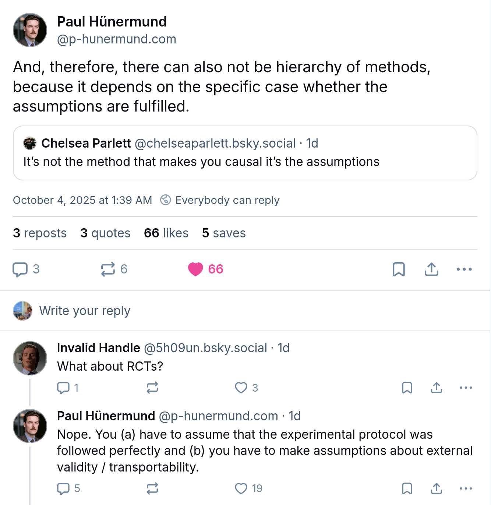{fig-align="center" width="55%"}

## Tipos de Dados

Em econometria, os dados provêm de duas fontes principais:


- **Dados Experimentais:** Provenientes de experimentos aleatórios controlados (seção anterior). Menos comuns em economia por questões éticas e financeiras.
    
- **Dados Observacionais:** Obtidos pela observação do comportamento no mundo real (censos, pesquisas, registros administrativos). O desafio é isolar o efeito causal de outros fatores. 


## Estrutura de Dados

::: {style="font-size: 80%;"}
Em econometria, os dados são organizados em três estruturas fundamentais
:::

::: {.r-stack}


::: {.fragment .fade-in-then-out}
::: {style="font-size: 80%;"}
1.  **Corte Transversal (*Cross-sectional*):** Observações de diferentes entidades (países, estados, indivíduos) em um único período de tempo. 
:::

```{r}
#| echo: true
#| code-fold: true
#| code-summary: "Veja o código"
# Construindo um data.frame de Corte Transversal
dados_corte_transversal <- data.frame(
  entidade = c("Distrito A", "Distrito B", "Distrito C", "Distrito D", "Distrito E"),
  nota_teste = c(650, 620, 680, 590, 710)
)

head(dados_corte_transversal)
```

:::

::: {.fragment .fade-in-then-out}
::: {style="font-size: 80%;"}
2.  **Séries Temporais:** Observações de uma única entidade ao longo de vários períodos de tempo. 


```{r}
#| echo: true
#| code-fold: true
#| code-summary: "Veja o código"
# Construindo um data.frame de Séries Temporais
dados_serie_temporal <- data.frame(
  ano = 2010:2015,
  indice_macro = c(102.48, 101.79, 105.03, 112.64, 111.47, 109.13)
)

head(dados_serie_temporal)
```


::: callout-warning
Séries Temporais é conteúdo de Econometria II e não será tratado neste curso. 
:::
:::

:::

::: {.fragment .fade-in-then-out}
::: {style="font-size: 80%;"}
3.  **Dados em Painel ou Longitudinais:** Múltiplas entidades, onde cada uma é observada em dois ou mais períodos de tempo.
:::

```{r}
#| echo: true
#| code-fold: true
#| code-summary: "Veja o código"
dados_painel <- data.frame(
  pais = rep(c("Argentina", "Brasil"), each = 4),
  ano = rep(2010:2013, 2),
  indice_macro = c(82.25, 81.70, 85.12, 87.50, 102.48, 101.79, 105.03, 112.64)
)

head(dados_painel, n = 8)
```

:::

:::

## Regressão

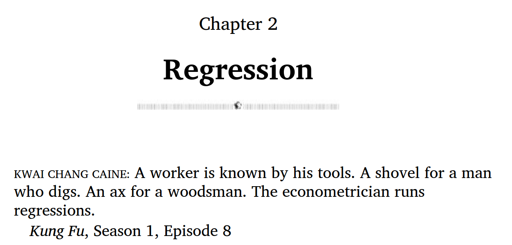{fig-align="center"}

## Educação privada de elite 


::: {.r-stack }

::: {.fragment .fade-in-then-out}
Vale a pena pagar uma universidade privada de elite? Por que?

:::

::: {.fragment .fade-in-then-out}
Existe prêmio (diferencial salarial futuro) por estudar em universidade privada de elite?
:::

::: {.fragment .fade-in}

Como separar efeito causal de viés de seleção?

:::

:::


## Trade-offs

::: {style="font-size: 90%;"}
::: columns

::: {.column width="50%"}
**Custos**

- Universidade privada de elite: ~US$ 29 mil/ano  

- Universidade pública estadual: ~ US$ 9 mil/ano  

- Diferença: ~US$ 20 mil/ano  

- Investimento total: > US$ 100 mil

:::

::: {.column width="50%"}
**Benefícios**

- Turmas menores  

- Professores renomados  

- Estrutura moderna  

- Colegas mais seletos

- *Networking*
:::

:::

:::

## Questão central

::: {style="font-size: 80%;"}
- Vale a pena pagar a diferença de custo?  

- Comparações simples (Harvard vs. U-Mass ou IBMEC vs UNB) são **viesadas** 

    - Por que?

- Problema de seleção: diferenças de notas, renda e motivação entre admitidos cada tipo de universidade

**Pare refletir**  

- Nancy Quian (prof. de Northwestern): passou em Harvard → escolheu UT por bolsa

- Amanda Pallais (prof. Harvard): passou em várias elites → escolheu UVA  

- Ambas tiveram carreiras de sucesso

:::

## O que fazer?


**Problema**  

- Diferenças de renda refletem:  
    - Tanto a qualidade da instituição  
    - Quanto as características dos alunos  

**Desafio**  
- Harvard não sorteia vagas  
- Não há experimento aleatório que possamos usar


## Possível solução

- Explorar **quase-aleatoriedade**:  
    - Bolsas de estudo  
    - Circunstâncias pessoais  
    - Timing de decisões  

- Resultado: grupos de tratamento e controle obtidos por **exprimento natural**

::: {.callout-tip}
É muito provável que exista prêmio de estudar em uma escola de elite, mas separar **efeito causal** de **viés de seleção** exige método rigoroso.
:::

## Notas e Tamanho das Turmas

Reduzir o tamanho das turmas melhora o desempenho escolar dos alunos?

::: {style="font-size: 70%;"}
::: {.fragment}
**Pergunta de política pública**

-  **Dilema:** Contratar mais professores para reduzir o número de alunos por sala custa o dinheiro dos contribuintes. Esse investimento compensa?


::: {.fragment .highlight-red}
Questão de Inferência Causal: necessidade de isolar e conhecer o *efeito causal* de diminuir a turma em 1 aluno sobre as notas nos testes. 
:::
:::

::: {.fragment}
**Pergunta da família**

- **Dilema:** Escolher o distrito escolar do filho que levará ao melhor desempenho acadêmico possível usando o tamanho da turma como indicador.

::: {.fragment .strike}
Questão de Previsão: Não importa o mecanismo causal, necessidade é prever o resultado a partir de variável indicadora
:::
:::

:::


## Inferência causal e regressões

::: {style="font-size: 75%;"}
**Estimação:**
  
  - Como devemos traçar uma linha através dos dados para estimar o efeito tratamento?
  
  - Quando o parâmetro estimado **identifica** o efeito causal?
  
  - Quais são as vantagens e desvantagens do MQO?

**Inferência:**

  - Como testar se o efeito tratamento é igual a zero?

  - Como construir um intervalo de confiança para o efeito tratamento?
  
::: callout-important
Inferência causal e previsão impõem requisitos diferentes aos dados, ainda que ambas utilizem regressão.
:::
:::

## O modelo de regressão linear

$$
Y_i = \beta_0 + \beta_1 X_i + u_i
$$

- $Y$: variável dependente  

- $X$: variável independente (regressor)  

- $\beta_0 + \beta_1 X_i$: função de regressão populacional  

- $\beta_0$: intercepto populacional  

- $\beta_1$: inclinação populacional  

- $u_i$: termo de erro populacional


## Exemplo


::: columns
::: {.column width="50%"}
:::{.nonincremental}
::: {style="font-size: 75%;"}
Modelo:

$$
\text{TestScore}_i = \beta_0 + \beta_1 \ \text{STR}_i + u_i
$$

Média condicional:

$$
E(\text{TestScore} \mid \text{STR}) = \beta_0 + \beta_1\,\text{STR}
$$

:::
:::
:::


::: {.column width="50%"}
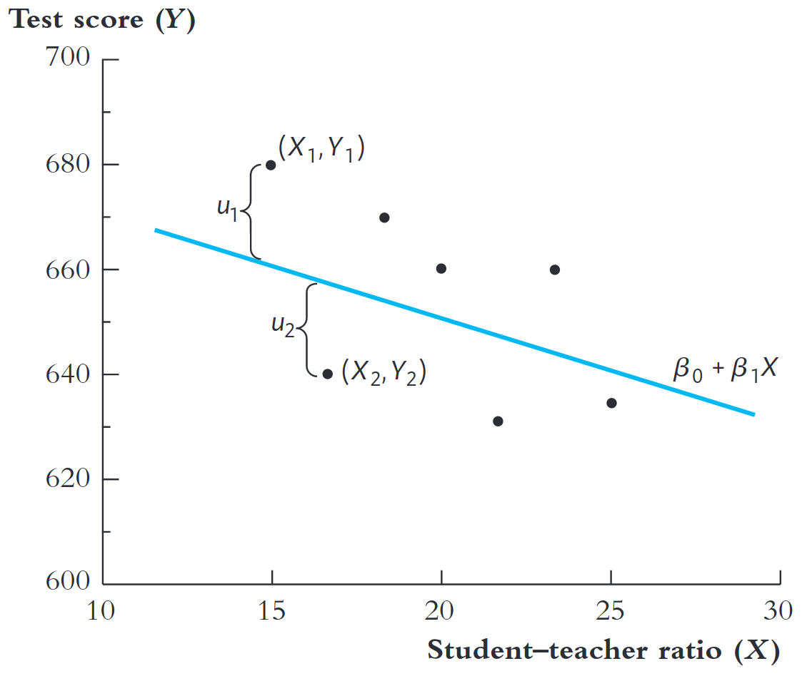
:::

:::


## Estimação do modelo de regressão linear {.nonincremental}

- Podemos estimar $\beta_0$ e $\beta_1$ a partir de uma amostra.

- Escolher $\beta_0$,$\beta_1$ para **ajustar melhor** aos dados.

. . . 

::: columns
::: {.column width="50%"}

:::

::: {.column width="50%"}
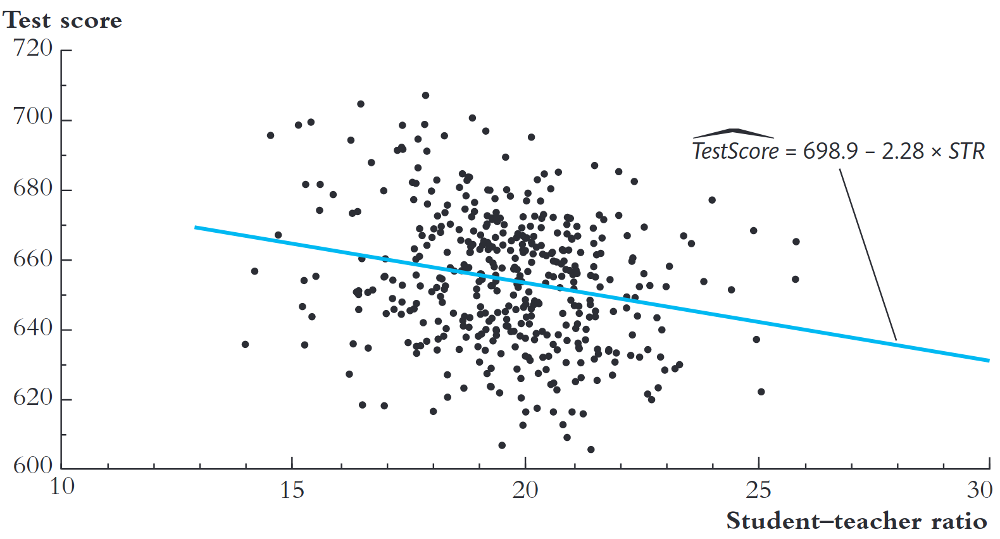
:::

:::


## MQO: um problema de minimização{.nonincremental}

::: {style="font-size: 80%;"}
Melhor ajuste = minimizar erros de previsão ao quadrado.

$$
(\hat\beta_0,\hat\beta_1)
\;=\;
\arg\min_{b_0,b_1}
\sum_{i=1}^n \left(Y_i - [b_0 + b_1 X_i]\right)^2
$$

A solução do problema acima define os estimadores de **Mínimos Quadrados Ordinários (MQO)**.


$$
\hat\beta_1
\;=\;
\frac{\sum_{i=1}^n (X_i - \bar X)(Y_i - \bar Y)}{\sum_{i=1}^n (X_i - \bar X)^2} =\frac{Cov(X,Y)}{Var(X)}
$$

$$
\hat\beta_0 \;=\; \bar Y - \hat\beta_1 \bar X
$$

:::

## Os estimadores de MQO

::: {style="font-size: 90%;"}
- Modelo de regressão linear: $\hat Y_i \;=\; \hat\beta_0 + \hat\beta_1 X_i + \hat u_i$

- Os coeficientes $\hat\beta_0$ e $\hat\beta_1$ são **estimativas pontuais** dos parâmetros populacionais $\beta_0$ e $\beta_1$ a partir dos dados da amostra

- $\hat Y_i = \hat\beta_0 + \hat\beta_1 X_i$: valor previsto de $Y_i$ com base em $X_i$.

- $\hat u_i$: resíduo da regressão (estimador do erro $u_i$).


::: callout-tip
O erro de regressão captura **todos** os fatores omitidos no modelo. Em geral, esses fatores omitidos são outros fatores que influenciam $Y$, além da variável $X$. 
:::

:::

## Estimativas do exemplo

{fig-align="center" width="90%"}

## Interpretação

::: {style="font-size: 80%;"}
- Distritos com um aluno a mais por professor, em média, têm pontuações em testes 2,28 pontos menores:

$$\hat\beta_1 = \frac{\Delta E(\text{TestScore} \mid \text{STR})}{\Delta \text{STR}}=-2,28$$

- Note que como $Y = \beta_0 + \beta_1 X$, se $X$ muda por uma quantidade $\Delta X$, então $Y$ muda por: $\Delta Y = \beta_1 \Delta X$

::: callout-tip
$\beta_0$ é o valor esperado de $Y$ quando $X = 0$. Em muitos modelos econômicos, $X = 0$ não faz sentido prático, então $\beta_0$ serve apenas para posicionar a reta de regressão.
:::

:::

## Ajuste do modelo: $R^2$


- $Y_i = \hat Y_i + \hat u_i = \text{Predição de MQO} +\text{Resíduo de MQO}$

- $\mathrm{Var}(Y_i) = \mathrm{Var}(\hat Y_i) + \mathrm{Var}(\hat u_i)$


- $R^2 = \frac{\mathrm{Var}(\hat Y_i)}{\mathrm{Var}(Y_i)+\mathrm{Var}(u_i)}=\frac{\mathrm{Var}(\hat Y_i)}{\mathrm{Var}(Y_i)}=\frac{\sum_{i=1}^{n}(\hat Y_i - \bar Y)²}{\sum_{i=1}^{n}( Y_i - \bar Y)²} = \frac{ESS}{TSS}$

. . .

ESS: Soma dos quadrados explicados

TSS: Soma dos quadrados totais


## Visualização de $R^2$ distintos

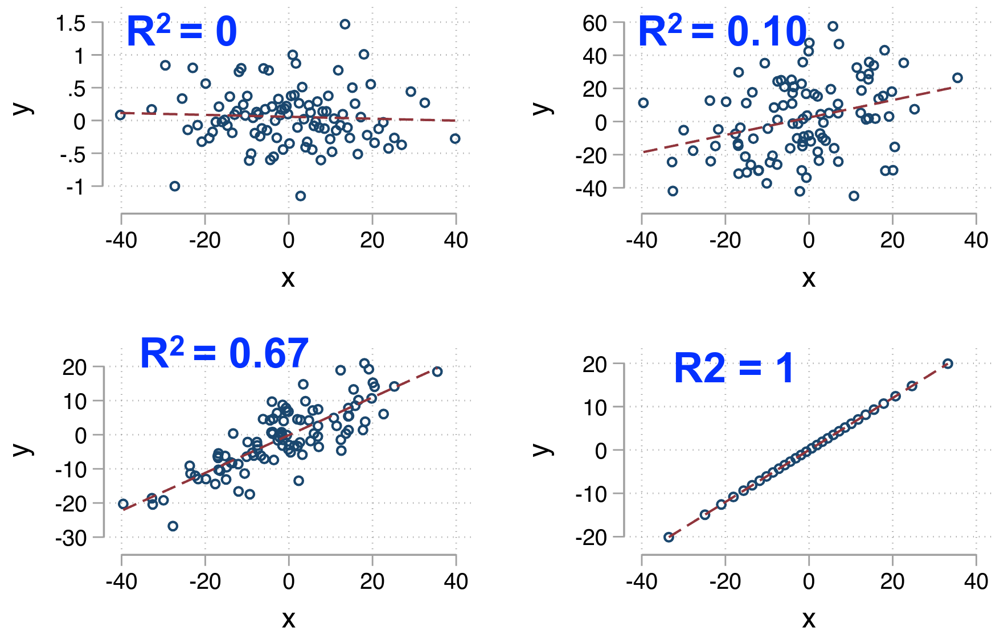{fig-align="center" width="90%"}

::: {style="font-size: 80%;"}
::: callout-important
Não iremos focar nas medidas de ajuste neste curso. Essas medidas têm deixado de ser enfatizadas. O foco é nas hipóteses de **identificação** de causalidade! 
:::
:::

## Ajuste do modelo: SER 

- **SER**: *Standard Error of the Regression*

- Mede a dispersão dos resíduos em torno da reta.


$$
SER
\;=\;
\hat\sigma_u
\;=\;
\sqrt{\frac{1}{n-2}\sum_{i=1}^n \hat u_i^{\,2}}
$$


## Condierações sobre ajuste de modelo

- Espere $R^2$ **baixo** quando muitos fatores não observados afetam $Y$.

- O **SER** informa a magnitude típica do erro de previsão.

::: callout-important
Não iremos focar nas medidas de ajuste neste curso. Essas medidas têm deixado de ser enfatizadas. O foco é nas hipóteses de **identificação** de causalidade! 
:::

## Distribuição amostral dos estimadores

-   $\hat\beta_0$ e $\hat\beta_1$ são variáveis aleatórias (por que?).

-   $E[\hat\beta_0]=\beta_0$ e $E[\hat\beta_1]=\beta_1$

-   $\hat\beta_0$ e $\hat\beta_1$ são normalmente distribuídos em amostras grandes

-   $\hat\beta_0 \sim N(\beta_0, \sigma_{\beta_0}^2)$ e $\hat\beta_1 \sim N(\beta_1, \sigma_{\beta_1}^2)$

-   O que determina $\sigma_{\beta_0}^2$ e $\sigma_{\beta_1}^2$?

## Variância do estimador - intuição

:::::: columns
:::: {.column width="50%"}
::: nonincremental
-   O número de observações em preto e azul são iguais

-   Todas observações vêm da mesma distribuição conjunta

-   Para qual dos dois grupos a reta de regressão é melhor estimada?

-   Aumentar dispersão de X diminui a $var(\beta_1)$
:::
::::

::: {.column width="50%"}
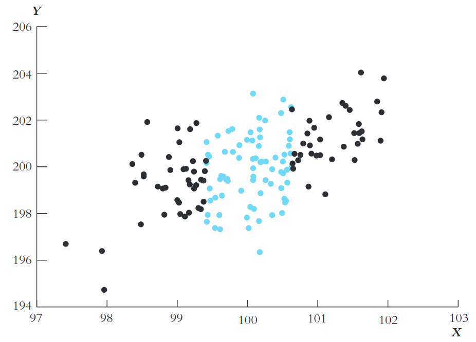
:::
::::::

## Homocedasticidade vs Heterocedasticidade

- Conceito relacionado à variância condicional do termo de erro:

. . .

$$
var(u\mid X = x)
$$

- Homocedasticidade: $var(u\mid X = x)$ é constante (**não depende de $X$**)

- Heterocedasticidade: $var(u\mid X = x)$ **varia com $X$**

## Visualização

::: columns

::: {.column width="50%"}
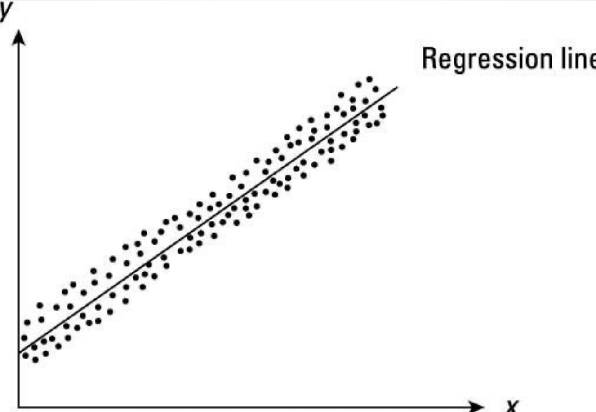{fig-align="center" width="90%"}
::::

::: {.column width="50%"}
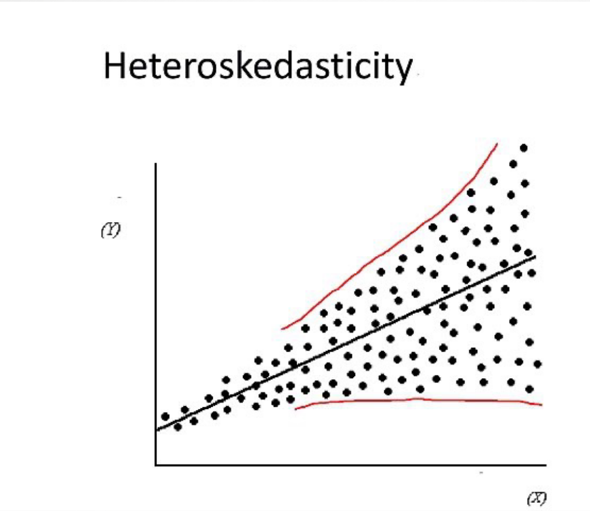{fig-align="center" width="80%"}
:::

:::

. . . 

::: {style="font-size: 80%;"}
::: {.r-stack}

::: {.fragment .fade-left}

::: {.fragment .fade-out}

Quando devemos usar desvios-padrões sob homocedasticidade ou não robustos?

:::

:::

::: {.fragment .fade-left}


::: {.callout-tip }
**NUNCA!** Os devios-padrão robustos são sempre mais adequados já que também são válidos sob a hipótese de homocedasticidade.
:::

:::

:::

:::

## Testes de hipóteses

:::::: columns
:::: {.column width="50%"}

::: {style="font-size: 80%;"}
$$
H_0:\; \beta_k=\beta_{k,0}
\qquad\text{vs.}\qquad
H_1:\; \beta_k\neq\beta_{k,0}
$$


Passos práticos para testar $H_0$:
:::

  1. Estime $\hat\beta_1$ e $SE(\hat\beta_1)$.

  2. Calcule a estatística $t$

  3. Calcule o p-valor

::::


::: {.column width="50%"}
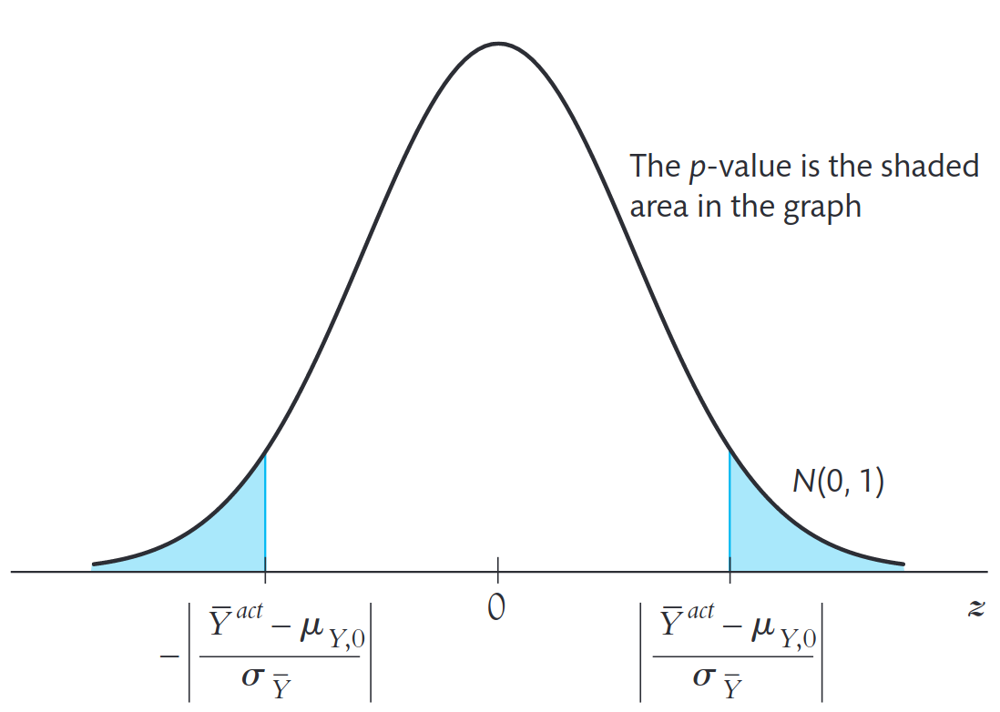
:::
::::::
 

## 1. Estime $\hat\beta_1$ e $SE(\hat\beta_1)$

::: {style="font-size: 80%;"}
-   $SE(\hat\beta_1)$ é o estimador da variância de $\hat\beta_1$ ($\sigma_{\hat\beta_1}$)

-   Erro-padrão robusto (ajuste para heteroscedasticidade) - regressão simples:
:::

. . . 

::: {style="font-size: 80%;"}
$$SE(\hat\beta_1) = \sqrt\sigma_{\hat\beta_1}=\frac{1}{n}\times\frac{\frac{1}{n-2}\sum_{i=1}^n(X_i-\bar X)^2\hat u_i^2}{[\frac{1}{n}\sum_{i=1}^n(X_i-\bar X)^2]^2}$$
:::

::: {style="font-size: 80%;"}

-   Fórmula complicada mas softwares (R, Stata, etc.) calculam automaticamente.

:::

## 2. Calcule a estatística $t$

$$
t = \frac{\text{estimador}-\text{valor hipotético}}{\text{erro padrão do estimador}}
$$

-   $t$ tem distribuição normal padrão em grandes amostras

-   $t \sim N(0,1)$

## 3. Calcule o p-valor

Seja $\hat{\beta}_1^{\text{ef}}$ a estimativa efetivamente calculada:

::: {style="font-size: 80%;"}
$$
\begin{aligned}
\text{p-valor} 
&= 
\Pr{H_0}\!\left(\left|\hat{\beta}_1-\beta_{1,0}\right|>\left|\hat{\beta}_1^{\text{ef}}-\beta_{1,0}\right|\right) \\
&= \Pr_{H_0}\!\left(\left|\frac{\hat{\beta}_1-\beta_{1,0}}{SE\!\left(\hat{\beta}_1\right)}\right|>\left|\frac{\hat{\beta}_1^{\text{ef}}-\beta_{1,0}}{SE\!\left(\hat{\beta}_1\right)}\right|\right) \\
&= \Pr_{H_0}\!\left(|t|>\left|t^{\text{ef}}\right|\right) \\
&= \Pr_{H_0}\!\left(|Z|>\left|t^{\text{ef}}\right|\right) \\
&= 2\,\phi\!\left(-\,\left|t^{\text{ef}}\right|\right)
\end{aligned}
$$
::: 


## Intervalo de Confiança de 95% para $\beta_k$

::: {style="font-size: 80%;"}
- Intervalo de Confiança de 95%: intervalo que possui 95% de probabilidade de conter o **verdadeiro** valor de $\beta_k$. 

- Inclui todos os valores de $\beta_k$ que não podemos rejeitar ao nível de significância de 5%.

:::

. . . 

$$
\hat\beta_k - 1,96 \times SE(\hat\beta_k) \leq \beta_k \leq \hat\beta_k + 1,96 \times SE(\hat\beta_k)
$$

::: callout-warning
Regra simples: sempre que o módulo da estimativa pontual for duas vezes maior que o desvio-padrão rejeita-se a hipótese nula.
:::

## Notas e tamanho das turmas


::: {.fragment}

Efeito causal do tamanho da sala?

::: {.fragment .fade-in}
::: {.fragment .highlight-red}
Ou alguma outra coisa?
:::
:::

:::

## Relações causais entre notas e tamanho das turmas

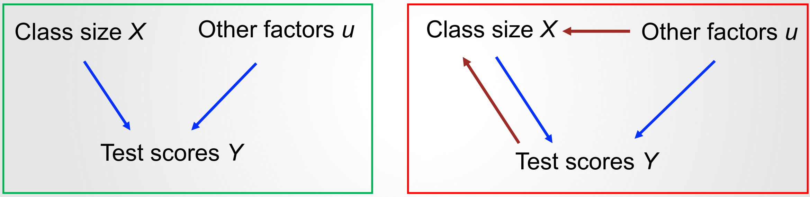

Quando uma das setas vermelhas está presentes, não é possível garantir que os coeficientes de MQO capturam o efeito causal.

## Regressões e causalidade

- Quando $\beta_1$ pode ser interpretado como efeito causal médio de $X$ sobre $Y$?

- $X$ precisa ser independente de outros fatores que afetam $Y$

  - $X$ tem que ser independente do termo de erro $u_i$
  
  - $\operatorname{corr}(X_i,u_i)=0$

- Isso acontece para dados experimentais!

- Não será sempre verdadeiro para dados observacionais!


## Três hipóteses de MQO  para inferência causal

::: {style="font-size: 80%;"}

1. A variável independente $X$ é independente do termo de erro $u_i$

$$E[u_i\mid X_i]=0; \operatorname{corr}(X_i,u_i)=0$$

2. $(X_i,Y_i)$, $i=1,\dots,n$, são independentes e identicamente distribuídos (i.i.d.).

    - Algumas violações de indpendência podem ser resolvidas com séries temporais ou dados em painel

3. Sem grandes outliers em $X$ e/ou $Y$.

    - A presença de outliers pode distorcer os estimadores de MQO.


:::

## Sensibilidade a outliers

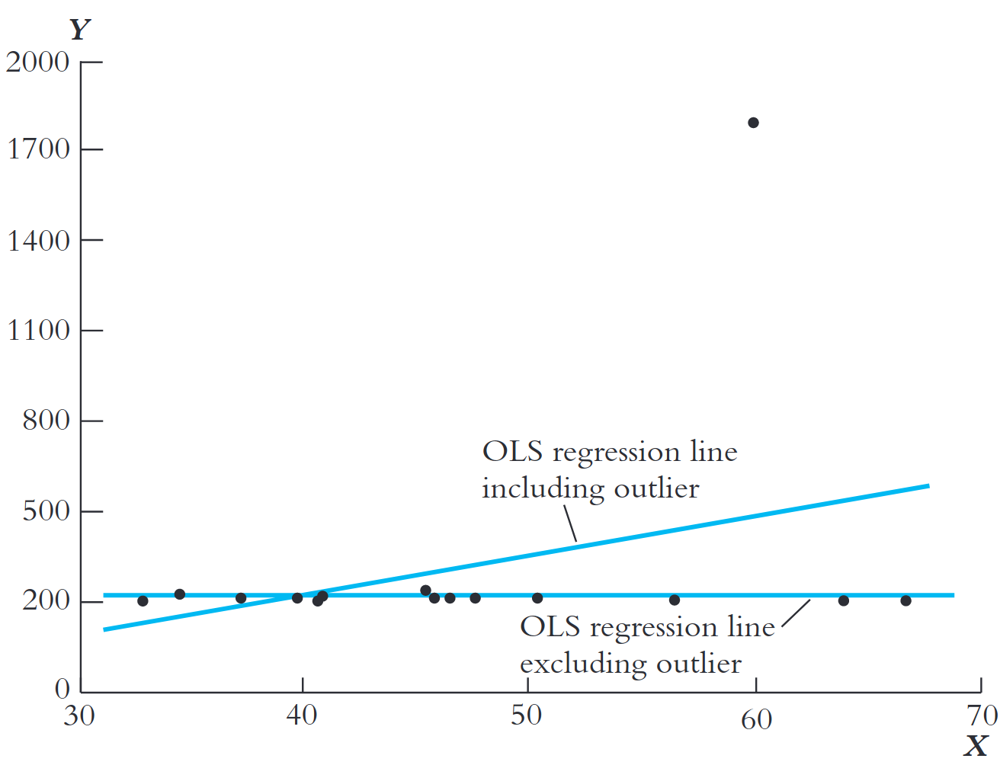

Pontos extremos em $X$ ou $Y$ podem **distorcer** a reta.