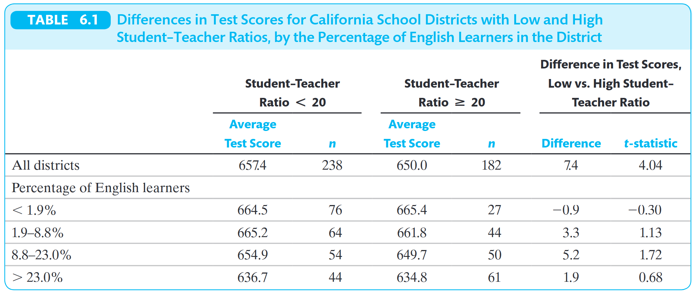
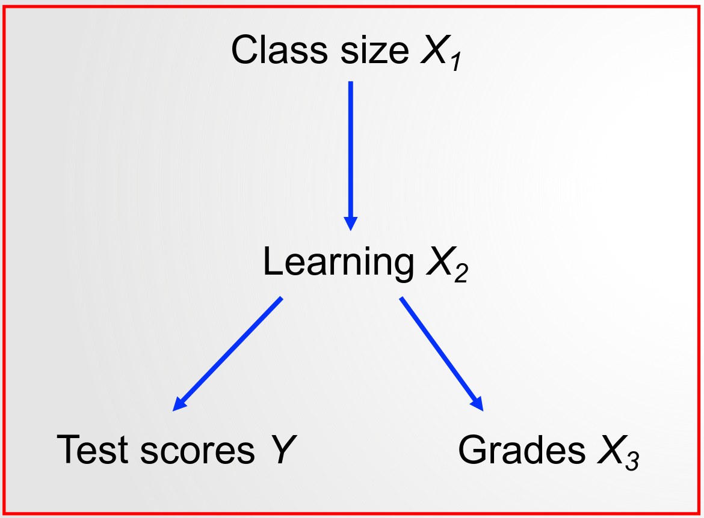

```{r}
#| include: false
library(countdown)
```


## Para reflexão

{fig-align="center" width="55%"}

::: {style="font-size: 70%;"}
Fonte: [Mike Konczal Substack](https://newsletter.mikekonczal.com/p/three-ways-terminal-ai-has-changed)
:::

## Aula passada: regressões e causalidade

- Quando $\beta_1$ pode ser interpretado como efeito causal médio de $X$ sobre $Y$?

- $X$ precisa ser independente de outros fatores que afetam $Y$

  - $X$ tem que ser independente do termo de erro $u_i$
  
  - $\operatorname{corr}(X_i,u_i)=0$

- Isso acontece para dados experimentais!

- Não será sempre verdadeiro para dados observacionais!


## Aula passada: 3 hipóteses para inferência causal

::: {style="font-size: 80%;"}

1. A variável explicativa $X$ é independente do termo de erro $u_i$

$$E[u_i\mid X_i]=0; \operatorname{corr}(X_i,u_i)=0$$

2. $(X_i,Y_i)$, $i=1,\dots,n$, são independentes e identicamente distribuídos (i.i.d.).

    - Algumas violações de independência podem ser resolvidas com séries temporais ou dados em painel

3. Sem grandes outliers em $X$ e/ou $Y$.

    - A presença de outliers pode distorcer os estimadores de MQO.


:::

## Por que inlcuir mais variáveis no modelo?

::: {style="font-size: 90%;"}

-   Se o objetivo for fazer previsão, incluir variáveis pode aumentar a precisão das previsões.

-   Se o objetivo for inferência causal, incluir variáveis permite controlar por outros determinantes da variável dependente que levariam a viés.

:::

. . .

::: {.callout-warning}
Incluir variáveis aleatoriamente no modelo não é uma boa ideia! A inclusão de controles ruins pode introduzir viés ao invés de eliminá-lo e inviabilizar a identificação de efeitos causais.
:::

## Viés de Variável Omitida

O viés de variável omitida (OVB) ocorre quando:

1.  A variável omitida é correlacionada com o regressor incluído.

2.  A variável omitida afeta a variável dependente $Y$.

## OVB no modelo de notas e tamanho das turmas

$$
\text{TestScore}_i = \beta_0 + \beta_1 \ \text{STR}_i + u_i
$$

::: {style="font-size: 80%;"}
A omissão de alguma das seguintes variáveis gera viés no modelo?

::: {.fragment .fade-in}
::: {.fragment .highlight-red}
1.  Capacidade financeira do distrito escolar
:::
:::

::: {.fragment .fade-in}
2.  Horário do teste
:::

::: {.fragment .fade-in}
3. Tamanho médio do estacionamento dos professores nas escolas do distrito.
:::

::: {.fragment .fade-in}
::: {.fragment .highlight-red}
4.  Percentual de alunos para os quais inglês não é o primeiro idioma
:::
:::

:::


## OVB: expressão matemática 

::: {style="font-size: 80%;"}
Seja $\beta_1$ o verdadeiro efeito causal de X sobre Y na população e $\rho_{Xu} = corr(X_i, u_i)$.

Sob essas hipóteses, o coeficiente de MQO será:^[Demonstração nos Apêndices 4.3 e 6.1 (4a edição) e 4.3 e 5.1 (1a edição) de Stock e Watson.]
:::

$$
E[\hat{\beta}_1] = \beta_1 + \rho_{Xu} \frac{\sigma_u}{\sigma_X}
$$

. . .

::: {.callout-important}
O tamanho da amostra não resolve o problema do viés de variável omitida. O estimador $\hat{\beta}_1$ é viesado e inconsistente quando OVB.
:::

## OVB: modelo longo vs curto

::: {style="font-size: 80%;"}
**Regressão Longa:**$Y_i = \alpha^l + \beta^l X_i + \gamma Z_i + e^l_i$

**Regressão Curta:**$Y_i = \alpha^s + \beta^c X_i + e^c_i$

::: {.callout-important}
## Efeito tratamento e OVB
A estimativa da regressão curta é igual a longa mais o efeito da omitida vezes a regressão da omitida na incluída. Ou seja, a regressão curta estima o **efeito causal** mais o **viés**. 
:::

**Derivação**:

::: r-stack

::: {.fragment .fade-in-then-out}
$$\beta^s = \frac{Cov(Y_i, X_i)}{Var(X_i)}$$
:::

::: {.fragment .fade-in-then-out}
$$\beta^s = \frac{(\color{red}{Cov(\alpha^l + \beta^l X_i + \gamma Z_i + e^l_i}, X_i)}{Var(X_i)}$$
:::

::: {.fragment .fade-in-then-out}
$$= \frac{\beta^l Var(X_i) + \gamma Cov(Z_i, X_i) + Cov(e^l_i, X_i)}{Var(X_i)}$$
:::

::: {.fragment .fade-in-then-out}
$$= \beta^l + \gamma \color{red}{\frac{Cov(Z_i, X_i)}{Var(X_i)}}$$
:::

::: {.fragment .fade-in-then-out}
$$= \beta^l + \gamma \color{red}{\pi_{21}}$$

::: {style="font-size: 60%;" algin="left"}
onde $\pi_{21}$ é o coeficiente de $X_i$ em  $Z_i = \pi_{20} + \pi_{21} X_i + u_i$.
:::

:::

:::

:::


## Qual o sinal esperado do OVB?

::: {style="font-size: 80%;"}

Seja: $Y$ a variável dependente, $X$ a variável independente e $Z$ a variável omitida.

A equação para o viés é dada por: $E[\hat{\beta}^l] = \beta^l + \gamma \pi_{21}$

:::

::: r-stack

::: {.fragment .fade-in}
$$
\begin{array}{l|c|c}
 & \textbf{Corr}(Z,X) > 0 & \textbf{Corr}(Z,X) < 0 \\
\hline
\mathbf{\textbf{Corr}(Z,Y) > 0} 
  &  
  &  \\
\hline
\mathbf{\textbf{Corr}(Z,Y) < 0}
  &  
  & 
\end{array}
$$
:::

::: {.fragment .fade-in}
$$
\begin{array}{l|c|c}
 & \textbf{Corr}(Z,X) > 0 & \textbf{Corr}(Z,X) < 0 \\
\hline
\mathbf{\textbf{Corr}(Z,Y) > 0} 
  &  \text{viés p/ cima }\color{red}{\uparrow} 
  &  \\
\hline
\mathbf{\textbf{Corr}(Z,Y) < 0}
  &  
  & 
\end{array}
$$
:::

::: {.fragment .fade-in}
$$
\begin{array}{l|c|c}
 & \textbf{Corr}(Z,X) > 0 & \textbf{Corr}(Z,X) < 0 \\
\hline
\mathbf{\textbf{Corr}(Z,Y) > 0} 
  & \text{viés p/ cima }\color{red}{\uparrow} 
  & \text{viés p/ baixo }\color{red}{\downarrow} \\
\hline
\mathbf{\textbf{Corr}(Z,Y) < 0}
  & 
  &  \\
\end{array}
$$
:::

::: {.fragment .fade-in}
$$
\begin{array}{l|c|c}
 & \textbf{Corr}(Z,X) > 0 & \textbf{Corr}(Z,X) < 0 \\
\hline
\mathbf{\textbf{Corr}(Z,Y) > 0} 
  & \text{viés p/ cima }\color{red}{\uparrow} 
  & \text{viés p/ baixo }\color{red}{\downarrow} \\
\hline
\mathbf{\textbf{Corr}(Z,Y) < 0}
  & \text{viés p/ baixo }\color{red}{\downarrow} 
  &  \\
\end{array}
$$
:::

::: {.fragment .fade-in}
$$
\begin{array}{l|c|c}
 & \textbf{Corr}(Z,X) > 0 & \textbf{Corr}(Z,X) < 0 \\
\hline
\mathbf{\textbf{Corr}(Z,Y) > 0} 
  & \text{viés p/ cima }\color{red}{\uparrow} 
  & \text{viés p/ baixo }\color{red}{\downarrow} \\
\hline
\mathbf{\textbf{Corr}(Z,Y) < 0}
  & \text{viés p/ baixo }\color{red}{\downarrow} 
  & \text{viés p/cima }\color{red}{\uparrow} \\
\end{array}
$$
:::
::::::::

## Solução 1: aleatorização

No caso de experimentos aleatórios:

-   $E(X)$ igual para todo valor de $X$, independente de outros fatores que afetam $Y$.

-   $E(u)$ não varia com $X$ → $corr(X_i,u_i)=0$.

. . .

Portanto: aleatórização de $X$ elimina viés de variável omitida (e causalidade reversa).

## Solução 2: controlando pelas variáveis omitidas

No caso de dados observacionais:

-   Não há garantia de $corr(X,u)=0$.

-   Mas se pudermos **observar as variáveis omitidas** que afetam tanto $Y$ quanto $X$, podemos controlar por elas.

-   Comparar $Y$ entre unidades com níveis similares de $Z$ mas diferentes níveis de $X$.

-   O que isso significa intuitivamente?

## Intuição: inglês como 2^o^ idioma 




::: {style="font-size: 70%;"}
::: {.fragment .highlight-red}
Percentual de alunos para os quais inglês é o segundo idioma é positivamente correlacionado com o tamnho médio das turmas! 
:::

::: {.fragment .fade-in}
Qual a direção do viés? Você espera um $\beta_1$ maior ou menor? 
:::
:::


## MQO com 2 regressores

Função de expectativa condicional: $$
E[Y_i|X_{1i}, X_{2i}] = \beta_0 + \beta_1 X_{1i} + \beta_2 X_{2i}
$$ Modelo de regressão: $$Y_i = \beta_0 + \beta_1 X_{1i} + \beta_2 X_{2i} + u_i$$

## Como interpretar $\beta_1$?

-   $\beta_1=\frac{\Delta Y}{\Delta X_1}$, mantendo $X_2$ constante.

-   Eefeito parcial de $X_1$

-   Como interpretar $\beta_2$? E $\beta_0$?

## MQO com $k$ regressores:

Função de expectativa condicional: $$
E[Y_i|X_{1i}, X_{2i}] = \beta_0 + \beta_1 X_{1i} + \beta_2 X_{2i} + ...+ \beta_k X_{ki}
$$

Modelo de regressão: $$Y_i = \beta_0 + \beta_1 X_{1i} + \beta_2 X_{2i} + ... + \beta_k X_{ki} + u_i$$

## Estimação: estratégia MQO

Selecionar $\hat{\beta}_0, \hat{\beta}_1, ..., \hat{\beta}_k$ que melhor ajustem os dados.

Melhor ajuste = minimizar os erros quadrados de previsão:

$$
\arg\min_{b_0, b_1,..., b_k} \sum_{i=1}^n \left( Y_i - [b_0 + b_1 X_{1i} + b_2 X_{2i} + ... + b_k X_{ki}] \right)^2
$$

## Os estimadores de MQO

-   Modelo de regressão linear: $\hat Y_i = \hat\beta_0 + \hat\beta_1 X_{1i} + \hat\beta_2 X_{2i} + ... + \hat\beta_k X_{ki} + u_i$

-   Os coeficientes de MQO $\hat\beta_0$,$\hat\beta_1$,$\hat\beta_2$,$...$ e $\hat\beta_k$ **estimam** os parâmetros populacionais $\beta_0$,$\beta_1$,$\beta_2$,$...$ e $\beta_k$ a partir dos dados da amostra

-   $\hat Y_i = \hat\beta_0 + \hat\beta_1 X_{1i} + \hat\beta_2 X_{2i} + ... + \hat\beta_k X_{ki}$: valor previsto de $Y_i$ com base em $X_i$

-   $\hat u_i = Y_i - \hat Y_i$: resíduo (estimador do erro $u_i$)

## O teorema Frisch-Waugh-Lovell

:::::: r-stack
:::: {.fragment .fade-in}
::: {.fragment .fade-out}
Com um regressor $(Y_i = \beta_0 + \beta_1 X_i + u_i)$:

$$
\hat\beta_1 = \frac{cov(X,Y)}{var(X)}
$$
:::
::::

::: {.fragment .fade-in}
Com múltiplos regressores $(Y_i = \beta_0 + \beta_1 X_{1i} + \beta_2 X_{2i} + ... + \beta_k X_{ki} + u_i)$:

$$
\hat{\beta}_1 = \frac{cov(\tilde{X}_1, \tilde{Y})}{var(\tilde{X}_1)}
$$

$\tilde{X}_1$: resíduos da regressão de $X_1$ em todos os outros regressores $(X_2,X_3,...,X_k)$.

$\tilde{Y}$: resíduos da regressão de $Y$ em todos os outros regressores $(X_2,X_3,...,X_k)$.
:::
::::::

## Estimando $\beta$'s em três passos

O teorema Frisch-Waugh-Lovell significa que $\beta_1$ pode ser estimado em 3 passos:

1.  Regredir $X_1$ em $X_2$,$X_3$,$...$,$X_k$ e obter os resíduos $\tilde{X}_1$

2.  Regredir $Y$ em $X_2$,$X_3$,$...$,$X_k$ e obter os resíduos $\tilde{Y}$

3.  Regredir $\tilde{Y}$ em $\tilde{X_1}$

-   $\tilde{Y_i} = \beta_0 + \beta_1 \tilde{X_1} + u_i$

## OVB no exemplo

Modelo com um regressor:
$$
\hat{TestScore} = 698.9 - 2.28 \text{STR}
$$ 

Modelo com controle:
$$
\hat{TestScore} = 686.0 - 1.10 \text{STR} - 0.65 \text{PctEL}
$$

O que aconteceu com o valor do coeficiente de STR? Por que?

## Relembrando o sinal do viés

$$
\begin{array}{l|c|c}
 & \textbf{Corr}(Z,X) > 0 & \textbf{Corr}(Z,X) < 0 \\
\hline
\mathbf{\textbf{Corr}(Z,Y) > 0} 
  & \text{viés p/ cima }\color{red}{\uparrow} 
  & \text{viés p/ baixo }\color{red}{\downarrow} \\
\hline
\mathbf{\textbf{Corr}(Z,Y) < 0}
  & \text{viés p/ baixo }\color{red}{\downarrow} 
  & \text{viés p/cima }\color{red}{\uparrow} \\
\end{array}
$$

## $R^2$ e $R^2$ ajustado

-   $R^2 = \frac{ESS}{TSS} = \frac{\sum_{i=1}^{n}(\hat Y_i - \bar Y)²}{\sum_{i=1}^{n}( Y_i - \bar Y)²} = 1 - \frac{SSR}{TSS}$

-   $R^2$ sempre aumenta com a inclusão de um regressor

-   $R^2$ ajustado ou $\bar R^2 =  1 - \frac{n-1}{n-k-1}\frac{SSR}{TSS}$

. . .

SSR: Soma dos quadrados dos resíduos

## SER (erro-padrão da regressão)

$$
SER
\;=\;
\hat\sigma_u
\;=\;
\sqrt{\frac{1}{n-k-1}\sum_{i=1}^n \hat u_i^{\,2}}
$$

-   Mede a dispersão dos resíduos em torno da reta.

-   $n-k-1$ chamado de graus de liberdade: um ajuste pelo viés introduzido pelo número de parâmetros estimados

## Hipóteses para inferência causal

1.  Os regressores $X_s$ são independentes do erro $u_i$: $E(u_i \mid X_{1i},X_{2i}...X_{ki}) = 0$

2.  $(Y_i,X_{1i},X_{2i}...X_{ki})$, $i=1,\dots,n$, são independentes e identicamente distribuídos (i.i.d.).

3.  Sem outliers relevantes.

4.  Não há multicolinearidade perfeita.

## Exemplo no modelo das notas e tamanho das turmas


Exemplo hipotético: tamanho das turmas $X_1$ é não correlacionada com o termo de erro somente após controlar pelos recursos financeiros do distrito $X_2$

## Hipótese de independência condicional

-   Seja $X$ o regressor ou tratamento de interesse

-   $W_1, W_2, ... W_k$ são as variáveis de controle

-   Hipótese de independência condicional (CIA):

::: {.fragment .fade-in}
$$
E(u_i \mid X,W_1,W_2,...,W_3) = E(u_i \mid W_1,W_2,...,W_3) 
$$
:::

. . .

Resumo: $u$ e $X$ são não correlacionados após controlar pelos $W$'s.

## Controles bons e ruins

-   Nem toda variável é uma boa opção para ser incluída como controle

-   **Controles Ruins**: variáveis que são afetadas pelas variáveis de interesse $X$

    -   ao mantê-las fixas, viés é introduzido no modelo

-   **Controles Bons**: variáveis pré-determinadas em relação à variável de intresse

## Exemplo de controle ruim

:::::: columns
::: {.column width="50%"}

:::

:::: {.column width="50%"}
::: {style="font-size: 70%;"}
-   Objetivo é estimar o efeito tratamento do tamanho das turmas nas notas em exames padronizados (test scores)

-   Não controlar por aprendizado! Nem por notas regulares (grades), já que são afetadas por aprendizado!

    -   Não faz sentido mantê-las fixas quando o tamanho da sala as afeta.

-   Aprendizado e notas regulares são controles ruins!
:::
::::
::::::

. . .

::: {.callout-important}
Não controle por nada que é afetado pelo regressor de interesse!
:::

## Evite multicolinearidade perfeita

::: {style="font-size: 80%;"}
$$\hat{TestScore_i} =  \beta_0 + \beta_1 STR_i +\beta_2 PctEL_i + \beta_3 FracEL_i+u_i$$

-   $PctEL_i$: percentual de alunos que estão aprendendo inglês (entre 0 e 100)

-   $FracEL_i$: fração de alunos que estão aprendendo inglês (entre 0 e 1)

-   Multicolinearidade perfeita: exemplo $PctEL = 100\times FracEL$.

  - $\beta_2$ = efeito de aumentar 1 unidade de $PctEL$ mantendo constante $FracEL_i$

-   Programas estatísticos geralmente eliminam automaticamente uma das variáveis

:::

## Armadilha da dummy

::: {style="font-size: 80%;"}
Duas variáveis indicadoras para sexo de nascimento:

:::::: columns
::: {.column width="50%"}
$$
H_i =
\begin{cases}
1, & \text{se $i$ é homem}, \\
0, & \text{se $i$ é mulher}.
\end{cases}
$$
:::

::: {.column width="50%"}
$$
M_i =
\begin{cases}
1, & \text{se $i$ é mulher}, \\
0, & \text{se $i$ é homem}.
\end{cases}
$$
:::

:::
:::

. . . 

::: {style="font-size: 80%;"}

$Y_i = \beta_0 + \beta_1 H_i + \beta_2 M_i + u_i$: não pode ser estimado!

-   Multicolinearidade perfeita: $H_i+M_i = 1$
:::

. . . 

::: {style="font-size: 80%;"}
Pode-se estimar: 

1. $Y_i = \beta_0 + \beta_1 H_i +  u_i$

2. $Y_i = \beta_0 + \beta_2 M_i + u_i$

3. $Y_i =  \beta_1 H_i + \beta_2 M_i + u_i$

:::

## Regra para evitar armadilha das dummies

::: {style="font-size: 90%;"}
- Se você tem $K$ variáveis indicadores onde cada observação cai em uma (e somente uma) categoria, não é possível estimar coeficientes para todos os $K$'s mais intercepto

- Solução padrão: incluir na regressão $K-1$ variáveis e intercepto

  - neste caso, coeficiente de uma variável indicadora  = diferença entre a aquela categoria e a categoria excluída
  
- Também é possível incluir todas as $K$ variáveis e excluir o intercepto
:::