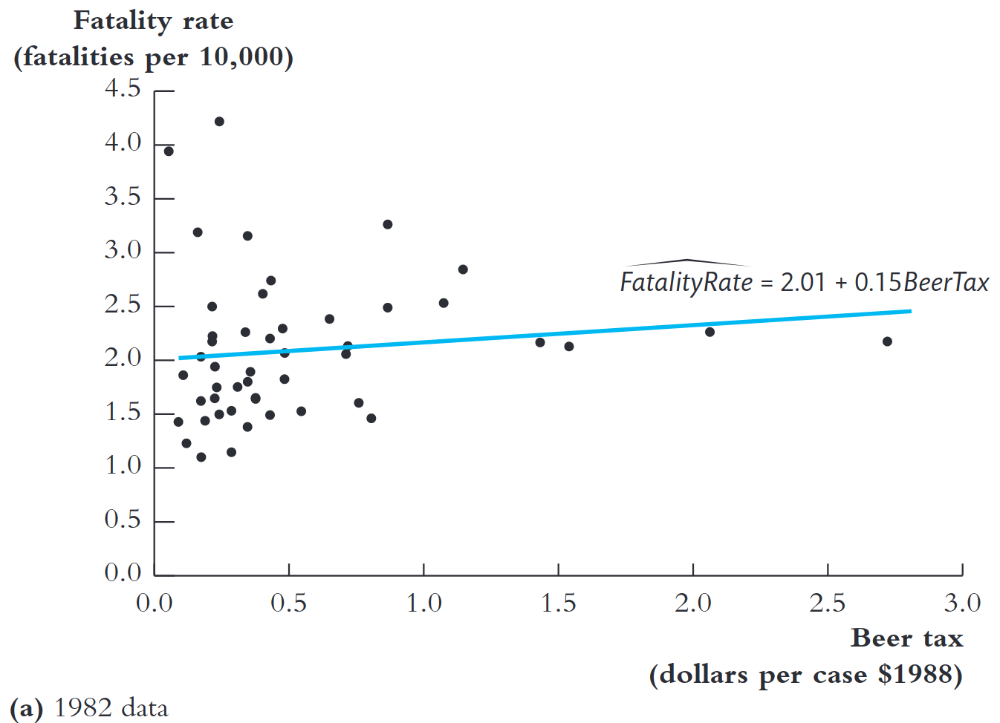
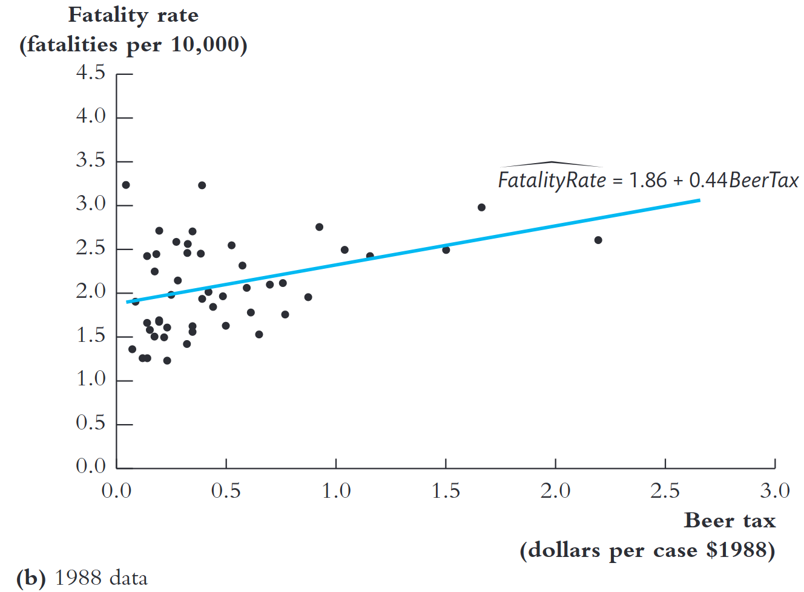
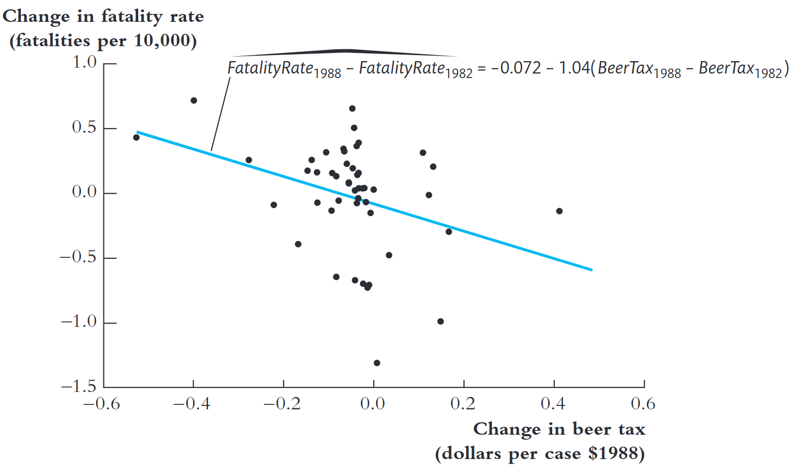
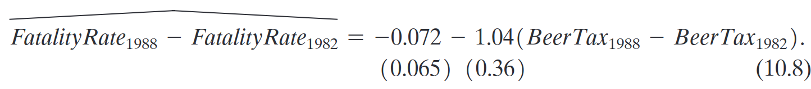
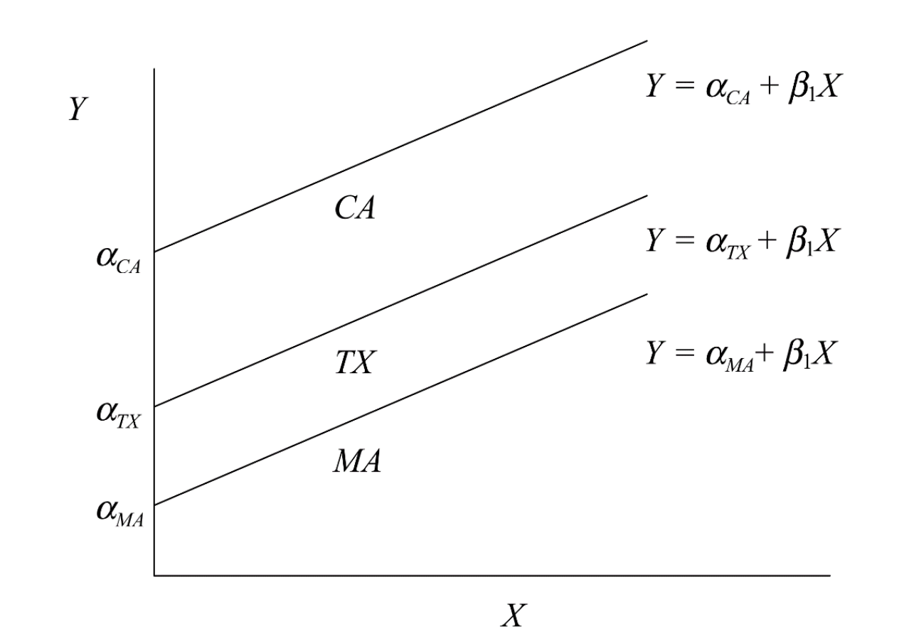
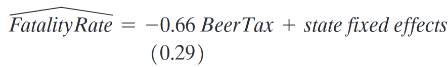

```{r}
#| include: false
library(countdown)
```


## Para reflexão

{fig-align="center" width="100%"}


## Aula passada: OVB

O viés de variável omitida (OVB) ocorre quando:

1.  A variável omitida é correlacionada com o regressor incluído.

2.  A variável omitida afeta a variável dependente $Y$.

## Aula passada: solução?

O que fazer quando temos OVB?

1.  Incluir bons controles 

2.  Evitar a inclusão de controles ruins

::: {.fragment .fade-in}
Problema resolvido?
:::

::: {.fragment .fade-in}
::: {.fragment .highlight-red}
E se a variável que está gerando viés não puder ser mensurada ou observada?
:::
:::

## Só mais uma por favor...

::: {style="font-size: 70%;"}

- O consumo de álcool está fortemente associado a acidentes de trânsito, tornando relevante entender como políticas públicas podem reduzir esse risco.

- Impostos sobre bebidas alcoólicas podem afetar o consumo e, consequentemente, a incidência de acidentes fatais.

- Leis contra dirigir embriagado (testes de bafômetro) buscam alterar o comportamento dos motoristas.

- Avaliar o impacto dessas políticas ajuda a orientar decisões governamentais mais eficazes para salvar vidas.

:::

::: {.callout-caution icon=false}
## 🤔 Pergunta Empírica
Qual o efeito de impostos sobre bebidas alcoólicas e leis que desincentivam dirigir embriagado sobre as mortes no trânsito?
:::
    
## Fatalidades no trânsito e álcool

::: {style="font-size: 90%;"}
Suponha que tenhamos a seguinte base de dados:

- Unidades de observação: um ano em um estado dos EUA

    -   Estados americanos

    -   7 anos, de 1982 a 1988

:::

. . .

::: {style="font-size: 90%;"}
- Variáveis:

    -   Taxa de fatalidade no trânsito (número de fatalidades por 10mil residentes)
    -   Imposto sobre uma caixa de cerveja
    -   Outras (idade mínima para tirar CNH, legislação sobre dirigir embriagado, etc)

:::      

## O que acontece se utilizarmos regressão?

::::: columns
::: {.column width="50%"}
{fig-align="center" width="80%"}
:::

::: {.column width="50%"}
{fig-align="center" width="80%"}
:::
:::::

::: {style="font-size: 90%;"}
::: r-stack

::: {.fragment .fade-out}
Para cada ano, poderíamos estimar a regressão: $$\text {FatalityRate}_i = \beta_0 + \beta_0 \text{BeerTax}_i + u_i$$
:::

::: {.fragment .fade-in}
::: {.fragment .fade-out}
O que vocês acham dos resultados acima? É o que vocês esperavam?
:::
:::

::: {.fragment .fade-in}
::: {.fragment .fade-out}
OVB: Nível de renda?
:::
:::

::: {.fragment .fade-in}
::: {.fragment .fade-out}
OVB: Áreas urbanas vs rurais?
:::
:::

::: {.fragment .fade-in}
::: {.fragment .fade-out}
OVB:cultura-educação sobre álcool e direção?
:::
:::


::: {.fragment .fade-in}
::: {.fragment .fade-out}
Conseguem pensar algo mais que possa gerar viés?
:::
:::

::: {.fragment .fade-in}
::: {.fragment .fade-out}
O que mais poderia ser feito com os dados disponíveis? 
:::
:::

:::

:::

## Relembrando: estrutura de dados

::: {style="font-size: 80%;"}
Em econometria, os dados são organizados em três estruturas fundamentais
:::

::: {.r-stack}


::: {.fragment .fade-in-then-out}
::: {style="font-size: 80%;"}
1.  **Corte Transversal (*Cross-sectional*):** Observações de diferentes entidades (países, estados, indivíduos) em um único período de tempo. 
:::

```{r}
#| echo: true
#| code-fold: true
#| code-summary: "Veja o código"
# Construindo um data.frame de Corte Transversal
dados_corte_transversal <- data.frame(
  entidade = c("Distrito A", "Distrito B", "Distrito C", "Distrito D", "Distrito E"),
  nota_teste = c(650, 620, 680, 590, 710)
)

head(dados_corte_transversal)
```

:::

::: {.fragment .fade-in-then-out}
::: {style="font-size: 80%;"}
2.  **Séries Temporais:** Observações de uma única entidade ao longo de vários períodos de tempo. 


```{r}
#| echo: true
#| code-fold: true
#| code-summary: "Veja o código"
# Construindo um data.frame de Séries Temporais
dados_serie_temporal <- data.frame(
  ano = 2010:2015,
  indice_macro = c(102.48, 101.79, 105.03, 112.64, 111.47, 109.13)
)

head(dados_serie_temporal)
```


::: callout-warning
Séries Temporais é conteúdo de Econometria II e não será tratado neste curso. 
:::
:::

:::

::: {.fragment .fade-in-then-out}
::: {style="font-size: 80%;"}
3.  **Dados em Painel ou Longitudinais:** Múltiplas entidades, onde cada uma é observada em dois ou mais períodos de tempo.
:::

```{r}
#| echo: true
#| code-fold: true
#| code-summary: "Veja o código"
dados_painel <- data.frame(
  pais = rep(c("Argentina", "Brasil"), each = 4),
  ano = rep(2010:2013, 2),
  indice_macro = c(82.25, 81.70, 85.12, 87.50, 102.48, 101.79, 105.03, 112.64)
)

head(dados_painel, n = 8)
```

:::

:::

## Dados em painel: fatalidades de trânsito e álcool

::::::: columns
:::: {.column width="50%"}
::: {style="font-size: 50%;"}
```{r}
#| echo: true
#| code-fold: true
#| code-summary: "Código R"

# Pacotes
library(tidyverse)
library(AER)

# Dados
data("Fatalities", package = "AER")

# Mostrando o começo da base

head(select(Fatalities,1:9),21)

```
:::
::::

:::: {.column width="50%"}
::: {style="font-size: 65%;"}
$n$ entidades, $T$ períodos

-   $i$: uma entidade qualquer
-   $n$: número total de entidades
-   $t$: um período de tempo qualquer
-   $T$: número total de períodos
-   $Y_{it}$: variável $Y$ da entidade $i$ no período $t$
-   $i = 1, 2, \ldots n$ = lista de entidades
-   $t = 1, 2, \ldots T$ = lista de períodos
:::
::::
:::::::

::: {style="font-size: 70%;"}
::: {.callout-note}
Um painel pode ser desbalanceado ou balanceado. Um painel é desbalanceado quando nem todas entidades são observadas em todos os períodos.
:::
:::


## Como painel pode nos ajudar?

::: {style="font-size: 80%;"}
A estrutura de dados em painel permite controlar por algumas variáveis omitidas **mesmo quando não é possível incluí-las explicitamente na regressão**:

1.  Fatores que variam entre unidades mas não variam ao longo do tempo

2.  Fatores que variam ao longo do tempo mas são comuns a todas as unidades


::: {.callout-tip}
A regressão com **efeitos fixos** (1) é uma extensão da regressão múltipla que explora dados em painel para controlar variáveis que diferem entre entidades, mas permanecem constantes ao longo do tempo. Também podem ser incorporados à regressão os chamados **efeitos fixos de tempo** (2), que controlam variáveis não observadas que são constantes entre entidades, mas variam ao longo do tempo.
:::
:::

## Modelo em diferenças (T=2)

::: {style="font-size: 90%;"}
- Considere apenas o ano inicial (1982) e o final da amostra (1988).

- Podemos estimar a regressão a partir das variações no período:

$$
\Delta \text{FatalityRate}_i = \beta_0 + \beta_1 \Delta \text{BeerTax}_i + u_i
$$

em que: $\Delta X_i = X_{i,1988} - X_{i,1982}$

- Este é o **modelo de regressão em diferenças**.

- Ele controla implicitamente por todos os fatores que variam entre estados, mas são constantes ao longo do tempo.
:::

## Intuição do modelo de diferenças

::: {style="font-size: 80%;"}

Suponha que a taxa de fatalidade em 1982 e 1988 seja determinada por: $$\text{FatalityRate}_{i,1982}
= \color{green}{\beta_{0,1982}} + \color{blue}{\beta_1 \, \text{BeerTax}_{i,1982}} + \color{red}{\beta_2 Z_i} + \color{brown}{u_{i,1982}}$$

$$
\text{FatalityRate}_{i,1988}
= \color{green}{\beta_{0,1988}} + \color{blue}{\beta_1 \, \text{BeerTax}_{i,1988}} + \color{red}{\beta_2 Z_i}+ \color{brown}{u_{i,1988}}
$$

:::

. . . 

::: {style="font-size: 80%;"}
Subtraindo a primeira equação da segunda: 
$$\begin{aligned}
\Delta \text{FatalityRate}_i &= \color{green}{(\beta_{0,1988} - \beta_{0,1982})} + \color{blue}{\beta_1 \, \Delta \text{BeerTax}_i} + \color{brown}{(u_{i,1988} - u_{i,1982})} \\
&= \beta_0 + \beta_1 \, \Delta \text{BeerTax}_i + u_i\end{aligned}$$

**O modelo em diferenças elimina o efeito de $Z_i$, pois ele não varia no tempo!**

:::::::


## Hipótese de identificação

::: {.callout-note}
## Hipótese de identificação:
Qualquer mudança na taxa de fatalidade de 1982 a 1988 não pode ser causada por $Z_i$, pois **assumimos** que $Z_i$ não muda entre 1982 e 1988. Ou seja, por hipótese, $E(u_{it} \mid \text{BeerTax}_{it}, Z_i) = 0$.
:::


## Modelo em diferenças (T=2)

Modelo de diferenças geral é dado por:

$$
\Delta Y_i = \beta_0+\beta_1 \Delta X_i+ \gamma_1W_{1i}+ ... \gamma_kW_{ki} + u_i
$$

-   $X_i$ é o regressor ou tratamento de interesse

-   $W_{1i}, W_{2i}, ... W_{ki}$ são as variáveis de controle que variam no tempo

-   Inferência estatística seguem como na regressão usual.

-   A estimação da variância e desvio-padrão será tratada na próxima aula

## Fatalidades de trânsito e álcool: o modelo de diferença

{width="60%"}

{width="80%"}


## O modelo de efeitos fixos (T>2)

::: {style="font-size: 80%;"}
$$
Y_{it} = \color{red}{\alpha_i} + \beta_1 X_{it} + u_{it}
$$

-   $\alpha_i =$ *efeito fixo de unidade* (ou *intercepto específico da unidade*)

-   Pode ser usado com qualquer $T > 2$
:::

. . .


::: {style="font-size: 80%;"}
Uma forma equivalente de representá-lo:
$$
Y_{it} = \color{red}{\gamma_1 D1_i + \gamma_2 D2_i + \cdots + \gamma_n Dn_i} +\beta_1 X_{it}+ u_{it}
$$ onde:

$$D1_{i} =
\begin{cases}
1, & \text{para } i=1, \\
0, & \text{para } i \neq 1.
\end{cases}
$$
:::


## Derivação do modelo de efeito fixo

::: {style="font-size: 80%;"}
Qual a lógica por traz do modelo de efeito fixo?
:::

. . .

::: {style="font-size: 80%;"}
Comece com o seguinte modelo de regressão:
$$
Y_{it} = \color{blue}{\beta_0 + \beta_2 Z_i} + \beta_1 X_{it} + u_{it}
$$

-   $Z_i =$ é uma variável constante específica da unidade

-   Seja $\color{red}{\alpha_i} = \color{blue}{\beta_0 + \beta_2 Z_i}$

:::

. . .

::: {style="font-size: 80%;"}
Logo:
$$
Y_{it} = \color{red}{\alpha_i} + \beta_1 X_{it} + u_{it}
$$
:::

## Intuição do modelo de efeito fixo

:::::: columns
::: {.column width="50%"}

:::

:::: {.column width="50%"}
::: {style="font-size: 70%;"}
Consideremos apenas 3 estados para facilitar: CA, TX, MA.

Para cada estados, haverá uma reta de regressão:

$$
\begin{aligned}
Y_{CA,t} &= \alpha_{CA} + \beta_1 X_{CA,t} \\
Y_{TX,t} &= \alpha_{TX} + \beta_1 X_{TX,t} \\
Y_{MA,t} &= \alpha_{MA} + \beta_1 X_{MA,t}
\end{aligned}
$$
:::
::::
::::::

## Desvios da média (*demean*)

::: {style="font-size: 80%;"}
-   O modelo de efeito fixo: $$
    \color{green}{Y_{it}} = \color{red}{\alpha_i} + \color{blue}{\beta_1}\color{green}{X_{it}} + \color{green}{u_{it}}
    $$

-   Se calcularmos a média ao longo do tempo $(\sum_{t=1}^{T}/T)$, temos: $$
    \color{brown}{\bar{Y}_i} =  \color{red}{\alpha_i} + \color{blue}{\beta_1} \color{brown}{\bar{X}_i} + \color{brown}{\bar{u}_i}
    $$

-   Subtraindo a primeira equação da segunda:$$
    (\color{green}{Y_{it}} - \color{brown}{\bar{Y}_i})
    =\color{blue}{\beta_1} (\color{green}{X_{it}} - \color{brown}{\bar{X}_i}) + (\color{green}{u_{it}} - \color{brown}{\bar {u}_i})
    $$

-   Definindo $\;\color{red}{\tilde{Y}_{it}} = \color{green}{Y_{it}} - \color{brown}{\bar{Y}_i}$ (e fazendo o mesmo para $X$ e $u$):$$
    \color{red}{\tilde{Y}_{it}} = \color{blue}{\beta_1} \color{red}{\tilde{X}_{it}} +\color{red}{\tilde{u}_{it}}
    $$
:::

## Desvios da média (cont.)


Resultados do slide anterior implicam que:

-   O coeficiente $\beta_1$ estimado por efeito fixo pode ser obtido fazendo-se a regressão de *"demeaned"* $Y$ em *"demeaned* $X$, onde *"demeaned"* significa subtrair a média específica de cada unidade.

-   Ou seja, trabalhamos com as variáveis $Y$ e $X$ como **desvios** de suas médias específicas de cada unidade.

## Estimação Efeitos Fixos

::: {style="font-size: 70%;"}
Três métodos de estimação:

1. Regressão MQO com **n-1 dummies de unidade**; ou
      
      - Regressão MQO com **n dummies de unidade**,  sem intercepto
2. Regressão MQO **com desvios da média por entidade** ("entity-demeaned")
3. Especificação de **diferenças**, sem intercepto (funciona apenas para T = 2)

:::

. . . 

::: {style="font-size: 70%;"}
Estes três métodos produzem estimativas **idênticas** dos coeficientes de regressão e dos erros-padrão.

- Já usamos a especificação de "diferenças" (1988 menos 1982) – mas funciona apenas para T = 2 anos.

- Os métodos #1 e #2 funcionam para qualquer número de períodos (T).

- O método #1 é prático apenas quando n não é muito grande.
:::

## Diferenças vs efeito fixo

Especificação do modelo em diferenças (1982-1988):


. . .

Especificação de efeito fixo:


## Aplicação em finanças corporativas

::: {style="font-size: 70%;"}
Motivação: Como empresas decidem investir?

Quanto uma empresa investe depende de dois fatores principais:

1. Fluxo de caixa disponível – o dinheiro que a empresa pode usar sem recorrer a financiamento externo.
2. Oportunidades de investimento – projetos lucrativos que a empresa pode perseguir.

Observação:
Mais caixa e mais oportunidades → mais investimento.

::: {.callout-caution icon=false}
## 🤔 Pergunta Empírica
Qual é o efeito do fluxo de caixa e das oportunidades de investimento sobre o nível de investimento das empresas?
:::

:::