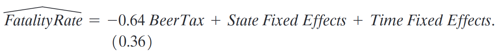

```{r}
#| include: false
library(countdown)
```


## Para reflexão

{fig-align="center" width="100%"}


## Aula passada: como painel pode nos ajudar?

::: {style="font-size: 80%;"}
A estrutura de dados em painel permite controlar por algumas variáveis omitidas **mesmo quando não é possível incluí-las explicitamente na regressão**:

1.  Fatores que variam entre unidades mas não variam ao longo do tempo

2.  Fatores que variam ao longo do tempo mas são comuns a todas as unidades


::: {.callout-tip}
A regressão com **efeitos fixos** (1) é uma extensão da regressão múltipla que explora dados em painel para controlar variáveis que diferem entre entidades, mas permanecem constantes ao longo do tempo. Também podem ser incorporados à regressão os chamados **efeitos fixos de tempo** (2), que controlam variáveis não observadas que são constantes entre entidades, mas variam ao longo do tempo.
:::
:::

## Aula passada: identificação efeitos fixos

::: {.callout-note}
## Hipótese de identificação:
Qualquer mudança na taxa de fatalidade de 1982 a 1988 não pode ser causada por $Z_i$, pois **assumimos** que $Z_i$ não muda entre 1982 e 1988. Ou seja, por hipótese, $E(u_{it} \mid \text{BeerTax}_{it}, Z_i) = 0$.
:::


## Aula passada: estimação efeitos fixos

Três métodos de estimação:

1. Regressão MQO com **n-1 dummies de unidade**; ou
      
      - Regressão MQO com **n dummies de unidade**,  sem intercepto
      
2. Regressão MQO **com desvios da média por entidade** ("entity-demeaned")
3. Especificação de **diferenças**, sem intercepto (funciona apenas para T = 2)


## Efeitos fixos de tempo

::: {style="font-size: 80%;"}
Uma variável omitida pode variar ao longo do tempo, mas não entre estados:
  
- Carros mais seguros (airbags, etc.)

- Mudanças em leis nacionais.

- Esses fatores geram interceptos que mudam ao longo do tempo.

- Seja $(S_t)$ o efeito combinado de variáveis que variam ao longo do tempo, mas não entre estados.

O modelo de regressão populacional resultante é:
$$Y_{it} = \beta_0 + \beta_1 X_{it} + \color{red}{\beta_2 Z_i + \beta_3 S_t} + u_{it}$$
:::

## Efeito fixo de tempo

$$Y_{it} = \beta_0 + \beta_1 X_{it} + \color{red}{\beta_3 S_t} + u_{it}$$

De modo semelhante ao modelo de efeito fixo de entidade, o modelo pode ser pensando tendo um intercepto para cada ano:

::: r-stack

::: {.fragment .fade-in-then-out}
$$
\begin{aligned}
Y_{i,1982} &= \color{red}{\beta_0} + \beta_1 X_{i,1982} + \color{red}{\beta_3 S_{1982}} + u_{i,1982} \\
  & = \color{red}{(\beta_0 + \beta_3 S_{1982})} + \beta_1 X_{i,1982} + u_{i,1982} \\
  & = \color{red}{\lambda_{1982}} + \beta_1 X_{i,1982} + u_{i,1982}
\end{aligned}
$$
:::

::: {.fragment .fade-in-then-out}
$$
\begin{aligned}
Y_{i,1983} &= \color{red}{\beta_0} + \beta_1 X_{i,1983} + \color{red}{\beta_3 S_{1983}} + u_{i,1983} \\
  & = \color{red}{(\beta_0 + \beta_3 S_{1983})} + \beta_1 X_{i,1983} + u_{i,1983} \\
  & = \color{red}{\lambda_{1983}} + \beta_1 X_{i,1983} + u_{i,1983}
\end{aligned}
$$
:::

::: {.fragment .fade-in}
$$
Y_{it} = \color{red}{\lambda_{t}} + \beta_1 X_{it} + u_{it}
$$
:::

:::

## Forma equivalente: variáveis dummy

$$
Y_{it} = \color{red}{\gamma_1 T1_t + \gamma_2 T2_t + \cdots + \gamma_T DT_t} +\beta_1 X_{it}+ u_{it}
$$ onde:

$$D1_{t} =
\begin{cases}
1, & \text{para } t=1, \\
0, & \text{para } t \neq 1.
\end{cases}
$$

## Desvios da média (*demean*)

::: {style="font-size: 80%;"}
-   O modelo de efeito fixo de tempo: $$
    \color{green}{Y_{it}} = \color{red}{\lambda_t} + \color{blue}{\beta_1}\color{green}{X_{it}} + \color{green}{u_{it}}
    $$

-   Se calcularmos a média entre unidades $(\sum_{i=1}^{n}/n)$, temos: $$
    \color{brown}{\bar{Y}_t} =  \color{red}{\lambda_t} + \color{blue}{\beta_1} \color{brown}{\bar{X}_t} + \color{brown}{\bar{u}_t}
    $$

-   Subtraindo a primeira equação da segunda:$$
    (\color{green}{Y_{it}} - \color{brown}{\bar{Y}_t})
    =\color{blue}{\beta_1} (\color{green}{X_{it}} - \color{brown}{\bar{X}_t}) + (\color{green}{u_{it}} - \color{brown}{\bar {u}_t})
    $$

-   Definindo $\color{red}{\tilde{Y}_{it}} = \color{green}{Y_{it}} - \color{brown}{\bar{Y}_t}$ (e fazendo o mesmo para $X$ e $u$):$$
    \color{red}{\tilde{Y}_{it}} = \color{blue}{\beta_1} \color{red}{\tilde{X}_{it}} +\color{red}{\tilde{u}_{it}}
    $$
:::

## Desvios da média (cont.)


Resultados do slide anterior implicam que:

-   O coeficiente $\beta_1$ estimado por efeito fixo de tempo pode ser obtido fazendo-se a regressão de *"demeaned"* $Y$ em *"demeaned* $X$, onde *"demeaned"* significa subtrair a média entre unidades para um mesmo período.

-   Ou seja, trabalhamos com as variáveis $Y$ e $X$ como **desvios** de suas médias entre unidades para um dado período.

## Estimação: efeitos fixos de tempo


Dois métodos de estimação:

1. Regressão MQO com **T-1 dummies de tempo**; ou
      
      - Regressão MQO com **T dummies de tempo**,  sem intercepto
2. Regressão MQO **com desvios da média entre entidades** ("time-demeaned")

## *Two-Way Fixed Effects*

::: {style="font-size: 70%;"}

Normalmente queremos incluir **efeitos fixos de unidade** e **efeitos fixos de tempo**:
$$
Y_{it} = \color{red}{\alpha_i} + \color{red}{\lambda_t} + \beta_1 X_{it} + u_{it}
$$  

Possível estimar de três formas:  

1. Incluir $n$ variáveis binárias específicas da unidade e ($T-1$) variáveis binárias específicas de tempo ou $T$ variáveis binárias específicas de tempo e $n-1$ variáveis binárias específicas da unidade.

2. Subtrair as médias específicas da unidade, calculando os desvios das médias de $X$ e $Y$. Em seguida, regredir "desvio $Y$" em "desvio $X$", incluindo $T$ dummies de tempo.  

3. Subtrair as médias de unidade e as médias de tempo, e regredir o "desvio duplo $Y$" em "desvio duplo $X$".  

Observação: com $T=2$, o modelo em diferença com a inclusão do intercepto é equivalente à especificação TWFE. 
:::


## TWFE para o efeito do álcool sobre fatalidades de trânsito

{width="65%"}

{width="80%"}

::: {style="font-size: 80%;"}
::: {.incremental}
- Especificação inclui 55 variáveis! Quais?

- Inclusão de efeito fixo de tempo:
    - altera pouco o coeficiente de interesse
    - torna as estimativas menos precisas

:::
:::

## Efeitos fixos e causalidade

::: {style="font-size: 80%;"}
$$
Y_{it} = \beta_1 X_{it} + \alpha_i + u_{it}, \quad i = 1, \ldots, n,\; t = 1, \ldots, T
$$

1. $E(u_{it} \mid X_{i1}, \ldots, X_{iT}, \alpha_i) = 0$

2. $(X_{i1}, \ldots, X_{iT}, u_{i1}, \ldots, u_{iT}), \; i = 1, \ldots, n,$ são i.i.d. de sua distribuição conjunta

3. Grandes outliers são improváveis: $(X_{it}, u_{it})$ possuem momentos de quarta ordem finitos

4. Não há multicolinearidade perfeita (quando há múltiplos $X$'s)

Observação: As hipóteses 3 e 4 são as mesmas de MQO, mas 1 e 2 diferem.
:::

## Hipótese 1

::: {style="font-size: 80%;"}
- $u_{it}$ tem média zero dado $\alpha_i$ e $X_{it}$

- Extensão da hipótese #1 do modelo de regressão múltipla

- Isso implica que não há efeitos defasados omitidos (ou tem que ser incluídos - slide seguinte)

- Não há **causalidade reversa** de $u$ para $X$ futuro:
  
    - se um estado apresenta uma taxa de fatalidade particularmente alta neste ano, isso não afeta a decisão de aumentar o imposto sobre a cerveja no futuro

::: {.callout-tip}
A plausibilidade da hipótese de não causalidade reversa depende do contexto específico do estudo e é uma das hipóteses de identificação do modelo causal.
:::
:::

## Adendo: o modelo TWFE dinâmico

::: {style="font-size: 80%;"}
O pressuposto de **ausência de efeitos defasados**  pode ser irrealista a depender da pergunta que se quer responder! 

- Ausência de efeitos defasados significa que $X_t$ afeta apenas $Y_t$ e não $Y_{t+1}, Y_{t+2}, \ldots$  

- Para permitir efeitos defasados, podemos usar um **modelo TWFE dinâmico**: $$
Y_{it} = \alpha_i + \lambda_t + \color{blue}{\beta_0 X_{it}} + \color{blue}{\beta_1 X_{it-1}} + \color{blue}{\beta_2 X_{it-2}} + \cdots + \color{blue}{\beta_m X_{it-m}}+ u_{it}
$$  

- Os coeficientes $\color{blue}{\beta_0, \beta_1, \beta_2, \ldots, \beta_m}$ acompanham a trajetória temporal do efeito, permitindo que ele se manifeste gradualmente ao longo do tempo.
:::

## Hipótese 2

::: {style="font-size: 80%;"}
- Esta é uma extensão da suposição #2 de modelo de regressão múltipla

- Essa hipótese é satisfeita se as unidades vierem de uma amostra aleatória da população

- Não é necessário que as observações sejam i.i.d. ao longo do tempo **para a mesma unidade**: isso seria irrealista! Se um estado tem um imposto sobre a cerveja elevado neste ano, é bem provável (altamente correlacionado) que ele terá um imposto elevado no próximo também.

- De forma semelhante, o termo de erro será correlacionado $\text{corr}(u_{it}, u_{i,t+1}) \neq 0$
:::

## Intuição Hipótese 2

Independência e autocorrelação dos resíduos:

::: {style="font-size: 60%;"}
$$
\begin{array}{cccccc}
 & i=1 & i=2 & i=3 & \cdots & i=n \\
t=1 & u_{11} & u_{21} & u_{31} & \cdots & u_{n1} \\
\vdots & \vdots & \vdots & \vdots & \cdots & \vdots \\
t=T & u_{1T} & u_{2T} & u_{3T} & \cdots & u_{nT}
\end{array}
$$

$$
\leftarrow \text{Amostragem é i.i.d. entre unidades} \rightarrow
$$
:::

::: {style="font-size: 80%;"}
- Se as unidades vêm de uma amostra aleatória, então $(u_{i1}, \ldots, u_{iT})$ é independente de $(u_{j1}, \ldots, u_{jT})$ para unidades diferentes $i \neq j$.

- Mas, se os fatores omitidos que compõem $u_{it}$ são serialmente correlacionados, então $u_{it}$ também será serialmente correlacionado.
:::

## *Clustered Standard Errors* 

::: {style="font-size: 80%;"}
- A hipótese 2 implica que as observações são independentes **entre diferentes unidades**.  
  
  - $u_{1982,CA}$ não ajuda a prever $u_{1982,MA}$.  

- Porém, essa hipótese não se verifica para as observações pertencentes à **mesma unidade**, ou seja, elas não são independentes entre si.  

  - **autocorrelação**: $u_{1982,CA}$ provavelmente ajuda a prever $u_{1983,CA}$.  

- **Erros-padrão agrupados (Clustered SEs)** assumem que as variáveis são i.i.d. entre unidades, mas permitem que sejam **autocorrelacionadas dentro de cada unidade!**  

- A fórmula é complexa, mas pacotes estatísticos computam os erros-padrão corrigidos quando solicitado.
:::

## Propriedades do MQO em painel

::: {style="font-size: 80%;"}
- O estimador de efeito fixo por MQO de $\hat{\beta}_1$ é não-viesado, consistente e assintóticamente tem distribuição normal.

- No entanto, os erros-padrão usuais de MQO (tanto os que assumem homocedasticidade quanto os robustos à heterocedasticidade) são incorretos em geral, pois assumem que $u_{it}$ não é serialmente correlacionado!

    - Na prática, os erros-padrão de MQO frequentemente subestimam a verdadeira incerteza amostral: se $u_{it}$ é correlacionado ao longo do tempo, você não dispõe de tanta informação (ou variação aleatória) quanto teria se $u_{it}$ fosse não correlacionado.

- Esse problema é resolvido utilizando erros-padrão "clusterizados".
:::


## Como apresentar resultados de um estudo empírico?

::: {style="font-size: 70%;"}
- Normalmente rodamos várias regressões (especificação de base + alternativas).  

- Usamos **tabelas** para apresentar resultados de múltiplas especificações.  

- Cada especificação corresponde a uma coluna.  

- A tabela deve incluir, para cada especificação:  
  1. Coeficientes estimados.  
  2. Erros-padrão.  
  3. Número de observações.  
  4. Medidas de ajuste.  
  5. Estatísticas F relevantes, se houver.

::: {.fragment .highlight-red}
Pensando no caso de fatalidades no trânsito e álcool quais especificações vocês utilizariam?
:::

:::

## Fatalidades no trânsito e álcool

<iframe src="/documents/stock_watson_tab_10_1.pdf" width="100%" height="600px"></iframe>

## Outras evidências

::: {style="font-size: 70%;"}

**Meta-análise (Wagenaar, Salois & Komro, 2009)**: 112 estudos sobre o efeito de preços e impostos sobre álcool.  
  
  - Elasticidades estimadas:  
    - Cerveja: -0,46  
    - Vinho: -0,69  
    - Destilados: -0,80  
  
  - Conclusão: impostos sobre álcool **reduzem consumo significativamente**, mais que outros programas.

- **Idade mínima para beber (Carpenter & Dobkin, 2011)**:  

  - Aumentar a idade mínima legal **reduz fatalidades** entre motoristas jovens, principalmente à noite.  

  - Observação: não controlam para outras variáveis de consumo/leis de trânsito.

:::