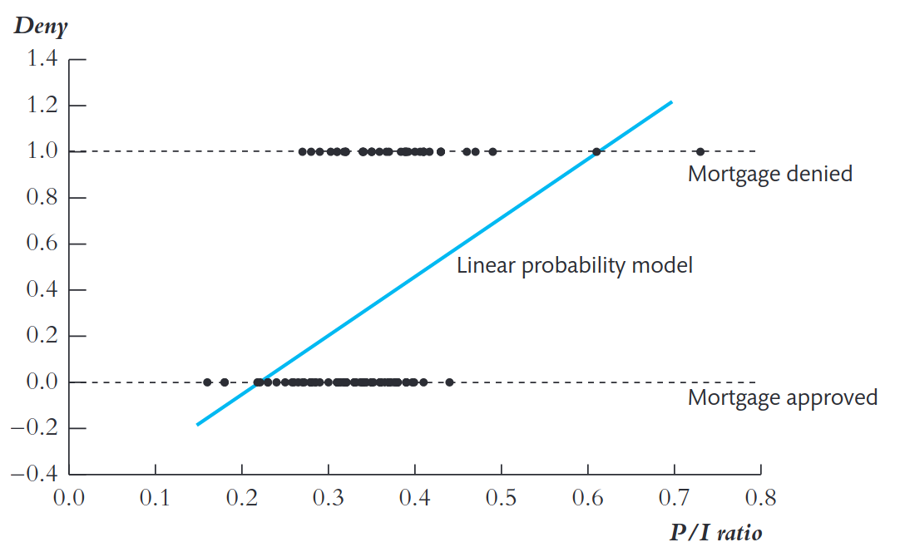
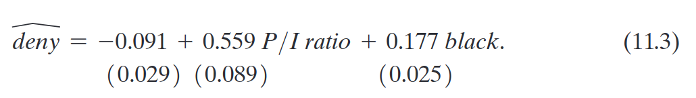

```{r setup, include=FALSE, eval=TRUE}
library(ggplot2)
library(broom)
library(dplyr)
library(tidyr)
library(ggdag)
library(ggraph)
options(digits=5)
```

## Objetivos de aprendizado

Nesta aula, formalizamos como utilizar regressões quando a variável dependente é binária.

<br>

Ao final, o aluno deverá ser capaz de:

-   entender intuitivamente o modelo de probabilidade linear (LPM)

-   entender as hipóteses de identificação do LPM

-   entender como interpretar resultados em um LPM

## Referências

::: nonincremental
-   Capítulo 9 @stock_watson_2020 (1a Edição, português)

-   Capítulo 11 @stock_watson_2004 (4a Edição, apenas inglês)

:::

## Variável Dependente Binária

::: {style="font-size: 95%;"}
- Em muitas aplicações econômicas, a variável de interesse é **binária**:

  - Ex.: uma pessoa **compra (1)** ou **não compra (0)** um bem.
  - Ex.: um pedido de hipoteca é **aceito (0)** ou **rejeitado (1)**.
  - Ex.: um indivíduo **trabalha (1)** ou **não trabalha (0)**.

- **Pergunta:** Mas não usamos variáveis dummies anteriormente?

  - Sim, mas elas eram variáveis explicativas e não de interesse.

:::

## Distribuição e valor esperado de variável binária

::: {.callout-tip}
## Distribuição Bernoulli

Seja $G$ uma variável discreta que assume os valores ${0,1}$. A variável binária é chamada de variável aleatória de Bernoulli e sua distribuição de probabilidade é chamada de distribuição Bernoulli.

$$
G =
\begin{cases}
1, & \text{com probabilidade } p,\\[2pt]
0, & \text{com probabilidade } 1-p,
\end{cases}
$$

O valor esperado da distribuição Bernoulli é dado por:$$E(G) = 0 \times (1 - p)+1 \times p = p$$
:::

## Regressão quando variável dependente é binária

::: {style="font-size: 90%;"}
- Nos modelos de MQO que estudamos anteriormente, a função de regressão populacional é dada por:$$E(Y \mid X_1,X_2,...,X_k)$$

- Quando $Y_i \in \{0,1\}$, o valor esperado de $Y$ é a probabilidade de que $Y=1$:$$E(Y) = 0 \times Pr(Y=0) + 1 \times Pr(Y=1) = Pr(Y=1)$$

- Portanto, para variável binária temos:$$E(Y \mid X_1,X_2,...,X_k)=Pr(Y=1 \mid X_1,X_2,...,X_k)$$
:::

## Modelo de Probabilidade Linear

- O modelo de regressão aplicado a uma variável dependente binária é chamado de **Modelo de Probabilidade Linear** (Linear Probability Model - LPM).

- Modelo de regressão múltipla: $$Y_i = \beta_0 + \beta_1X_{1i} + \beta_2 X_{2i} + ... + \beta_kX_{ki} + u_i$$

- Como $Y_i \in \{0,1\}$:$$Pr(Y=1\mid X_1, X_2, ..., X_k) = \beta_0 + \beta_1X_{1i} + \beta_2 X_{2i} + ... + \beta_kX_{ki}$$

## LPM: interpretação dos coeficientes

::: {style="font-size: 90%;"}
O modelo de probabilidade linear é:

$$
\begin{aligned}
E(Y \mid X_1,X_2,...,X_k) & = \\
Pr(Y=1\mid X_1, X_2, ..., X_k) =& \\
\beta_0 + \beta_1X_{1i} + \beta_2 X_{2i} + ... + \beta_kX_{ki}
\end{aligned}
$$

- $\beta_1$ mede a **variação na probabilidade de $Y=1$** quando **$X$ aumenta uma unidade**, mantendo as demais variáveis consantes.

- Estima-se via **MQO**.

:::

## LPM: estimação e inferência

- Como o modelo de probabilidade linear **é uma regressão** com variável dependennte limitada, a estimação pode ser feita normalmente por **MQO**.

- Toda inferência estatística que vimos anteriormente se aplica: intervalos de confiança, estatísticas T e F, testes de hipótese

- O LPM será **sempre** heterocedástico. Portanto, sempre deve-se usar **erros-padrão robustos**!

- **Atenção**: $R^2$ não é válido em um modelo de probabilidade linear.

## LPM: identificação do tratamento

::: {.callout-important}
## Identificação e causalidade

Como o modelo de probabilidade linear **é uma regressão**, as hipóteses para inferência causal são as mesmas do modelo de MQO com seleção em observáveis.

:::

::: {style="font-size: 90%;"}
**Quais são essas hipóteses?**

1.  Os regressores $X_s$ são independentes do erro $u_i$.

2.  $(Y_i,X_{1i},X_{2i}...X_{ki})$, $i=1,\dots,n$, são independentes e identicamente distribuídos (i.i.d.).

3.  Sem outliers relevantes.

4.  Não há multicolinearidade perfeita.

:::

## Existe discriminação racial no mercado de crédito imobiliário?

::: {style="font-size: 70%;"}
- **Pergunta causal:** a raça influencia a **probabilidade** de ter um pedido de hipoteca negado?

- **Cenário empírico:** solicitações na área de Boston (MA), em 1990, a partir dos dados *Home Mortgage Disclosure Act (HMDA)* do FED de Boston.

- **Processo de decisão:** agentes bancários avaliam a capacidade de pagamento dos solicitantes. Como podemos utilizar os métodos estatístios para obter evidências de discriminação nesse mercado?

  - 28% dos solicitantes pretos tiverem seus pedidos negados em 1990 em Boston, enquanto para apenas 9% dos solicitantes brancos os pedidos foram negados.

  - Podemos considerar estes números como evidencia de discriminação? Justifique.

  - A comparação simples não garante que os dois grupos sejam comparáveis: brancos e pretos são diferentes em outros aspectos.

      - Identificação com MQO requer que tudo o mais seja constante.

:::

## Relação entre P/I ratio e negação do empréstimo

::: columns
::: column

::: {style="font-size: 70%;"}
- **Contexto:** o agente bancário avalia se o solicitante conseguirá pagar o empréstimo.
- **Indicador-chave:** a razão **P/I** = pagamento mensal / renda mensal.
- **Variável dependente:** `deny = 1` se a solicitação foi negada, `0` se aprovada.
- **Padrão observado:**
  - Quando **P/I < 0,3**, quase ninguém é negado.
  - Quando **P/I > 0,4**, a maioria é negada.
:::

:::
::: column

:::
:::

## Interpretação econométrica do LPM

{width="150%"}

::: {style="font-size: 80%;"}

- A regressão linear estima a **probabilidade de negação** como função da razão **P/I** e **raça**.

- Se $P/I$ aumenta em $0,1$, a probabilidade de ter o pedido negado aumenta em $0,56 \times 0,1 \approx 0,056$, ou seja um aumento de 5 pontos percentuais.

- O coeficiente da variável *black* indica que uma pessoa preta tem uma probabilidade ter o pedido negado $17,7%$ maior do que uma pessoa branca, para o mesmo nível de P/I.

:::

## Limitações do LPM

1. **Previsões fora do intervalo [0,1]:**
   - Como o modelo é linear, pode gerar $\hat{P}<0$ ou $\hat{P}>1$.

2. **Heterocedasticidade inerente:**
   $$
   \text{Var}(u_i|X_i) = P_i(1 - P_i)
   $$

3. **Não linearidade ignorada:**
   - Relações reais entre variáveis binárias e explicativas tendem a ser não lineares.

## Referências {visibility="uncounted"}

::: {#refs}
:::
