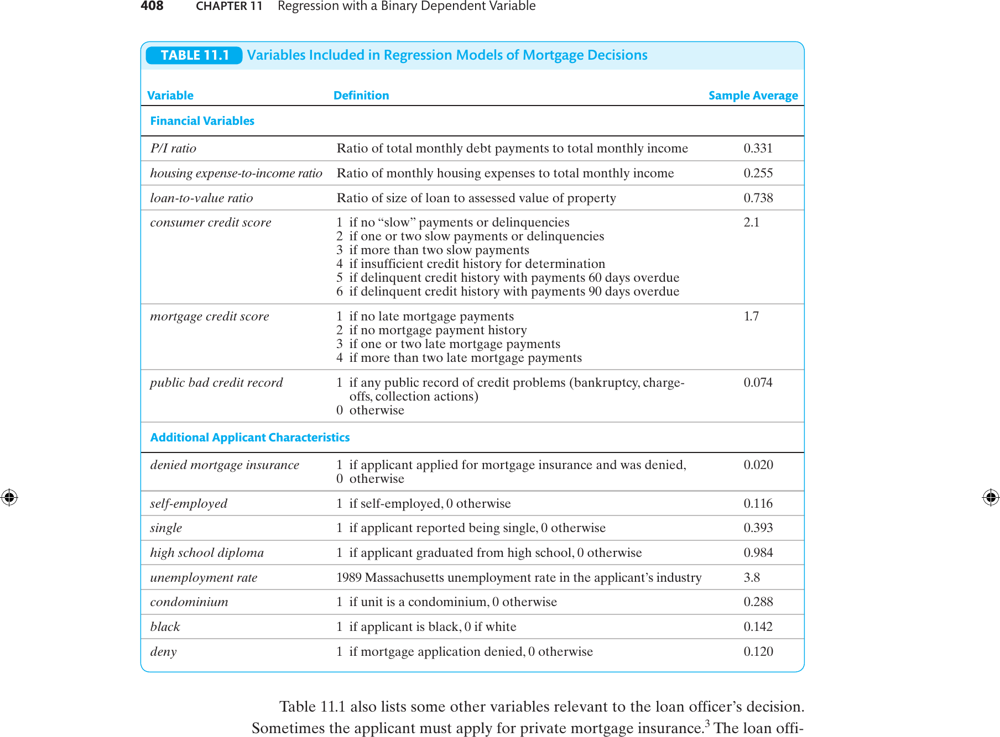

```{r setup, include=FALSE, eval=TRUE}
library(ggplot2)
library(broom)
library(dplyr)
library(tidyr)
library(ggdag)
library(ggraph)
options(digits=5)
```

## Objetivos de aprendizado

Nesta aula, formalizamos como utilizar regressões quando a variável dependente é binária.

<br>

Ao final, o aluno deverá ser capaz de:

-   entender intuitivamente o modelo de probabilidade linear (LPM)

-   entender as hipóteses de identificação do LPM

-   interpretar coeficientes e calcular probabilidades previstas no LPM

-   compreender as limitações do LPM e quando utilizá-lo na prática

## Referências

::: nonincremental
-   Capítulo 9 @stock_watson_2020 (1ª Edição, português)

-   Capítulo 11 @stock_watson_2004 (4ª Edição, apenas inglês)

:::

## Variável Dependente Binária

::: {style="font-size: 90%;"}
- Em muitas aplicações econômicas, a variável de interesse é **binária**:

  - [Ex.: uma pessoa **compra (1)** ou **não compra (0)** um bem.]{.fragment}
  - [Ex.: um pedido de hipoteca é **aceito (0)** ou **rejeitado (1)**.]{.fragment}
  - [Ex.: um indivíduo **trabalha (1)** ou **não trabalha (0)**.]{.fragment}

::: {.fragment}
- **Pergunta:** Mas não usamos variáveis dummies anteriormente?

  - Sim, mas elas eram variáveis explicativas e não de interesse.
:::
:::

## Distribuição e valor esperado de variável binária

::: {.callout-tip}
## Distribuição Bernoulli

Seja $G$ uma variável discreta que assume os valores $\{0,1\}$. A variável binária é chamada de variável aleatória de Bernoulli e sua distribuição de probabilidade é chamada de distribuição Bernoulli.

$$
G =
\begin{cases}
1, & \text{com probabilidade } p,\\[2pt]
0, & \text{com probabilidade } 1-p,
\end{cases}
$$

O valor esperado e a variância da distribuição Bernoulli são:
$$E(G) = p \qquad \text{e} \qquad \text{Var}(G) = p(1-p)$$
:::

::: {.fragment}
::: {style="font-size: 80%;"}
→ A variância depende de $p$: é máxima em $p = 0{,}5$ e zero nos extremos. Isso terá consequências importantes para a estimação.
:::
:::

## Regressão quando variável dependente é binária

::: {style="font-size: 90%;"}
- Nos modelos de MQO que estudamos anteriormente, a função de regressão populacional é dada por:$$E(Y \mid X_1,X_2,\ldots,X_k)$$

::: {.fragment}
- Quando $Y_i \in \{0,1\}$, o valor esperado de $Y$ é a probabilidade de que $Y=1$:$$E(Y) = 0 \times Pr(Y=0) + 1 \times Pr(Y=1) = Pr(Y=1)$$
:::

::: {.fragment}
- Portanto, para variável binária temos:$$E(Y \mid X_1,X_2,\ldots,X_k)=Pr(Y=1 \mid X_1,X_2,\ldots,X_k)$$
:::
:::

## Modelo de Probabilidade Linear

::: {style="font-size: 90%;"}
- O modelo de regressão aplicado a uma variável dependente binária é chamado de **Modelo de Probabilidade Linear** (Linear Probability Model - LPM).

::: {.fragment}
- Modelo de regressão múltipla: $$Y_i = \beta_0 + \beta_1X_{1i} + \beta_2 X_{2i} + \cdots + \beta_kX_{ki} + u_i$$
:::

::: {.fragment}
- Como $Y_i \in \{0,1\}$:$$Pr(Y=1\mid X_1, X_2, \ldots, X_k) = \beta_0 + \beta_1X_{1i} + \beta_2 X_{2i} + \cdots + \beta_kX_{ki}$$
:::
:::

## LPM: interpretação dos coeficientes

::: {style="font-size: 85%;"}
O modelo de probabilidade linear é:

$$
\begin{aligned}
E(Y \mid X_1,\ldots,X_k) &= Pr(Y=1\mid X_1, \ldots, X_k) \\
&= \beta_0 + \beta_1X_{1i} + \beta_2 X_{2i} + \cdots + \beta_kX_{ki}
\end{aligned}
$$

::: {.fragment}
- $\beta_j$ mede a **variação na probabilidade de $Y=1$** quando $X_j$ aumenta uma unidade, mantendo os demais regressores constantes.

- Estima-se via **MQO**. Toda a estrutura de inferência do MQO se aplica.
:::

::: {.fragment}
**Exemplo (S&W, Eq. 11.1):** regressão simples de negação de hipoteca na razão P/I:

$$\widehat{deny} = \underset{(0{,}032)}{-0{,}080} + \underset{(0{,}098)}{0{,}604}\;P/I, \qquad t = 6{,}13$$

Um aumento de $0{,}1$ na razão P/I eleva a probabilidade de negação em $\approx 6{,}0$ p.p.
:::
:::

## Exemplo Prático: Calculando Probabilidades Previstas

::: {style="font-size: 86%;"}
Com a equação estimada (com raça como controle, S&W Eq. 11.3):

$$\widehat{deny} = -0{,}091 + 0{,}559\;P/I + 0{,}177\;black$$

::: {.fragment}
**Passo 1 — Calcule o valor do índice:** substitua os valores de $X$.

**Passo 2 — O resultado é a probabilidade prevista** (no LPM, a função já é linear em $P$).

**Passo 3 — Interprete a diferença** entre dois cenários como o **efeito marginal**.
:::

::: {.fragment}
| Solicitante | P/I | $\hat{P}(\text{deny}=1)$ |
|-------------|-----|--------------------------|
| Branco, P/I = 0,25 | 0,25 | $-0{,}091 + 0{,}559(0{,}25) = 4{,}9\%$ |
| Branco, P/I = 0,45 | 0,45 | $-0{,}091 + 0{,}559(0{,}45) = 16{,}1\%$ |
| Preto, P/I = 0,30 | 0,30 | $7{,}7\% + 17{,}7\;\text{p.p.} = 25{,}4\%$ |

→ O mesmo incremento em P/I produz **sempre o mesmo efeito** no LPM (linearidade).
:::
:::

## LPM: estimação e inferência

::: {style="font-size: 90%;"}
- Como o modelo de probabilidade linear **é uma regressão**, a estimação pode ser feita normalmente por **MQO**.

- [Toda inferência estatística que vimos anteriormente se aplica: intervalos de confiança, estatísticas $t$ e $F$, testes de hipótese.]{.fragment}

- [O LPM será **sempre** heterocedástico. Portanto, sempre deve-se usar **erros-padrão robustos**!]{.fragment}

- [**Atenção**: $R^2$ não é uma medida de ajuste válida em um modelo com variável dependente binária.]{.fragment}
:::

## Por que o $R^2$ falha com variável dependente binária?

::: {style="font-size: 86%;"}
No MQO padrão, o $R^2$ mede a fração da variância de $Y$ explicada pelo modelo. Para isso, compara os resíduos com o desvio em torno de $\bar{Y}$.

::: {.fragment}
**O problema com $Y$ binário:**

- Todos os valores observados de $Y$ estão em **apenas duas linhas horizontais**: $Y = 0$ e $Y = 1$.
- O $R^2$ sempre será baixo, independentemente de quão bem o modelo estima as probabilidades.
- Um modelo que prevê $\hat{P} = 0{,}9$ para $Y=1$ e $\hat{P} = 0{,}1$ para $Y=0$ parece ter $R^2$ baixo, mesmo sendo excelente.
:::

::: {.fragment}
**O que usar no lugar?**

- **Fração corretamente prevista:** se $\hat{P}_i \geq 0{,}5$ e $Y_i = 1$ → acerto; se $\hat{P}_i < 0{,}5$ e $Y_i = 0$ → acerto.
- **Pseudo-$R^2$ de McFadden** (veremos na próxima aula).

→ Reporte erros-padrão robustos, coeficientes e significância — não $R^2$.
:::
:::

## LPM: identificação do tratamento

::: {.callout-important}
## Identificação e causalidade

Como o modelo de probabilidade linear **é uma regressão**, as hipóteses para inferência causal são as mesmas do modelo de MQO com seleção em observáveis.

:::

::: {style="font-size: 88%;"}
**Quais são essas hipóteses?**

::: incremental
1. Os regressores $X_s$ são independentes do erro $u_i$.
2. $(Y_i,X_{1i},X_{2i},\ldots,X_{ki})$, $i=1,\dots,n$, são i.i.d.
3. Sem outliers relevantes.
4. Não há multicolinearidade perfeita.
:::
:::

## Existe discriminação racial no mercado de crédito imobiliário?

::: r-stack

::: {style="font-size: 78%;"}
**Pergunta causal:** a raça influencia a **probabilidade** de ter um pedido de hipoteca negado?

<br>

**Cenário empírico:** solicitações na área de Boston (MA), em 1990, a partir dos dados *Home Mortgage Disclosure Act (HMDA)* do FED de Boston.

**Processo de decisão:** agentes bancários avaliam a capacidade de pagamento dos solicitantes. Como podemos obter evidências de discriminação?
:::

::: {.fragment .current-visible style="font-size: 78%;"}
**Dado observado (Boston, 1990):**

| Grupo | Taxa de negação |
|-------|----------------|
| Solicitantes pretos | **28%** |
| Solicitantes brancos | **9%** |

<br>

→ Podemos considerar estes números como evidência de discriminação? **Justifique.**
:::

::: {.fragment style="font-size: 78%;"}
**Problema da comparação simples:**

A comparação direta não garante que os grupos sejam **comparáveis em outras características**:

- Brancos e pretos podem diferir em renda, histórico de crédito, etc.
- Identificação com MQO requer que *tudo o mais seja constante*.

→ Precisamos **controlar** por outras variáveis relevantes!
:::

:::

## Variáveis disponíveis: dados HMDA

{width="85%" fig-align="center"}

::: {style="font-size: 65%;"}
Fonte: @stock_watson_2004, Table 11.1.
:::

## Dados HMDA: estatísticas descritivas

::: {style="font-size: 82%;"}
**Amostra:** $n = 2{.}380$ solicitações de hipoteca em Boston, 1990.

| Variável | Média / Proporção |
|----------|-------------------|
| Taxa de negação (*deny* = 1) | **12,0%** |
| Proporção de solicitantes pretos | 14,2% |
| Razão P/I (pagamento / renda) | 0,331 |
| Razão despesa habitacional / renda | 0,255 |
| Razão empréstimo / valor do imóvel | 0,738 |
| Histórico de crédito ruim (público) | 7,4% |
| Autônomo | 11,6% |
| Solteiro | 39,3% |

::: {.fragment}
→ A taxa de negação geral é 12%. Controlando por características financeiras, quanto da diferença racial (28% vs. 9%) persiste?
:::
:::

## Relação entre P/I ratio e negação do empréstimo

::: columns
::: column

::: {style="font-size: 70%;"}
- **Contexto:** o agente bancário avalia se o solicitante conseguirá pagar o empréstimo.
- **Indicador-chave:** a razão **P/I** = pagamento mensal / renda mensal.
- **Variável dependente:** `deny = 1` se a solicitação foi negada, `0` se aprovada.
- **Padrão observado:**
  - Quando **P/I < 0,3**, quase ninguém é negado.
  - Quando **P/I > 0,4**, a maioria é negada.
:::

:::
::: column

:::
:::

## LPM simples: razão P/I como único regressor

::: {style="font-size: 85%;"}

$$\widehat{deny} = \underset{(0{,}032)}{-0{,}080} + \underset{(0{,}098)}{0{,}604}\;P/I$$

$$n = 2{.}380, \quad t_{\hat{\beta}_1} = 6{,}13$$

::: {.fragment}
- Coeficiente de P/I: $+0{,}604$ → aumento de $0{,}1$ na razão P/I eleva a probabilidade de negação em **6,0 p.p.**

- Estatisticamente significativo ao nível de 1%.
:::

::: {.fragment}
**Previsão para dois valores extremos:**

| P/I | $\hat{P}(\text{deny}=1)$ |
|-----|--------------------------|
| 0,20 | $-0{,}080 + 0{,}604(0{,}20) = 4{,}1\%$ |
| 0,50 | $-0{,}080 + 0{,}604(0{,}50) = 22{,}2\%$ |

→ Mas este modelo **não controla** por raça nem por outras características financeiras.
:::
:::

## LPM com raça: interpretação econométrica

::: {style="font-size: 85%;"}

$$\widehat{deny} = \underset{(0{,}029)}{-0{,}091} + \underset{(0{,}089)}{0{,}559}\;P/I + \underset{(0{,}025)}{0{,}177}\;black$$

$$n = 2{.}380, \quad t_{black} = 7{,}11$$

::: {.fragment}
- Se $P/I$ aumenta em $0{,}1$: probabilidade de negação aumenta em $0{,}559 \times 0{,}1 \approx$ **5,6 p.p.**
:::

::: {.fragment}
- O coeficiente de *black*: um solicitante preto tem probabilidade de negação **17,7 p.p. maior** do que um branco com o **mesmo nível de P/I**.

  - Branco com P/I = 0,30: $\hat{P} = -0{,}091 + 0{,}559(0{,}30) = 7{,}7\%$
  - Preto com P/I = 0,30: $\hat{P} = 7{,}7\% + 17{,}7\;\text{p.p.} = 25{,}4\%$
:::

::: {.fragment}
→ Efeito estatisticamente significativo ao nível de 1%. Mas ainda há omissão de outros controles relevantes.
:::

:::

## LPM com controles financeiros completos

::: {style="font-size: 80%;"}
Expandindo o modelo para incluir múltiplas características financeiras (S&W Tabela 11.2, col. 1):

| Variável | Coef. | EP | $t$ |
|----------|-------|----|-----|
| Razão P/I | +0,449 | (0,114) | 3,94 |
| Razão empréstimo/valor ≥ 0,95 | +0,189 | (0,050) | 3,78 |
| Score de crédito ao consumidor | +0,031 | (0,005) | 5,20 |
| Histórico de crédito ruim (público) | +0,197 | (0,035) | 5,62 |
| **Preto (black)** | **+0,084** | **(0,023)** | **3,65** |

::: {.fragment}
- Controlando por **todas as características financeiras legítimas**, o coeficiente de *black* cai de 17,7 p.p. para **8,4 p.p.** — mas permanece **altamente significativo** (nível de 1%).

- Os controles financeiros absorvem parte do diferencial, mas não o eliminam.
:::
:::

## Ameaças à validade interna

::: {style="font-size: 85%;"}
Mesmo após controlar por características observáveis, três ressalvas importantes:

::: {.fragment}
**1. Variáveis omitidas não observadas**

Entrevistas presenciais revelam informações não registradas nos dados (impressão do solicitante, histórico verbal). Essas podem estar correlacionadas com raça. Se não controladas, o coeficiente de *black* pode refletir omissão, não discriminação.
:::

::: {.fragment}
**2. Forma funcional**

O LPM é linear — especificações não lineares (Probit, Logit) poderiam dar resultados diferentes? Na prática, as três abordagens produzem estimativas similares (veremos na próxima aula).
:::

::: {.fragment}
**3. Validade externa**

Os dados são de Boston, 1990. Resultados podem não se generalizar para outros mercados ou épocas — especialmente com o advento do crédito digital.
:::
:::

## Limitações do LPM

::: r-stack

::: {style="font-size: 88%; text-align: center;"}
**Limitação 1 de 3 — Previsões fora do intervalo $[0,1]$**

<br>

Como o modelo é linear, pode gerar $\hat{P} < 0$ ou $\hat{P} > 1$.

Veja o gráfico anterior: para valores baixos de $P/I$, a reta LPM entra em território negativo.

<br>

Uma probabilidade não pode ser menor que 0 ou maior que 1.
:::

::: {.fragment .current-visible style="font-size: 88%; text-align: center;"}
**Limitação 2 de 3 — Heterocedasticidade inerente**

<br>

O LPM é **sempre** heterocedástico — a variância do erro depende de $X$:

$$\text{Var}(u_i \mid X_i) = P_i(1 - P_i)$$

<br>

→ Sempre use **erros-padrão robustos!**
:::

::: {.fragment style="font-size: 85%;"}
**Resumo das limitações:**

1. **Previsões fora de $[0,1]$** — a reta linear pode prever probabilidades impossíveis.
2. **Heterocedasticidade inerente** — $\text{Var}(u_i|X_i) = P_i(1-P_i)$ → erros robustos obrigatórios.
3. **Não linearidade ignorada** — a relação real entre $X$ e $Pr(Y=1)$ tende a ser não linear.

<br>

→ Essas limitações motivam os modelos **Probit** e **Logit** (próxima aula).
:::

:::

## Heterocedasticidade: intuição e visualização

::: {style="font-size: 84%;"}
A variância do erro no LPM é $\text{Var}(u_i \mid X_i) = P_i(1-P_i)$, onde $P_i = Pr(Y_i=1\mid X_i)$.

::: {.fragment}
| $P_i$ | $\text{Var}(u_i\mid X_i) = P_i(1-P_i)$ | Intuição |
|--------|------------------------------------------|----------|
| 0,10 | 0,09 | Evento raro: baixa incerteza |
| 0,30 | 0,21 | Alguma incerteza |
| **0,50** | **0,25** | **Máxima incerteza** |
| 0,70 | 0,21 | Alguma incerteza |
| 0,90 | 0,09 | Evento quase certo: baixa incerteza |
:::

::: {.fragment}
- A variância é **máxima** quando $P = 0{,}5$ (máxima incerteza sobre o resultado).
- A variância **colapsa a zero** quando $P \to 0$ ou $P \to 1$ (sem incerteza).
- Essa estrutura não é acidental — é **inerente** à natureza de variáveis binárias.
- **Consequência:** os erros-padrão do MQO padrão são inválidos. Sempre use a opção `HC1` ou `HC3` em R.
:::
:::

## Quando o LPM é suficiente?

::: {style="font-size: 86%;"}
::: {.fragment}
**O LPM é uma boa aproximação quando:**

- As probabilidades previstas ficam longe dos extremos ($0$ e $1$), isto é, $\hat{P}_i \in [0{,}1\,;\,0{,}9]$.
- O interesse é identificar um **efeito causal médio** (ATE), não prever probabilidades individuais.
- O modelo combina com outros estimadores: **variáveis instrumentais**, **efeitos fixos**, **diferenças em diferenças**.
:::

::: {.fragment}
**Quando Probit/Logit são preferíveis:**

- Probabilidades previstas próximas de $0$ ou $1$.
- O objetivo é **previsão individual** ou classificação.
- Publicação em revistas que exigem robustez a forma funcional.
:::

::: {.fragment}
::: {.callout-tip}
## Recomendação de Angrist & Pischke
Reporte o LPM com erros-padrão robustos. Se houver preocupação com a forma funcional, adicione Probit ou Logit como verificação de robustez.
:::
:::
:::

## Resumo do LPM

::: {style="font-size: 86%;"}

::: columns
::: {.column width="50%"}
**Vantagens**

::: incremental
- Simples de estimar e interpretar
- Coeficientes = efeitos em pontos percentuais
- Toda a inferência do MQO se aplica
- Compatível com VI, efeitos fixos, DiD
- Resultados próximos ao Probit/Logit na maioria dos casos
:::
:::

::: {.column width="50%"}
**Limitações**

::: incremental
- Probabilidades previstas podem sair de $[0,1]$
- Sempre heterocedástico → erros robustos obrigatórios
- Ignora a não linearidade da relação real
- $R^2$ não é uma medida de ajuste válida
:::
:::
:::

::: {.fragment}
<br>

→ Na próxima aula: **Probit** e **Logit** — modelos que impõem $\hat{P} \in [0,1]$ por construção.
:::

:::

## Referências {visibility="uncounted"}

::: {#refs}
:::
